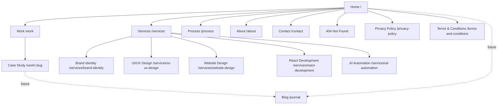
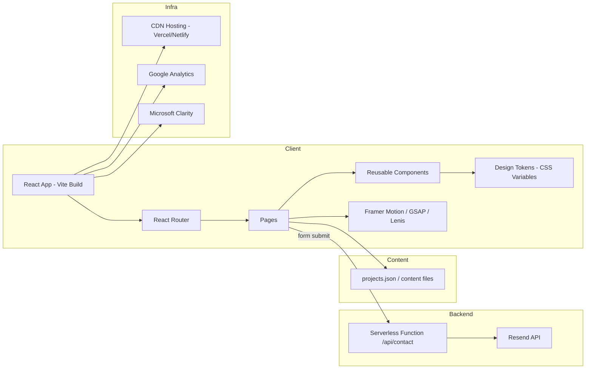
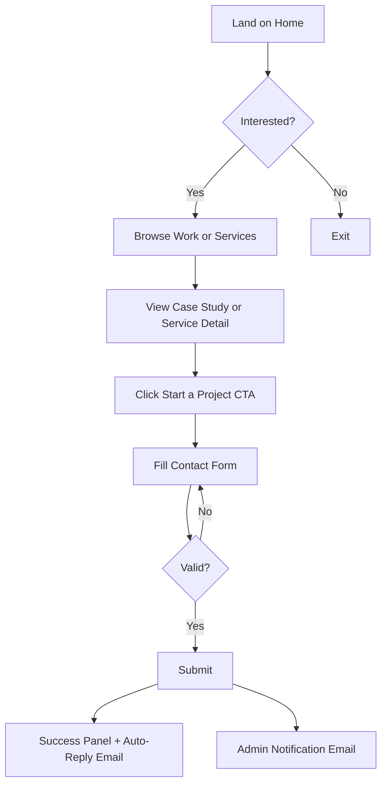
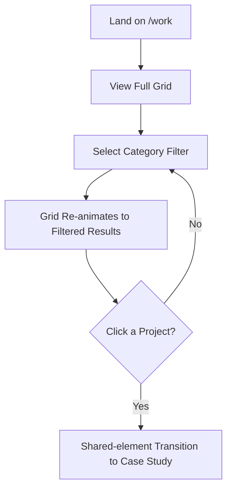

# Taksha — Official Website
## Product Requirements Document (PRD)

**Document Type:** Master Product Requirements Document
**Product:** Taksha Digital Craft Studio — Official Website (MVP)
**Version:** 1.0
**Status:** Draft for Engineering Handoff
**Prepared For:** Design, Frontend Engineering, SEO, and Content Teams
**Prepared By:** Product, UX Strategy, Brand, and Technical Architecture (Combined PRD)

---

## Document Control

| Field | Detail |
|---|---|
| Project Name | Taksha Official Website |
| Version | 1.0 |
| Classification | Internal / Engineering Handoff |
| Primary Stack | React 19, Vite, React Router, Framer Motion, GSAP, Lenis, Plain CSS |
| Target Release | MVP v1.0 |
| Owner | Product & Brand Strategy |
| Review Cycle | Pre-development sign-off required from Design + Engineering leads |

---

## How to Use This Document

This PRD is the **single source of truth** for the Taksha website MVP. It is written so that a senior frontend engineer can implement every page, component, animation, and interaction without requiring additional clarification from Product or Design. Every section below defines:

- **Purpose** — why the section/page/component exists
- **Copy** — actual production-ready copy (not placeholder lorem ipsum, unless explicitly marked)
- **Layout** — structural composition, grid behavior, spacing intent
- **Components** — reusable component references tied to the Design System
- **Animations/Interactions** — motion behavior, triggers, easing, duration
- **Responsive Behaviour** — behavior across breakpoints
- **Accessibility** — WCAG 2.2 AA compliance notes specific to that section

Where content is a **placeholder for future real content** (e.g., blog posts, future case studies), it is explicitly marked `[FUTURE CONTENT — PLACEHOLDER]`. Nothing in this PRD fabricates real clients, testimonials, awards, or case studies. Taksha is a new studio; its portfolio is honestly and proudly presented as **Studio Originals** — self-initiated concept work.

---

## Table of Contents

1. Executive Summary
2. Brand Foundation Reference
3. Goals, Success Metrics & Non-Goals
4. Target Audience & Personas
5. Information Architecture & Sitemap
6. Global Navigation & Footer
7. Design System
8. Motion System
9. Home Page PRD
10. Work Page PRD
11. Case Study Page Template PRD
12. Concept Projects (9 Studio Originals)
13. Services Pages PRD
14. Process Page PRD
15. About Page PRD
16. Contact Page PRD & Email Integration
17. 404 Page PRD
18. Privacy Policy Page PRD
19. Terms & Conditions Page PRD
20. Tech Stack & Architecture
21. SEO Strategy
22. Accessibility Strategy
23. Performance Strategy
24. Security Strategy
25. Analytics & Tracking
26. Future Roadmap
27. User Flows
28. Component Hierarchy
29. Functional & Non-Functional Requirements
30. User Stories & Acceptance Criteria
31. Edge Cases
32. Checklists (SEO, Accessibility, Performance, Testing, Deployment, Launch)
33. Folder Structure & Code Standards
34. Git Workflow & Deployment Strategy
35. Risk Assessment
36. Project Timeline & Milestones
37. Maintenance Plan
38. Appendices

---

## 1. Executive Summary

Taksha is a new, premium **Digital Craft Studio** — not a web development agency — that combines branding, UI/UX design, frontend engineering, and AI automation to build digital experiences for ambitious businesses. The Taksha website is the studio's primary trust-building and lead-generation asset. It must communicate the brand's core belief — *"Technology becomes meaningful only when crafted with intention"* — through restrained, premium visual design, precise typography, and confident motion, while being transparent about the fact that Taksha is a new studio without live clients, testimonials, or awards yet.

The website's job is threefold:

1. **Establish credibility through craft, not claims.** Since Taksha has no client roster yet, the entire portfolio is built from **Studio Originals** — concept projects designed and built in-house to demonstrate design thinking, systems thinking, and engineering quality across realistic industry scenarios (healthcare, SaaS, real estate, hospitality, fintech, and more).
2. **Generate qualified inbound leads** from founders and businesses who value design quality over the lowest price, using a contact experience that pre-qualifies budget, timeline, and service needs.
3. **Be a working demonstration of the studio's own standard** — the website itself must be fast, accessible, well-architected, and animated with intention, because the site is, in effect, Taksha's first real case study.

This document specifies every page, section, component, interaction, and system required to design and build the MVP. It also defines SEO, accessibility, performance, and security requirements, plus the roadmap for post-launch features (blog, CMS, client portal, AI estimator).

**Non-negotiable brand truth:** No fabricated clients. No fabricated testimonials. No fabricated awards or press mentions. No fabricated case study "results" (e.g., no invented "+340% conversion" style metrics tied to a fictional client). Every project is labeled clearly as a **Concept Project / Studio Exploration**.

---

## 2. Brand Foundation Reference

This section is the canonical brand reference that all copywriting, design, and content decisions must align to.

### 2.1 Brand Name & Etymology

**Taksha** derives from the Sanskrit root **"Takṣ"** — to carve, to shape, to craft, to build, to create with precision. The name positions the studio as a maker of considered, engineered, precise digital work — closer to a craftsman's studio than a typical agency.

### 2.2 Brand Definition

> Taksha is a premium Digital Craft Studio that transforms ideas into meaningful digital experiences through branding, design, engineering, and AI.

### 2.3 Tagline

> **Crafting Digital Excellence.**

### 2.4 Mission

> To help ambitious businesses communicate their value through thoughtful digital experiences that are beautifully designed, technically excellent, and built to last.

### 2.5 Vision

> To become one of the world's most respected Digital Craft Studios, known for timeless design and precision engineering.

### 2.6 Purpose Statement

> Technology becomes meaningful only when crafted with intention.

### 2.7 Core Values

| Value | Expression on the Website |
|---|---|
| Craftsmanship | Every pixel, spacing value, and transition is deliberate; no template-feel UI |
| Precision | Consistent 8px spacing grid, exact type scale, pixel-perfect alignment |
| Simplicity | Generous white space, restrained color palette, minimal ornamentation |
| Honesty | Transparent "Studio Originals" portfolio labeling; no fake testimonials |
| Curiosity | Process page and concept projects show exploration and experimentation |
| Excellence | 95+ Lighthouse target, WCAG 2.2 AA, meticulous micro-interactions |

### 2.8 Brand Personality

Premium · Minimal · Elegant · Confident · Warm · Modern · Reliable · Purposeful · Creative · Technical · Timeless

**Design implication:** The visual language must balance *editorial minimalism* (like a design studio portfolio) with *engineering credibility* (clean grids, real code-quality signals) and *warmth* (human, not cold — warm neutrals, not stark pure black/white only).

### 2.9 Brand Positioning Statement

> Taksha is NOT a web development agency. Taksha is a Digital Craft Studio. We combine branding, design, engineering, and AI to create digital experiences businesses are proud to own.

This distinction must appear explicitly on the Home and About pages. It differentiates Taksha from commodity "we build websites" agencies by emphasizing the full-spectrum craft (brand + design + engineering + AI) and pride of ownership.

### 2.10 Services Taxonomy

| Category | Services |
|---|---|
| Brand | Brand Identity, Logo Design, Visual Identity, Brand Systems |
| Design | UI Design, UX Design, Website Design, Landing Pages, Dashboard Design |
| Engineering | React Development, Website Development, Frontend Engineering, Performance Optimization |
| AI & Automation | AI Automation, AI Chatbots, Workflow Automation, Business Automation, AI Integration |

### 2.11 Target Audience Segments

Startups & Founders · Creative Businesses · Healthcare · Restaurants · Hotels · Education · Real Estate · SaaS · Creators · Premium Local Businesses

### 2.12 Website Goals

1. Establish trust despite being a new studio
2. Showcase craftsmanship through concept work
3. Generate qualified leads (quality over quantity)
4. Present concept projects with editorial-grade professionalism
5. Rank well on Google over time (SEO is a long-term compounding asset, not an instant switch)
6. Load extremely fast (95+ Lighthouse)
7. Be highly accessible (WCAG 2.2 AA)
8. Be fully responsive across all breakpoints
9. Feel unmistakably premium in every micro-detail

### 2.13 Transparency Mandate (Critical Constraint)

Because Taksha is brand new:

- ❌ No real client logos, names, or logo walls
- ❌ No testimonials or review quotes, real or invented
- ❌ No "Awards" or "Featured In" press sections
- ❌ No case studies with fabricated business metrics (e.g., no "increased revenue by 210%")
- ✅ Portfolio work is explicitly labeled **"Studio Original," "Concept Project,"** or **"Self-Initiated Exploration"** on every card and case study
- ✅ Copy openly frames Taksha as a new studio proving its craft through original work, positioning this as a *strength* (creative freedom, no client compromises) rather than hiding it

This constraint must be enforced in code via a reusable `<ConceptBadge />` component (see Design System §7.9) applied to every project reference sitewide, so it can never be accidentally omitted.

---

## 3. Goals, Success Metrics & Non-Goals

### 3.1 Business Goals

| Goal | Metric | Target (6 months post-launch) |
|---|---|---|
| Generate qualified leads | Contact form submissions with complete budget/timeline fields | 15–30/month |
| Build organic visibility | Organic sessions from Search | Steady month-over-month growth (baseline in Month 1) |
| Demonstrate craft | Avg. session duration on Work/Case Study pages | > 2 minutes |
| Establish authority | Returning visitor rate | > 20% |
| Technical excellence | Lighthouse Performance/Accessibility/Best Practices/SEO | 95+ each |

### 3.2 User Goals

- Quickly understand *what Taksha does* and *why it's different* from typical agencies
- See evidence of design/engineering quality without needing testimonials to trust it
- Explore relevant case studies for their industry (e.g., a hotel owner explores Aure Home)
- Understand service offerings, timelines, and process before reaching out
- Submit a project inquiry with confidence it will be read and answered

### 3.3 Non-Goals (Explicitly Out of Scope for MVP)

- No CMS-driven blog (structure ready, content deferred — see Roadmap)
- No client portal / login system
- No e-commerce or payment processing
- No multi-language / i18n support (structure should not block future i18n, but no localization in MVP)
- No real-time chat widget in MVP (AI chatbot showcased as a *service capability*, not necessarily embedded live on the marketing site at MVP — see Services §13.5 for nuance)


## 4. Target Audience & Personas

### 4.1 Persona 1 — "The Founder Building From Zero"

- **Who:** Early-stage startup founder, pre-seed to seed stage
- **Need:** A credible brand + website before fundraising or launch
- **Fear:** Hiring an agency that produces generic, templated work
- **What convinces them:** Seeing original, thoughtful design work (even if conceptual) and a clear, structured process
- **Primary pages:** Home → Work → Services (Brand Identity, Website Design) → Contact

### 4.2 Persona 2 — "The Operator Modernizing a Local Business"

- **Who:** Owner of a clinic, hotel, restaurant, or real estate agency
- **Need:** A premium-feeling website that reflects the quality of their physical business
- **Fear:** Looking cheap or outdated compared to competitors
- **What convinces them:** Industry-relevant concept projects (NovaCare, Aure Home, Skyline Realty, Ember & Oak)
- **Primary pages:** Home → Work (filtered by industry) → Case Study → Contact

### 4.3 Persona 3 — "The Product Lead Needing a Dashboard/SaaS UI"

- **Who:** Product manager or technical founder at a SaaS company
- **Need:** Complex UI/UX for dashboards, workflows, or internal tools
- **Fear:** Agencies that can design but can't engineer performant React interfaces
- **What convinces them:** FlowOS and Finora case studies showing UI systems + component libraries + real frontend architecture
- **Primary pages:** Home → Services (UI/UX, React Development) → Case Study (FlowOS/Finora) → Process → Contact

### 4.4 Persona 4 — "The Business Wanting Automation"

- **Who:** Any business owner curious about AI chatbots or workflow automation
- **Need:** Understand what "AI Automation" practically means for their business
- **Fear:** AI implementations that feel gimmicky or don't integrate with real workflows
- **What convinces them:** A clear AI Automation service page with concrete deliverables and FAQs
- **Primary pages:** Home → Services (AI Automation) → Contact

---

## 5. Information Architecture & Sitemap

### 5.1 Sitemap Diagram



### 5.2 URL Structure

| Page | Path | Notes |
|---|---|---|
| Home | `/` | Primary landing |
| Work (Portfolio Index) | `/work` | Filterable grid |
| Case Study | `/work/:slug` | e.g. `/work/novacare` |
| Services (Index) | `/services` | Overview of all 5 core services |
| Service Detail | `/services/:slug` | e.g. `/services/ai-automation` |
| Process | `/process` | Static timeline page |
| About | `/about` | Brand story, founder philosophy |
| Contact | `/contact` | Lead form |
| Privacy Policy | `/privacy-policy` | Legal |
| Terms & Conditions | `/terms-and-conditions` | Legal |
| 404 | `*` (catch-all) | Custom not-found page |
| [Future] Journal/Blog | `/journal`, `/journal/:slug` | Post-MVP |

### 5.3 Route-to-Component Map (React Router v6/v7 Data Router)

```jsx
// src/router.jsx
import { createBrowserRouter } from "react-router-dom";
import RootLayout from "./layouts/RootLayout";
import Home from "./pages/Home";
import Work from "./pages/Work";
import CaseStudy from "./pages/CaseStudy";
import ServicesIndex from "./pages/ServicesIndex";
import ServiceDetail from "./pages/ServiceDetail";
import Process from "./pages/Process";
import About from "./pages/About";
import Contact from "./pages/Contact";
import PrivacyPolicy from "./pages/PrivacyPolicy";
import Terms from "./pages/Terms";
import NotFound from "./pages/NotFound";

export const router = createBrowserRouter([
  {
    element: <RootLayout />,
    children: [
      { path: "/", element: <Home /> },
      { path: "/work", element: <Work /> },
      { path: "/work/:slug", element: <CaseStudy /> },
      { path: "/services", element: <ServicesIndex /> },
      { path: "/services/:slug", element: <ServiceDetail /> },
      { path: "/process", element: <Process /> },
      { path: "/about", element: <About /> },
      { path: "/contact", element: <Contact /> },
      { path: "/privacy-policy", element: <PrivacyPolicy /> },
      { path: "/terms-and-conditions", element: <Terms /> },
      { path: "*", element: <NotFound /> },
    ],
  },
]);
```

**Developer Note:** `RootLayout` renders persistent `<Navbar />`, `<Footer />`, `<CustomCursor />`, `<PageTransition />`, and initializes `Lenis` smooth scroll once at the app shell level — not per page — to avoid re-initialization jank on route change.

---

## 6. Global Navigation & Footer

### 6.1 Navbar

**Purpose:** Persistent wayfinding and primary CTA access across the entire site.

**Layout (Desktop, ≥1024px):**
- Fixed/sticky, transparent over hero, transitions to solid background with blur (`backdrop-filter: blur(12px)`) after 80px scroll
- Left: Taksha wordmark/logo (links to `/`)
- Center-right: Nav links — Work · Services · Process · About
- Right: "Start a Project" button (primary CTA, links to `/contact`)

**Copy (Nav Items):** Work, Services, Process, About, **Start a Project**

**Components:** `<Navbar />`, `<NavLink />`, `<Button variant="primary" size="sm" />`, `<Logo />`

**Animations/Interactions:**
- On mount: logo and nav items fade+slide up (staggered, 60ms stagger, 400ms duration, `ease-out-quart`)
- On scroll past 80px: background transitions from `transparent` to `var(--color-surface-translucent)` over 300ms
- Active route indicator: underline animates via `layoutId`-style shared transition (Framer Motion `motion.div` with `layoutId="nav-underline"`)
- Hover on nav link: text color shifts from `--color-text-secondary` to `--color-text-primary`, underline grows from center (200ms ease)
- CTA button hover: subtle scale (1.02) + background shift, 150ms ease-out

**Mobile (<768px):**
- Logo left, hamburger icon right
- Tapping hamburger opens full-screen overlay menu (`<MobileMenu />`) with large nav links, staggered entrance (80ms stagger), and CTA button pinned at bottom
- Menu closes on link click, backdrop click, or Escape key

**Accessibility:**
- `<nav aria-label="Primary">`
- Hamburger button: `aria-expanded`, `aria-controls="mobile-menu"`, `aria-label="Open menu"` / `"Close menu"` toggled dynamically
- Focus trapped inside mobile menu when open (`focus-trap` pattern); focus returns to hamburger button on close
- Skip link (`<a href="#main-content" class="skip-link">Skip to content</a>`) is the first focusable element in the DOM

### 6.2 Footer

**Purpose:** Secondary navigation, contact touchpoint, brand reinforcement, legal links.

**Layout:**
- 4-column grid on desktop (Brand block · Sitemap · Services · Contact), collapsing to stacked single-column accordion-free list on mobile
- Column 1: Logo + tagline ("Crafting Digital Excellence.") + short mission line + social icons (LinkedIn, Instagram, X/Twitter, Behance — using `lucide-react` icons or custom SVGs)
- Column 2 (Sitemap): Home, Work, Process, About, Contact
- Column 3 (Services): Brand Identity, UI/UX Design, Website Design, React Development, AI Automation
- Column 4 (Contact): Email (`hello@taksha.studio` — placeholder, confirm real domain before launch), "Start a Project" button, response-time note ("We reply within 1–2 business days")
- Bottom bar: © {currentYear} Taksha. All rights reserved. · Privacy Policy · Terms & Conditions

**Components:** `<Footer />`, `<FooterColumn />`, `<SocialIcons />`, `<Button variant="secondary" />`

**Animations:** Footer content fades+rises into view once on scroll intersection (staggered by column), `IntersectionObserver`-driven, animate once (`viewport={{ once: true }}` in Framer Motion)

**Responsive:** 4-col → 2-col (tablet) → 1-col stacked (mobile), 32px vertical rhythm between stacked columns

**Accessibility:** `<footer role="contentinfo">`, all icon-only links have `aria-label`, sufficient color contrast on translucent backgrounds (must be validated with dark theme tokens, not assumed)


## 7. Design System

### 7.1 Design Philosophy

The Taksha design system follows **"Precision Minimalism"** — warm neutral surfaces, a single confident accent color, generous negative space, and typography that carries most of the visual weight instead of decoration. No UI libraries (no Tailwind, no Bootstrap) — all styling is **plain, hand-authored CSS** using CSS custom properties (design tokens) and a consistent naming convention (BEM-inspired: `.block__element--modifier`).

### 7.2 Color Tokens

```css
:root {
  /* Core neutrals — warm, not stark */
  --color-bg: #FAF9F6;            /* warm off-white */
  --color-surface: #FFFFFF;
  --color-surface-translucent: rgba(250, 249, 246, 0.8);
  --color-ink: #14120F;           /* near-black, warm undertone */
  --color-text-primary: #14120F;
  --color-text-secondary: #5C574E;
  --color-text-tertiary: #8A857A;
  --color-border: #E5E1D8;
  --color-border-strong: #CFC9BB;

  /* Accent — single confident accent, used sparingly */
  --color-accent: #B85C2E;        /* warm terracotta/copper — "carved clay" */
  --color-accent-hover: #9C4A22;
  --color-accent-soft: #F3E3D8;

  /* Semantic */
  --color-success: #3F7D5C;
  --color-error: #B0392F;
  --color-warning: #B8862E;

  /* Dark theme overrides (applied via [data-theme="dark"]) */
}

[data-theme="dark"] {
  --color-bg: #0F0E0C;
  --color-surface: #171512;
  --color-surface-translucent: rgba(15, 14, 12, 0.75);
  --color-ink: #F5F2EC;
  --color-text-primary: #F5F2EC;
  --color-text-secondary: #B8B2A4;
  --color-text-tertiary: #7D766A;
  --color-border: #2A2723;
  --color-border-strong: #3A362F;
  --color-accent: #D97A45;
  --color-accent-hover: #E68F5C;
  --color-accent-soft: #2A1D14;
}
```

**Usage rule:** Accent color (`--color-accent`) is used for max 1–2 elements per viewport at a time (CTA button, active nav underline, key highlight word). Never for large background fills.

### 7.3 Typography Scale

**Typefaces:**
- **Display/Headings:** A refined serif or high-contrast sans (recommend **"Fraunces"** for display warmth + craft feel, or **"Söhne"/"General Sans"** if a cleaner sans is preferred) — final selection confirmed in visual design phase, loaded via self-hosted `woff2` for performance.
- **Body/UI:** **"Inter"** or **"General Sans"** — neutral, highly legible sans-serif.

```css
:root {
  --font-display: "Fraunces", Georgia, serif;
  --font-body: "Inter", -apple-system, BlinkMacSystemFont, sans-serif;

  --text-xs: 0.75rem;    /* 12px */
  --text-sm: 0.875rem;   /* 14px */
  --text-base: 1rem;     /* 16px */
  --text-md: 1.125rem;   /* 18px */
  --text-lg: 1.375rem;   /* 22px */
  --text-xl: 1.75rem;    /* 28px */
  --text-2xl: 2.25rem;   /* 36px */
  --text-3xl: 3rem;      /* 48px */
  --text-4xl: 4rem;      /* 64px */
  --text-5xl: 5.5rem;    /* 88px — hero headline, desktop only */

  --line-height-tight: 1.1;
  --line-height-snug: 1.3;
  --line-height-normal: 1.6;
  --line-height-relaxed: 1.8;

  --tracking-tight: -0.02em;
  --tracking-normal: 0em;
  --tracking-wide: 0.04em;
}
```

**Responsive type scaling:** Use `clamp()` for hero/display headings so they scale fluidly instead of jumping at breakpoints:
```css
.hero__headline {
  font-family: var(--font-display);
  font-size: clamp(2.5rem, 6vw + 1rem, 5.5rem);
  line-height: var(--line-height-tight);
  letter-spacing: var(--tracking-tight);
}
```

### 7.4 Spacing System (8px base grid)

```css
:root {
  --space-1: 0.25rem;  /* 4px */
  --space-2: 0.5rem;   /* 8px */
  --space-3: 0.75rem;  /* 12px */
  --space-4: 1rem;     /* 16px */
  --space-6: 1.5rem;   /* 24px */
  --space-8: 2rem;     /* 32px */
  --space-12: 3rem;    /* 48px */
  --space-16: 4rem;    /* 64px */
  --space-24: 6rem;    /* 96px */
  --space-32: 8rem;    /* 128px */
  --space-48: 12rem;   /* 192px — max section vertical padding, desktop */
}
```

### 7.5 Grid System & Containers

```css
:root {
  --container-max: 1440px;
  --container-padding-desktop: 5vw;
  --container-padding-mobile: 24px;
  --grid-columns: 12;
  --grid-gap: 24px;
}

.container {
  max-width: var(--container-max);
  margin-inline: auto;
  padding-inline: var(--container-padding-mobile);
}
@media (min-width: 1024px) {
  .container { padding-inline: var(--container-padding-desktop); }
}

.grid-12 {
  display: grid;
  grid-template-columns: repeat(var(--grid-columns), 1fr);
  gap: var(--grid-gap);
}
```

### 7.6 Breakpoints

| Token | Range | Target Devices |
|---|---|---|
| `--bp-xs` | 0–479px | Small phones |
| `--bp-sm` | 480–767px | Large phones |
| `--bp-md` | 768–1023px | Tablets |
| `--bp-lg` | 1024–1439px | Small laptops/desktops |
| `--bp-xl` | 1440px+ | Large desktops/monitors |

Mobile-first CSS authored with `min-width` media queries throughout.

### 7.7 Elevation & Shadows

```css
:root {
  --shadow-sm: 0 1px 2px rgba(20, 18, 15, 0.06);
  --shadow-md: 0 4px 12px rgba(20, 18, 15, 0.08);
  --shadow-lg: 0 12px 32px rgba(20, 18, 15, 0.12);
  --shadow-focus: 0 0 0 3px var(--color-accent-soft);
}
```

### 7.8 Border Radius

```css
:root {
  --radius-sm: 4px;
  --radius-md: 8px;
  --radius-lg: 16px;
  --radius-xl: 24px;
  --radius-full: 999px;
}
```

### 7.9 Core Components

| Component | Description | Variants |
|---|---|---|
| `<Button />` | Primary action element | `primary`, `secondary`, `ghost`, `icon` × sizes `sm`/`md`/`lg` |
| `<Card />` | Base surface container | `project`, `service`, `value` |
| `<ProjectCard />` | Work grid item with hover reveal | image-forward, includes `<ConceptBadge />` |
| `<ConceptBadge />` | Mandatory "Studio Original / Concept Project" pill on every project reference | fixed copy, non-removable prop |
| `<Input />` / `<Textarea />` / `<Select />` | Form fields | default, error, success, disabled states |
| `<Navbar />` / `<Footer />` | Global chrome | — |
| `<SectionHeading />` | Eyebrow + Heading + optional subhead pattern used across all pages | left-aligned, centered |
| `<Timeline />` | Used in Process page | vertical (mobile), horizontal (desktop) |
| `<Accordion />` | FAQs on Service pages | single-open, multi-open |
| `<Tag />` / `<FilterPill />` | Work page category filters | active/inactive |
| `<Breadcrumb />` | Case study & service detail navigation aid | with Schema.org markup |
| `<Toast />` | Form submission feedback | success, error |
| `<Skeleton />` | Loading placeholders for image-heavy grids | shimmer animation |
| `<CustomCursor />` | Desktop-only custom cursor that morphs on hover targets | dot + trailing ring |

### 7.10 Buttons — Detailed Spec

```css
.btn {
  display: inline-flex;
  align-items: center;
  gap: var(--space-2);
  font-family: var(--font-body);
  font-weight: 600;
  border-radius: var(--radius-full);
  transition: transform 150ms ease-out, background-color 200ms ease, color 200ms ease;
  cursor: pointer;
}
.btn--primary {
  background: var(--color-ink);
  color: var(--color-bg);
  padding: var(--space-4) var(--space-8);
}
.btn--primary:hover { background: var(--color-accent); transform: translateY(-2px); }
.btn--secondary {
  background: transparent;
  border: 1px solid var(--color-border-strong);
  color: var(--color-text-primary);
  padding: var(--space-4) var(--space-8);
}
.btn--secondary:hover { border-color: var(--color-ink); }
.btn:focus-visible { box-shadow: var(--shadow-focus); outline: none; }
```

### 7.11 Forms — Detailed Spec

```css
.field { margin-bottom: var(--space-6); }
.field__label { font-size: var(--text-sm); color: var(--color-text-secondary); margin-bottom: var(--space-2); display: block; }
.field__input {
  width: 100%;
  padding: var(--space-4);
  border: 1px solid var(--color-border);
  border-radius: var(--radius-md);
  background: var(--color-surface);
  font-family: var(--font-body);
  font-size: var(--text-base);
  transition: border-color 150ms ease, box-shadow 150ms ease;
}
.field__input:focus { border-color: var(--color-accent); box-shadow: var(--shadow-focus); outline: none; }
.field__input--error { border-color: var(--color-error); }
.field__error-text { color: var(--color-error); font-size: var(--text-xs); margin-top: var(--space-2); }
```

### 7.12 Focus States (Sitewide Rule)

Every interactive element MUST have a visible `:focus-visible` style using `--shadow-focus` or an outline of at least 2px with 3:1 contrast against adjacent colors. Never remove focus outlines without providing a replacement (`outline: none` is only permitted when paired with a custom focus style in the same rule).

### 7.13 Dark Theme

Dark theme is a first-class, user-toggleable mode (toggle in Navbar, persisted to `localStorage`, respects `prefers-color-scheme` on first visit). All tokens are defined via the `[data-theme="dark"]` attribute selector shown in §7.2. No component should hardcode a color outside the token system.


## 8. Motion System

### 8.1 Motion Philosophy

Taksha's motion language follows four principles, mirroring the brand's "craft" metaphor:

1. **Reveal** — Content doesn't just appear; it's uncovered (clip-path reveals, mask wipes, staggered fade-ups)
2. **Refine** — Motion settles precisely; no bouncy/springy overshoot except on small delightful UI accents
3. **Shape** — Elements transform with purpose (scale, morph) rather than just fading, echoing "carving"
4. **Assemble** — Grouped elements (cards, grids) enter as a coordinated system via stagger, not randomly

### 8.2 Global Motion Tokens

```css
:root {
  --ease-out-quart: cubic-bezier(0.25, 1, 0.5, 1);
  --ease-in-out-quart: cubic-bezier(0.76, 0, 0.24, 1);
  --ease-out-expo: cubic-bezier(0.16, 1, 0.3, 1);

  --duration-fast: 150ms;
  --duration-base: 300ms;
  --duration-slow: 500ms;
  --duration-slower: 800ms;

  --stagger-tight: 40ms;
  --stagger-base: 80ms;
  --stagger-loose: 120ms;
}
```

`prefers-reduced-motion: reduce` — ALL non-essential motion (parallax, cursor follower, decorative reveals, autoplay marquees) must be disabled and replaced by simple opacity fades ≤150ms. This is implemented via a single `useReducedMotion()` hook (Framer Motion built-in) checked at the root and propagated via context, not re-checked ad hoc in every component.

### 8.3 Library Roles

| Library | Responsibility |
|---|---|
| **Framer Motion** | Component-level animation: enter/exit, layout animations, shared element transitions, page transitions, hover/tap gestures |
| **GSAP** (+ ScrollTrigger) | Complex scroll-driven sequences: pinned sections, scrubbed timelines (e.g., Craft Philosophy section number counters, image mask reveals tied precisely to scroll progress) |
| **Lenis** | Smooth-scroll physics layer sitting under native scroll, synced with GSAP ScrollTrigger via `lenis.on('scroll', ScrollTrigger.update)` |

**Developer Note:** Do not use both Framer Motion `whileInView` and GSAP ScrollTrigger on the *same* element — pick one per element to avoid conflicting scroll listeners. Rule of thumb: Framer Motion for discrete component transitions; GSAP for anything scrubbed/pinned.

### 8.4 Motion Specs by Context

**Hero:**
- Headline: characters/words split and fade-up with 3D perspective tilt (`rotateX: 10deg → 0`), 600ms, staggered per word (80ms), `ease-out-expo`, on page load only (not on scroll)
- Hero visual (abstract 3D/SVG carve motif): slow continuous idle animation (subtle rotation/parallax on mouse move, disabled under reduced motion)

**Cards (Project/Service/Value):**
- Enter: fade-up 24px, 500ms, `ease-out-quart`, staggered 80ms per card, triggered once via `whileInView`
- Hover (desktop): image scales 1.0 → 1.05 (400ms `ease-out-quart`), overlay gradient fades in, title/category slides up 8px

**Images:**
- Reveal via `clip-path: inset(100% 0 0 0)` → `inset(0 0 0 0)` on scroll-in, 700ms `ease-out-expo` (GSAP ScrollTrigger, `once`)

**Buttons:**
- Hover: `translateY(-2px)` + background color transition, 150ms
- Tap: `scale(0.97)`, 100ms

**Case Study transitions:**
- Clicking a `<ProjectCard />` triggers a Framer Motion `layoutId` shared-element transition where the card image morphs into the case study hero image (perceived continuity), ~500ms `ease-in-out-quart`

**Page Transition:**
- Route change: outgoing page fades out + 16px upward shift (200ms), a brief brand-mark "carve" wipe transition overlay (a thin animated line/mask, 300ms), incoming page fades in + upward reveal (300ms). Implemented via `<AnimatePresence mode="wait">` wrapping the router outlet.

**Navbar:** See §6.1.

**Footer:** See §6.2.

**Scroll:** Lenis smooth scroll, duration 1.2, easing `(t) => Math.min(1, 1.001 - Math.pow(2, -10 * t))`, `smoothWheel: true`, `syncTouch: false` (native touch scroll preserved on mobile for feel + performance).

**Cursor (desktop ≥1024px only):**
- Default: 8px dot cursor with 32px trailing ring (lags via spring, `stiffness: 300, damping: 30`)
- On hover over links/buttons: ring scales to 48px and label text appears inside (e.g., "View" on project cards, "Drag" on carousels)
- Disabled entirely on touch devices (`@media (hover: hover) and (pointer: fine)`)

**Loading:**
- Initial app load: minimal branded loader — a thin horizontal line that "carves" left-to-right (600–1000ms depending on asset readiness), then fades out; never a spinner (feels generic/off-brand)

**Skeleton:**
- Work grid and case study images use shimmer skeletons (`background: linear-gradient` animated `background-position`) matching final image aspect ratio to prevent layout shift (paired with explicit `width`/`height`/`aspect-ratio` CSS)

**Micro-interactions:**
- Form field focus: label color shifts to accent, border transitions, 150ms
- Checkbox/radio (if used): custom-styled with a subtle "carve" checkmark draw-in (SVG `stroke-dashoffset` animation, 200ms)
- Copy-to-clipboard (email link): icon morphs to checkmark for 1.5s on click


## 9. Home Page PRD

**Route:** `/`
**Primary Goal:** Convert first-time visitors into believers within 10 seconds, then guide them toward Work, Services, or Contact.

### 9.1 Section Map

1. Hero
2. Craft Philosophy
3. Featured Projects
4. Services Overview
5. Process Preview
6. Why Taksha
7. Brand Manifesto
8. Final CTA
9. Footer

---

### 9.1.1 Hero

**Purpose:** Communicate brand identity + tagline + positioning instantly; set the premium tone.

**Copy:**
- Eyebrow: `Digital Craft Studio`
- Headline: `Crafting Digital Excellence.`
- Subhead: `Taksha blends branding, design, engineering, and AI to build digital experiences ambitious businesses are proud to own.`
- Primary CTA: `View Our Work` → `/work`
- Secondary CTA: `Start a Project` → `/contact`
- Scroll cue: small animated down-arrow with label `Scroll to explore`

**Layout:**
- Full viewport height (`min-height: 100vh`) on desktop; `100svh` mobile-safe
- Split composition: left 60% text block (eyebrow, headline, subhead, CTA row), right 40% abstract visual — a generative/geometric "carved form" (3D SVG or Three.js-lite abstract shape suggesting carving/sculpting, NOT a literal product screenshot)
- Center-stacked on mobile (visual moves below text, reduced scale)

**Components:** `<Hero />`, `<Button />` ×2, `<ScrollCue />`, `<HeroVisual />`

**Animations:** See §8.4 Hero. Additionally, hero visual has slow idle rotation (12s loop, linear, disabled under reduced motion) and subtle parallax on mouse move (desktop only, max ±12px translate).

**Responsive:** Headline uses `clamp()` scale (§7.3). On mobile, CTA buttons stack full-width with 12px gap.

**Accessibility:** `<h1>` is the headline (only one `<h1>` per page). Hero visual is `aria-hidden="true"` (purely decorative). Scroll cue is a `<button>` with `aria-label="Scroll to next section"`.

---

### 9.1.2 Craft Philosophy

**Purpose:** Explain the *meaning* of "Taksha" and the studio's approach — deepen brand understanding before showing work.

**Copy:**
- Eyebrow: `The Meaning Behind Taksha`
- Heading: `To carve. To shape. To craft — with precision.`
- Body: `Taksha comes from the Sanskrit "Takṣ" — the act of shaping something with intention and skill. We apply that same philosophy to digital products: nothing is default, nothing is templated. Every interface, every interaction, every line of code is considered.`
- Three supporting pillars (icon + short label + one-line description):
  1. **Branding** — "Identity systems built to last, not trend-chase."
  2. **Design** — "Interfaces shaped around real user behavior."
  3. **Engineering** — "Fast, accessible, precisely built frontends."
  (A 4th pillar — **AI** — "Automation that removes friction, not adds noise." — may be included as a 4-column variant.)

**Layout:** Centered heading/body block (max-width ~720px) above a 3–4 column pillar grid (collapses to 1 column stacked on mobile with a divider line between items).

**Components:** `<SectionHeading />`, `<PillarCard />` ×3–4

**Animations:** GSAP ScrollTrigger scrubbed — as section scrolls into view, the word "precision" in the heading gets a subtle underline/highlight draw-in synced to scroll progress; pillars fade-up staggered 100ms each.

**Accessibility:** Sanskrit term rendered with `lang="sa"` span for correct screen-reader pronunciation hinting where supported; philosophy explained in plain English regardless.

---

### 9.1.3 Featured Projects

**Purpose:** Showcase 3–4 strongest Studio Original concept projects; drive to full Work page.

**Copy:**
- Eyebrow: `Studio Originals`
- Heading: `Concept work. Real craft.`
- Subhead: `Taksha is a new studio — every project below is a self-initiated exploration, not a client engagement. It's how we prove our craft before we're hired for yours.`
- CTA: `View All Work` → `/work`

**Layout:** Asymmetric editorial grid — first project large (spans 8/12 columns), next two smaller (span 4/12 stacked or side-by-side), alternating rhythm. Each `<ProjectCard />` shows: cover image, `<ConceptBadge />` ("Concept Project"), project name, one-line category/industry tag, and an arrow icon.

**Components:** `<SectionHeading />`, `<ProjectCard />` ×4, `<ConceptBadge />`, `<Button variant="secondary" />`

**Animations:** Cards reveal per §8.4 Cards spec; on hover, image scales + `<ConceptBadge />` and title lift.

**Responsive:** Grid collapses to single column, full-width cards, vertical stack, standard spacing (no asymmetric spans on mobile).

**Accessibility:** Each card is a single `<a>` wrapping the whole card (not nested interactive elements); image `alt` describes the project visually (e.g., "NovaCare patient dashboard interface in warm clinical color palette").

---

### 9.1.4 Services Overview

**Purpose:** Summarize the 4 service pillars with a path to detailed service pages.

**Copy:**
- Eyebrow: `What We Do`
- Heading: `Four disciplines. One studio.`
- Services grid (using the 5 core service pages, condensed into 4 visual groups per taxonomy):
  1. **Brand Identity** — "Logos, visual systems, and brand foundations built to scale." → `/services/brand-identity`
  2. **UI/UX Design** — "Interfaces designed around clarity, hierarchy, and behavior." → `/services/ui-ux-design`
  3. **Website Development** — "Fast, accessible, precision-built React frontends." → `/services/website-design` and `/services/react-development`
  4. **AI Automation** — "Chatbots and workflows that remove friction from your business." → `/services/ai-automation`
- CTA: `Explore All Services` → `/services`

**Layout:** 2×2 grid (desktop), each cell a `<ServiceCard />` with icon, title, description, arrow link. 1 column on mobile.

**Components:** `<SectionHeading />`, `<ServiceCard />` ×4

**Animations:** Fade-up stagger on scroll-in; hover reveals a subtle accent-colored left border grow-in (4px, top-to-bottom, 200ms).

**Accessibility:** Icons are decorative (`aria-hidden`), text alone conveys meaning.

---

### 9.1.5 Process Preview

**Purpose:** Build confidence via a visible, structured methodology (condensed from full Process page).

**Copy:**
- Eyebrow: `How We Work`
- Heading: `A process built on clarity, not guesswork.`
- Condensed 5-step preview (of the full 10-stage process): Discover → Design → Prototype → Develop → Launch
- CTA: `See Our Full Process` → `/process`

**Layout:** Horizontal stepper on desktop (connected by a thin line with dot markers), vertical stacked on mobile.

**Components:** `<Timeline variant="preview" />`

**Animations:** Connecting line draws left-to-right via `stroke-dashoffset` scrub tied to scroll (GSAP ScrollTrigger), dots "pop" in sequence as line reaches them (scale 0→1, `ease-out-quart`).

**Accessibility:** Rendered as an ordered list (`<ol>`) semantically, regardless of visual horizontal styling — ensures logical reading order for screen readers.

---

### 9.1.6 Why Taksha

**Purpose:** Directly address the "new studio, no clients yet" concern by reframing it as a differentiator; state positioning explicitly.

**Copy:**
- Eyebrow: `Why Taksha`
- Heading: `A new studio. An honest one.`
- Body: `We won't show you fabricated testimonials or invented client logos — because we don't have any yet, and pretending otherwise isn't craftsmanship. What we do have is original, self-initiated work built to the same standard we'd bring to yours. Taksha isn't a web development agency. We're a Digital Craft Studio — branding, design, engineering, and AI, combined with intention.`
- Supporting stat-style callouts (honest, non-fabricated — process/quality claims, not fake client numbers), e.g.:
  - "9 self-initiated concept projects across healthcare, SaaS, hospitality, real estate, and fintech"
  - "95+ target Lighthouse score on every build we ship"
  - "WCAG 2.2 AA accessibility as a baseline, not an afterthought"

**Layout:** Two-column: left heading+body, right a vertical list of 3 callout stats with large numerals.

**Components:** `<SectionHeading />`, `<StatCallout />` ×3

**Animations:** Numerals count up from 0 on scroll-in (GSAP, 1200ms, `ease-out-quart`) — but only for genuinely factual, non-fabricated numbers (project count, score targets), never invented metrics.

**Accessibility:** Numeral count-up animation respects `prefers-reduced-motion` (renders final value immediately, no animation).

---

### 9.1.7 Brand Manifesto

**Purpose:** An emotional, editorial closing statement reinforcing brand belief before the final CTA.

**Copy (full manifesto, large display type, one line/phrase revealed at a time):**

> We believe technology means nothing without intention.
> We believe design is a form of respect for the people who use it.
> We believe simplicity takes more discipline than complexity.
> We believe craft is not a phase of a project — it's the standard for all of it.
> We are Taksha. We carve, shape, and build — with precision.

**Layout:** Full-width, centered, dark-toned section (can invert to dark theme colors regardless of site theme for dramatic contrast — a deliberate "manifesto moment"), generous vertical padding (`--space-48`).

**Components:** `<Manifesto />`

**Animations:** GSAP ScrollTrigger pinned section — each line fades in and the previous line fades to low opacity (not fully hidden) as user scrolls, creating a "reading through" scrubbed effect. Pin releases after last line.

**Accessibility:** Because this uses a pinned/scrubbed scroll effect, ensure all text remains in the DOM and readable via screen reader in natural order regardless of visual opacity state (opacity ≠ `visibility:hidden`/`display:none` for any line). Under `prefers-reduced-motion`, disable pinning entirely and stack all lines statically with normal scroll.

---

### 9.1.8 Final CTA

**Purpose:** Last conversion opportunity before footer.

**Copy:**
- Heading: `Have a project worth crafting well?`
- Subhead: `Tell us what you're building. We'll tell you how we'd approach it.`
- CTA: `Start a Project` → `/contact`

**Layout:** Centered, generous padding, large CTA button, subtle background texture (e.g., a faint carved-line SVG pattern, low opacity, decorative).

**Components:** `<CTASection />`, `<Button variant="primary" size="lg" />`

**Animations:** Heading fades-up on scroll-in; button has a continuous very subtle "breathing" scale (1.0↔1.02, 3s loop, disabled under reduced motion) to draw the eye without being distracting.

**Accessibility:** Decorative background pattern is `aria-hidden`; breathing animation disabled under reduced motion.

---

### 9.1.9 Footer

See §6.2 for full global footer spec.


## 10. Work Page PRD

**Route:** `/work`
**Purpose:** Present the full portfolio of Studio Originals with filtering, in an editorial grid.

### 10.1 Hero/Header

**Copy:**
- Eyebrow: `Studio Originals`
- Heading: `Concept work, crafted without compromise.`
- Subhead: `Taksha is a new studio. Every project here is a self-initiated exploration — designed and built to the same standard as client work, without a client's constraints.`

### 10.2 Filtering & Categories

**Categories (by industry/discipline — multi-select filter):**
`All` · `Brand Identity` · `UI/UX` · `Website` · `Dashboard/SaaS` · `AI Automation` · Industry sub-tags: `Healthcare` · `SaaS` · `Hospitality` · `Real Estate` · `Fintech` · `Retail/Lifestyle`

**Layout:** Horizontal scrollable pill row (`<FilterPill />`) below header, sticky below navbar on scroll (desktop). Selected filters shown as removable chips above the grid when active.

**Interaction:** Clicking a pill filters the grid client-side (no page reload); grid re-animates (exit fade-out 150ms → re-layout via Framer Motion `<AnimatePresence>` + `layout` prop → enter fade-up stagger). URL updates via query param (`?category=healthcare`) for shareable/bookmarkable filtered views, using `useSearchParams`.

**Empty state:** If a filter combination yields zero results (future-proofing for when filters expand): centered message `"No projects match this filter yet — check back soon or view all work."` with a "Clear Filters" button.

### 10.3 Project Grid

**Layout:** Responsive masonry-style editorial grid — 3 columns desktop (≥1280px), 2 columns tablet (768–1279px), 1 column mobile. Uses CSS Grid with `grid-auto-flow: dense` and varied card heights for editorial rhythm, OR a strict uniform grid if simplicity is prioritized for MVP (recommend: uniform grid for MVP, editorial masonry as a v1.1 polish pass — lower implementation risk).

**Card content (`<ProjectCard />`):** Cover image (consistent `aspect-ratio: 4/3`), `<ConceptBadge />`, project name, category tag, short one-line descriptor.

**Components:** `<FilterBar />`, `<ProjectGrid />`, `<ProjectCard />`, `<ConceptBadge />`

**Hover Effects:** Image scale 1.05 (400ms), dark gradient overlay fades in from bottom (0→0.4 opacity), descriptor text slides up 8px into view, `<ConceptBadge />` shifts to accent-colored fill on hover.

**Transitions:** Grid re-flow on filter change uses Framer Motion `layout` animations (`transition={{ duration: 0.4, ease: [0.25,1,0.5,1] }}`). Clicking a card triggers shared-element transition into the Case Study hero (see §8.4).

### 10.4 Pagination (Future-Ready, Not Required for MVP Content Volume)

With only 9 concept projects, MVP shows all on one page (no pagination needed). Build `<ProjectGrid />` to accept a `pageSize` prop and expose `<Pagination />` component (numbered + prev/next, `aria-current="page"` on active) that activates automatically once project count exceeds `pageSize` (default 12) — so no refactor is needed when the portfolio grows.

### 10.5 Search (Future-Ready, Not Required for MVP)

Include a disabled/hidden `<SearchInput />` component in the codebase (not rendered in MVP UI) that filters `projects.json` by name/tag substring match, ready to enable when portfolio volume justifies it (roadmap item).

### 10.6 Accessibility

- Filter pills are a `role="group" aria-label="Filter projects by category"` set of `<button aria-pressed="true/false">` elements, not links
- Grid announces result count changes via a visually-hidden `aria-live="polite"` region: `"12 projects shown"` → updates on filter
- All cards keyboard-navigable in logical DOM order matching visual order


## 11. Case Study Page Template PRD

**Route:** `/work/:slug`
**Purpose:** A single reusable template that renders any of the 9 concept projects from structured data (`projects.json` or per-project MDX/JSON files) — not 9 hand-built pages.

### 11.1 Data-Driven Architecture (Developer Note)

```
/src/content/projects/
  taksha.json
  novacare.json
  flowos.json
  vertex-atelier.json
  aure-home.json
  skyline-realty.json
  finora.json
  aaranya.json
  ember-and-oak.json
```

Each JSON conforms to a shared schema (see §11.3). `<CaseStudy />` page component fetches by `:slug`, and if no match is found, renders `<NotFound />` (reuse 404 page logic, not a separate error state).

### 11.2 Mandatory Transparency Element

Every case study MUST render `<ConceptBadge size="lg" />` immediately below the project title in the hero, plus a dedicated disclosure line:

> `"This is a self-initiated Studio Original — a concept project created by Taksha to explore design and engineering craft. It does not represent a real client engagement."`

This disclosure is **not optional** and is not to be placed only in fine print — it belongs in the primary hero viewport, in `--text-sm` size, `--color-text-secondary`, directly under the badge.

### 11.3 Section-by-Section Template

**1. Overview (Hero)**
- Project name (`<h1>`), one-line tagline, `<ConceptBadge />` + disclosure line, cover visual (large, full-bleed or contained per project), meta row: Industry · Services Involved · Year (Concept) · [Live Prototype link if applicable, else omit]

**2. Challenge**
- Heading: `The Challenge`
- 1–2 paragraphs framing the *fictional-but-realistic* problem this concept project explores (e.g., for NovaCare: "Healthcare portals often overwhelm patients with clinical density instead of clarity...")

**3. Research**
- Heading: `Research & Context`
- Bullet list or short paragraphs on the design research approach taken for this exploration (competitive audits of the industry pattern space, accessibility considerations relevant to the audience, etc.) — framed honestly as "the research we'd apply to a real engagement of this type," not fabricated user interview quotes.

**4. Discovery**
- Heading: `Discovery`
- Key insights/principles that shaped direction (3–5 bullet points)

**5. User Journey**
- Heading: `User Journey`
- A simple flow diagram (Mermaid or custom SVG) showing key user paths through the product concept

**6. Wireframes**
- Heading: `Wireframes`
- Low-fidelity wireframe images (grayscale/blueprint style) in a 2–3 column gallery, `<Lightbox />` on click

**7. Visual Language**
- Heading: `Visual Language`
- Mood-board style image grid + a short paragraph on the creative direction rationale

**8. Typography**
- Heading: `Typography`
- Live-rendered type specimen block showing the project's chosen typefaces/scale (using actual `<h1>`–`<body>` samples styled per the project's palette)

**9. Color Palette**
- Heading: `Color System`
- Swatch row (`<ColorSwatch />` components showing hex + name) tied to the project's specific palette (distinct from Taksha's own site palette)

**10. Component Library**
- Heading: `Component Library`
- Grid of key UI components designed for the concept (buttons, cards, forms) shown as static image exports or live styled examples

**11. Responsive Screens**
- Heading: `Responsive Design`
- Device-frame mockups (desktop/tablet/mobile) shown side-by-side or in a scrollable row

**12. Motion**
- Heading: `Motion & Interaction`
- Embedded short looping video/GIF or Lottie of key interaction (e.g., a card hover, an onboarding transition) — lazy-loaded, `muted autoplay loop playsinline` with a visible pause control (motion must be pausable per WCAG 2.2.2)

**13. Accessibility**
- Heading: `Accessibility Considerations`
- Bullets on how this concept addressed contrast, keyboard nav, reduced motion, etc., specific to its context (e.g., NovaCare: larger tap targets for elderly users, high-contrast mode)

**14. Development**
- Heading: `Development Notes`
- Brief on the technical approach *if a working prototype exists* (tech used, component architecture) — framed as "how we would build this" if purely conceptual, never claiming a live production deployment that doesn't exist

**15. Performance**
- Heading: `Performance Targets`
- Target Lighthouse/Core Web Vitals goals this concept was designed against (aspirational/standard-setting, not fabricated live metrics)

**16. Lessons Learned**
- Heading: `Reflections`
- 1 short paragraph — honest, first-person studio reflection on what the exploration taught the team

**17. Next Project Navigation**
- `<NextProjectCard />` — links to the next project in sequence, with shared-element image transition

### 11.4 Layout & Components

`<CaseStudyHero />`, `<ConceptBadge />`, `<SectionHeading />`, `<TextBlock />`, `<ImageGallery />`, `<Lightbox />`, `<ColorSwatch />`, `<TypeSpecimen />`, `<DeviceFrame />`, `<VideoLoop />`, `<NextProjectCard />`, `<Breadcrumb />`

### 11.5 Responsive Behaviour

All multi-column galleries (wireframes, component library, device frames) collapse to a horizontally-scrollable single row on mobile (`overflow-x: auto` with scroll-snap) rather than an awkward single-column stack of tiny images — preserves visual comparison ability.

### 11.6 Accessibility

- `<Breadcrumb />` uses Schema.org `BreadcrumbList` markup (see SEO §21.9)
- Video loops: `aria-label` describing the interaction, plus a visible pause/play toggle button (never autoplay-only motion without user control)
- Lightbox: focus-trapped modal, `Escape` closes, focus returns to triggering thumbnail


## 12. Concept Projects (9 Studio Originals)

All 9 projects below are entirely fictional concept explorations created by Taksha. None represent real clients or real business outcomes. Each follows the shared schema from §11.3 and populates `projects.json`.

### 12.0 Shared JSON Schema

```json
{
  "slug": "novacare",
  "name": "NovaCare",
  "tagline": "string",
  "industry": "Healthcare",
  "servicesInvolved": ["Brand Identity", "UI/UX Design", "React Development"],
  "year": "2025 (Concept)",
  "conceptDisclosure": true,
  "challenge": "string",
  "audience": "string",
  "goal": "string",
  "designThinking": ["string"],
  "colorSystem": [{ "name": "string", "hex": "#000000" }],
  "typography": { "display": "string", "body": "string" },
  "uiHighlights": ["string"],
  "features": ["string"],
  "screens": ["url1", "url2"],
  "technology": ["string"],
  "outcome": "string"
}
```

---

### 12.1 Taksha (The Studio's Own Site)

- **Problem:** A new studio needs to prove design and engineering credibility with zero existing clients.
- **Audience:** Founders and businesses evaluating design/dev partners.
- **Goal:** Build a website that is itself the strongest case study — fast, accessible, precisely crafted.
- **Design Thinking:** Warm minimalism over cold corporate-agency tropes; typography-led hierarchy; motion used to reinforce the "craft" metaphor rather than decorate.
- **Color System:** Warm off-white `#FAF9F6`, ink `#14120F`, terracotta accent `#B85C2E`.
- **Typography:** Display — Fraunces; Body — Inter.
- **UI Highlights:** Scrubbed manifesto section; shared-element project transitions; custom cursor states.
- **Features:** Filterable portfolio, service pages, budget-qualifying contact form, dark theme.
- **Screens:** Home, Work, Case Study, Contact (desktop + mobile).
- **Technology:** React 19, Vite, Framer Motion, GSAP, Lenis.
- **Outcome:** A self-referential proof point — the site's own performance and craft *is* the case study.

### 12.2 NovaCare — Patient-First Healthcare Platform

- **Problem:** Healthcare portals are typically clinical, dense, and intimidating, especially for elderly or first-time patients.
- **Audience:** Patients aged 35–75 managing appointments, prescriptions, and lab results; secondary audience: clinic administrators.
- **Goal:** Design a healthcare dashboard that feels calm and legible rather than sterile and overwhelming.
- **Design Thinking:** Reduce cognitive load through progressive disclosure; use warm, human color instead of cold clinical blues; prioritize large tap targets and high contrast for accessibility across age groups.
- **Color System:** Sage `#6B8F71`, warm cream `#FBF7F0`, deep navy-ink `#1F2A33`, soft coral accent `#E08B6F`.
- **Typography:** Display — "Fraunces" (softened weight); Body — "Inter" at increased base size (17px) for legibility.
- **UI Highlights:** Card-based appointment timeline, one-tap prescription refill flow, plain-language lab result summaries with an option to "see medical terms."
- **Features:** Appointment scheduling, secure messaging mockup, medication reminders, accessibility mode toggle (larger text, higher contrast).
- **Screens:** Dashboard home, appointment booking flow, lab results view, mobile app screens.
- **Technology:** React, component-driven design system, WCAG 2.2 AA-targeted contrast ratios throughout.
- **Outcome:** A concept demonstrating how healthcare UX can be both compliant and genuinely comforting.

### 12.3 FlowOS — Workflow Automation SaaS Dashboard

- **Problem:** Internal operations teams juggle disconnected tools; automation platforms often have overwhelming, developer-only interfaces.
- **Audience:** Operations managers and no-code-savvy founders at growing startups.
- **Goal:** Design a workflow-builder dashboard that's powerful but approachable — visual automation without needing to "think like an engineer."
- **Design Thinking:** Node-based visual builder inspired by clarity-first information design; dense data given breathing room through strict spacing rhythm; dark-mode-first since this is a power-user tool.
- **Color System:** Charcoal `#15171A`, electric indigo accent `#5B5FEF`, muted slate `#8A8F98`, signal green `#3FBF7F` for active states.
- **Typography:** Display/Body unified — "General Sans" for a technical, systematic feel; monospace accents ("JetBrains Mono") for workflow node labels/logic.
- **UI Highlights:** Drag-and-drop node canvas, real-time run-status indicators, collapsible sidebar with saved workflow templates.
- **Features:** Visual workflow builder, integration marketplace grid, run history log, team permissions panel.
- **Screens:** Canvas builder view, integrations grid, analytics/run-history dashboard, mobile companion view (read-only monitoring).
- **Technology:** React, custom canvas/node-graph rendering approach, dark-theme-first design tokens.
- **Outcome:** A demonstration of dashboard/SaaS UI systems thinking — the kind of complex product-design work Taksha positions itself to take on for real SaaS clients.

### 12.4 Vertex Atelier — Fashion/Creative Studio Brand & Site

- **Problem:** Independent creative studios/ateliers often default to generic portfolio templates that undersell their craft.
- **Audience:** Prospective fashion/creative clients and press/collaborators.
- **Goal:** A visual identity and website that feels as considered and tactile as the atelier's physical work.
- **Design Thinking:** Editorial, magazine-inspired layout; oversized imagery; typography as texture; restrained motion that lets photography lead.
- **Color System:** Bone white `#F5F1EA`, ink black `#0C0C0C`, muted gold accent `#B08D4F`.
- **Typography:** Display — a high-contrast serif for editorial drama; Body — a neutral grotesque sans for clean captioning.
- **UI Highlights:** Full-bleed image sequences, scroll-scrubbed lookbook transitions, minimal chrome (near-invisible navigation until scrolled).
- **Features:** Lookbook gallery, atelier story page, collection archive grid, press/contact page.
- **Screens:** Home hero, lookbook scroll sequence, collection archive, about/atelier story.
- **Technology:** React, GSAP scroll-scrubbed sequences, heavy image optimization (AVIF/WebP with responsive `srcset`).
- **Outcome:** Demonstrates Taksha's brand identity + editorial web design range beyond utilitarian business sites.

### 12.5 Aure Home — Boutique Hotel Booking Experience

- **Problem:** Boutique hotel websites often rely on generic booking-engine embeds that clash with the property's aesthetic and erode the premium feel.
- **Audience:** Discerning travelers booking a boutique/luxury stay.
- **Goal:** Design a booking flow that feels like an extension of the hotel's ambiance, not a bolted-on transaction tool.
- **Design Thinking:** Sensory, atmospheric visual storytelling (light, texture, materiality) paired with a frictionless, minimal-step booking flow; imagery-first hierarchy.
- **Color System:** Warm stone `#E8E1D6`, deep olive `#4A5240`, brushed brass accent `#C6A15B`.
- **Typography:** Display — refined serif with generous letter-spacing for a "resort" feel; Body — clean humanist sans.
- **UI Highlights:** Immersive full-screen room galleries, a 3-step booking flow (dates → room → confirm) with persistent price summary, ambient background video on the homepage hero.
- **Features:** Room/suite browsing, date-based availability mockup, amenities showcase, location/experience guide.
- **Screens:** Home hero, room gallery, booking flow (3 steps), confirmation screen.
- **Technology:** React, optimized video hero handling (poster fallback, lazy load), responsive image galleries.
- **Outcome:** Shows how Taksha approaches hospitality UX — balancing emotion-led storytelling with conversion-focused flow design.

### 12.6 Skyline Realty — Real Estate Discovery Platform

- **Problem:** Real estate listing sites are often cluttered with dense filters and low-quality imagery presentation, undermining trust in higher-end listings.
- **Audience:** Home buyers and renters browsing premium listings; secondary: agents managing listings.
- **Goal:** A property discovery experience that foregrounds photography and map-based exploration with clean, confident filtering.
- **Design Thinking:** Map-first spatial browsing paired with a card-based listing feed; consistent photo treatment (color grading, aspect ratio) across listings to elevate perceived quality regardless of source photos.
- **Color System:** Slate blue `#2E3A46`, warm white `#FAFAF8`, amber accent `#D99A3D`.
- **Typography:** Display — confident geometric sans for a modern-real-estate feel; Body — neutral sans matched for data density (price, sqft, beds/baths).
- **UI Highlights:** Split-view map + listing feed, saved-listings favoriting, agent contact card pattern, mortgage-estimate widget mockup.
- **Features:** Property search with filters (price, beds, type), map view toggle, listing detail pages, agent profile pages.
- **Screens:** Search/map split view, listing detail page, agent profile, saved listings dashboard.
- **Technology:** React, map integration pattern (placeholder/mock map layer for concept purposes), filter state management.
- **Outcome:** Demonstrates Taksha's ability to design data-dense, map-integrated product experiences for real estate.

### 12.7 Finora — Personal Finance & Budgeting App Concept

- **Problem:** Personal finance apps often either oversimplify (hiding useful detail) or overwhelm (spreadsheet-like density), rarely balancing both.
- **Audience:** Young professionals managing budgets, subscriptions, and savings goals.
- **Goal:** A finance dashboard that makes financial clarity feel calm and motivating rather than anxiety-inducing.
- **Design Thinking:** Data visualization as the emotional core of the product (progress rings, trend lines); optimistic color language (avoiding alarming reds for normal spending); goal-based framing over raw transaction lists.
- **Color System:** Deep forest `#1C3B32`, mint accent `#4FD1A5`, soft cream `#F7F5EF`, warning amber (used sparingly) `#E0A458`.
- **Typography:** Display — rounded-geometric sans for approachability; Body — Inter for numerical legibility (tabular figures enabled via `font-variant-numeric: tabular-nums`).
- **UI Highlights:** Animated progress rings for savings goals, categorized spending breakdown chart, subscription-tracker card list.
- **Features:** Budget overview dashboard, goal tracking, subscription management, spending insights/trends.
- **Screens:** Dashboard home, goal detail view, subscriptions list, insights/trends screen.
- **Technology:** React, chart rendering (SVG-based custom charts, no heavy chart library dependency to keep bundle lean), tabular numeral typography handling.
- **Outcome:** Shows fintech-adjacent dashboard design competency with a focus on emotional tone in data-heavy UI.

### 12.8 Aaranya — Sustainable Lifestyle & Wellness Brand

- **Problem:** Wellness/sustainability brands often rely on visual clichés (excessive greenery stock photos, generic "calm" gradients) that feel inauthentic.
- **Audience:** Consumers seeking sustainable, intentional lifestyle products.
- **Goal:** A brand identity and site that feels grounded and tactile rather than trend-driven "wellness aesthetic."
- **Design Thinking:** Earthy, textured visual language rooted in natural materials rather than digital gradients; slow, unhurried motion pacing to reflect brand values; typography with organic warmth (slightly irregular serif details).
- **Color System:** Terracotta clay `#B5673A`, moss `#5C6B4F`, sand `#E8DCC8`, charcoal ink `#2B2822`.
- **Typography:** Display — warm serif ("Fraunces") for organic character; Body — humanist sans for readability.
- **UI Highlights:** Texture-forward product photography grid, ingredient/material transparency panels, a "slow scroll" storytelling homepage.
- **Features:** Product catalog, sustainability/material transparency pages, brand story/journal section, newsletter signup.
- **Screens:** Home story-scroll, product catalog grid, product detail with material transparency panel, journal/story page.
- **Technology:** React, optimized textured imagery, scroll-paced storytelling sections (GSAP).
- **Outcome:** Demonstrates brand identity work for lifestyle/DTC-adjacent categories distinct from Taksha's more technical SaaS/dashboard work.

### 12.9 Ember & Oak — Restaurant Brand & Reservation Experience

- **Problem:** Restaurant websites frequently prioritize a reservation widget over the sensory experience the restaurant itself offers, undermining the brand.
- **Audience:** Diners researching where to eat for a special occasion or discovering a new restaurant.
- **Goal:** A restaurant site that sells the *experience* first, with reservation and menu access made effortless, not primary visual real estate.
- **Design Thinking:** Moody, warm photography-led design evoking the restaurant's ambiance (wood-fire, dim lighting); menu presented as a designed artifact, not a plain list; reservation CTA persistent but visually secondary to storytelling.
- **Color System:** Ember red-orange `#C4552E`, charcoal oak `#211C18`, warm cream `#F3EAD9`, brass accent `#9C7A3F`.
- **Typography:** Display — bold high-contrast serif evoking a printed menu; Body — clean sans for practical info (hours, location).
- **UI Highlights:** Full-bleed ambiance photography hero, designed digital menu presentation, sticky-but-subtle reservation CTA, location/hours footer block with map.
- **Features:** Menu showcase, reservation flow (mock integration), private events inquiry form, gallery/ambiance page.
- **Screens:** Home hero, menu page, reservation flow, gallery/ambiance page.
- **Technology:** React, image-heavy performance optimization (lazy loading, blur-up placeholders), mock reservation flow UI.
- **Outcome:** Rounds out the portfolio with hospitality/F&B brand and web design range.


## 13. Services Pages PRD

### 13.1 Services Index Page (`/services`)

**Purpose:** Overview hub linking to all 5 detailed service pages.

**Layout:** Hero (`Eyebrow: What We Do` / `Heading: Services built around your goals, not our templates.`) followed by a vertical stack of 5 large `<ServiceRow />` sections (alternating image-left/image-right), each with a short description and a "Learn More" link into the detail page.

### 13.2 Shared Service Detail Template Structure

Each of the 5 service pages (`/services/brand-identity`, `/services/ui-ux-design`, `/services/website-design`, `/services/react-development`, `/services/ai-automation`) follows this structure:

1. **Hero** — Service name, one-line positioning statement, relevant visual
2. **Overview** — 2–3 paragraphs on the service philosophy and approach
3. **Ideal Clients** — Who this service is best suited for (bullet list tying back to Target Audience segments)
4. **Deliverables** — Concrete list of what's included
5. **Timeline** — Typical duration range (explicitly labeled as an estimate, since Taksha has no historical delivery data yet)
6. **FAQs** — 4–6 accordion Q&As
7. **CTA** — "Start a [Service] Project" → Contact page, pre-filling the "Service Required" field via query param (`/contact?service=brand-identity`)

### 13.3 Brand Identity (`/services/brand-identity`)

- **Overview:** Brand identity at Taksha means building the foundational visual and verbal system a business will grow into — logo, color, typography, tone of voice, and usage guidelines — designed to remain relevant for years, not seasons.
- **Ideal Clients:** Startups pre-launch, businesses rebranding, creative businesses needing a distinct visual voice.
- **Deliverables:** Logo suite (primary, secondary, icon/favicon), color system, typography system, brand guidelines document, basic brand collateral templates (business card, letterhead, social templates).
- **Timeline:** Estimated 3–5 weeks depending on scope.
- **FAQs:**
  - "Do you design logos only, or full identity systems?" — Full systems; logo-only engagements are scoped case-by-case.
  - "Can you work with an existing brand and refine it rather than starting over?" — Yes, brand refinement/evolution is supported.
  - "What files do we receive?" — Source files (vector), guideline PDF, and export-ready assets.

### 13.4 UI/UX Design (`/services/ui-ux-design`)

- **Overview:** Interface design grounded in real user behavior and information hierarchy — covering everything from marketing sites to complex dashboards.
- **Ideal Clients:** SaaS founders, product teams needing dashboard/app UI, businesses redesigning an underperforming interface.
- **Deliverables:** UX research/structure (sitemap, flows), wireframes, high-fidelity UI designs, interactive prototype, design system/component library.
- **Timeline:** Estimated 4–8 weeks depending on product complexity.
- **FAQs:**
  - "Do you design in Figma?" — Yes, Figma is the standard design tool; files are shared with the client.
  - "Can you design without engineering the build too?" — Yes, design-only engagements are available, though Taksha's strength is in design-to-development continuity.

### 13.5 Website Design (`/services/website-design`) — *(covers Website Design + Landing Pages + Dashboard Design breadth)*

- **Overview:** End-to-end website design — from marketing sites to landing pages to product dashboards — built with conversion, clarity, and craft in balance.
- **Ideal Clients:** Any business needing a new or redesigned website; particularly premium local businesses and startups.
- **Deliverables:** Full-site UI design across all required pages, responsive design specs, content/copy guidance, handoff-ready design files.
- **Timeline:** Estimated 3–6 weeks for a marketing site; landing pages 1–2 weeks.
- **FAQs:**
  - "Do you also build the website, or just design it?" — Both — see React Development service for build; many clients engage Taksha for design + development together.

### 13.6 React Development (`/services/react-development`) — *(covers React Development + Website Development + Frontend Engineering + Performance Optimization)*

- **Overview:** Frontend engineering built with the same precision as the design — performant, accessible, maintainable React applications, not just "a site that looks right in the browser."
- **Ideal Clients:** Businesses needing their designed site/product actually built; SaaS teams needing frontend architecture help.
- **Deliverables:** Production-ready React codebase, component documentation, performance optimization pass (Lighthouse 95+ target), deployment setup guidance.
- **Timeline:** Estimated 3–8 weeks depending on scope, run in parallel with or after design phase.
- **FAQs:**
  - "What tech stack do you use?" — React, Vite, and a hand-selected set of libraries chosen per project (see Tech Stack §20); no unnecessary framework bloat.
  - "Can you work with our existing codebase?" — Yes, audits and incremental improvement engagements are supported.

### 13.7 AI Automation (`/services/ai-automation`)

- **Overview:** Practical AI integration — chatbots, workflow automation, and business process automation designed to remove friction rather than add novelty for its own sake.
- **Ideal Clients:** Businesses with repetitive manual workflows, customer support volume suited to AI-assisted triage, or a need for lightweight internal automation.
- **Deliverables:** Automation audit/opportunity map, chatbot design + integration (where applicable), workflow automation setup, documentation for ongoing management.
- **Timeline:** Estimated 2–6 weeks depending on integration complexity.
- **FAQs:**
  - "Will an AI chatbot replace our support team?" — Positioned as augmentation for common/repetitive queries, not a wholesale replacement; scoped per client needs.
  - "What platforms/tools do you integrate with?" — Scoped per engagement based on the client's existing stack (evaluated during the Discover phase — see Process).

---

## 14. Process Page PRD

**Route:** `/process`
**Purpose:** Present the studio's 10-stage methodology as a premium, explorable timeline — reinforcing structure and trust.

### 14.1 Hero

- Eyebrow: `How We Work`
- Heading: `A process built on clarity, not guesswork.`
- Subhead: `Every project — concept or client — moves through the same disciplined process.`

### 14.2 The 10 Stages

| # | Stage | Description |
|---|---|---|
| 1 | **Discover** | Understand the business, goals, audience, and constraints through structured conversation and existing-material review. |
| 2 | **Define** | Translate discovery into a clear problem statement, scope, and success criteria before any design begins. |
| 3 | **Research** | Study the competitive and industry landscape, accessibility needs, and relevant design/technical patterns. |
| 4 | **Strategy** | Define the information architecture, content strategy, and technical approach that will guide execution. |
| 5 | **Design** | Develop wireframes through to high-fidelity UI, grounded in the brand and UX strategy established earlier. |
| 6 | **Prototype** | Build interactive prototypes to validate flows and interactions before development investment. |
| 7 | **Develop** | Engineer the approved design into a performant, accessible, production-quality frontend. |
| 8 | **Test** | QA across devices, browsers, accessibility tools, and performance benchmarks. |
| 9 | **Launch** | Deploy, verify production behavior, and confirm analytics/SEO foundations are live and correct. |
| 10 | **Support** | Provide a defined post-launch support window for fixes and minor refinements. |

### 14.3 Layout & Components

Vertical timeline on desktop with alternating left/right content blocks connected by a central animated line (`<Timeline variant="full" />`); collapses to a single-column left-aligned timeline on mobile (line moves to the left edge).

### 14.4 Animations

Central line draws in via `stroke-dashoffset` scrubbed to scroll progress (GSAP ScrollTrigger); each stage's dot marker scales in (0→1) as the line reaches it; content blocks fade-up+slide-in from their respective side (24px, 500ms, `ease-out-quart`).

### 14.5 Accessibility

Rendered as a semantic `<ol>` regardless of visual timeline styling; connecting line and dot markers are `aria-hidden` decorative elements; stage number/name/description form the accessible content in reading order.

---

## 15. About Page PRD

**Route:** `/about`
**Purpose:** Tell the studio's origin story, philosophy, and honest positioning as a new studio — building emotional trust.

### 15.1 Sections

**Brand Story**
- Heading: `Why Taksha Exists`
- Copy: `Taksha began with a simple frustration: too much of the web feels the same — templated, rushed, indistinct. We started Taksha to slow down and build things with the same care a craftsman brings to their materials. The name comes from the Sanskrit "Takṣ" — to carve, to shape, to build with precision — because that's exactly the standard we hold ourselves to.`

**Founder Philosophy**
- Heading: `How We Think`
- Copy: `We believe the best digital work sits at the intersection of brand, design, and engineering — not as separate handoffs, but as one continuous act of craft. A beautiful interface that's slow to load isn't beautiful. A fast site with no design intention isn't finished. We build for both.`

**Mission / Vision / Values**
- Rendered as three clearly labeled blocks using the canonical brand copy from §2.4–2.7.

**Why Taksha Exists (Positioning Restated)**
- Explicit restatement of §2.9 positioning: "Taksha is not a web development agency..."

**Manifesto**
- Reuses/links to the Home page Brand Manifesto (§9.1.7) — either embedded again in full or a condensed excerpt with a link to view the full manifesto moment on Home.

**Future Vision**
- Heading: `Where We're Headed`
- Copy: `Taksha today is concept work and craftsmanship-first thinking. Taksha tomorrow is real client partnerships built on that same standard — plus a growing studio journal, open-source component work, and tools that make great design more accessible to ambitious businesses.` (Honest forward-looking statement, no fabricated claims about current scale.)

**Honest New-Studio Note**
- A clearly presented callout box (not hidden): `"Taksha is a newly founded studio. The work shown across this site is original concept work created to demonstrate our craft — not client case studies. We're transparent about this because honesty is one of our core values."`

### 15.2 Layout

Long-form editorial single-column layout (max-width ~760px for body text blocks) interspersed with full-width supporting visuals/quotes-as-typography moments; similar large-type "manifesto" treatment reused for emphasis lines within Brand Story and Founder Philosophy sections.

### 15.3 Components

`<SectionHeading />`, `<TextBlock />`, `<PullQuote />` (for manifesto lines), `<CalloutBox variant="honest-disclosure" />`, `<ValueCard />` ×6 (Core Values grid)

### 15.4 Animations

Standard scroll fade-up reveals per paragraph block (staggered lightly); Pull-quote lines use the same scrubbed opacity technique as the Home manifesto (§9.1.7) but not pinned (lighter-weight version for a secondary page).

### 15.5 Accessibility

Callout box uses sufficient contrast and is marked with `role="note"`; no information conveyed by color alone (icon + text label, e.g., an info icon alongside "Honest Note" label).


## 16. Contact Page PRD & Email Integration

**Route:** `/contact`
**Purpose:** Capture qualified project inquiries with enough detail to triage and respond meaningfully.

### 16.1 Hero

- Eyebrow: `Start a Project`
- Heading: `Tell us what you're building.`
- Subhead: `The more context you share, the better we can tell you how we'd approach it.`

### 16.2 Form Fields

| Field | Type | Required | Validation |
|---|---|---|---|
| Name | Text | Yes | 2–80 chars, letters/spaces/hyphens |
| Email | Email | Yes | RFC-valid email format |
| Company | Text | No | Max 100 chars |
| Budget | Select | Yes | Options: `Under $2,000` · `$2,000–$5,000` · `$5,000–$15,000` · `$15,000+` · `Not sure yet` |
| Project Details | Textarea | Yes | 20–2000 chars |
| Timeline | Select | Yes | Options: `ASAP` · `Within 1 month` · `1–3 months` · `Flexible` |
| Service Required | Select (multi) | Yes | Options: Brand Identity, UI/UX Design, Website Design, React Development, AI Automation, Not sure yet |

**Pre-fill support:** `Service Required` accepts a pre-selected value via `?service=` query param (linked from Service pages CTAs, §13.2).

### 16.3 Buttons

- Primary submit: `Send Project Details` (disabled state while submitting, shows inline `<Spinner />` + "Sending...")
- No secondary button on this form (single clear action)

### 16.4 Validation Behavior

- Client-side validation on blur (per field) and on submit (full form)
- Inline error messages beneath each invalid field (`<Input error="..." />`), red text (`--color-error`), paired with a red left-border on the field, never color-only
- Submit button remains enabled but shows all errors on submit attempt if fields are invalid (do not silently disable submit — always give feedback on click)

### 16.5 Success State

- On successful submission: form is replaced (not just overlaid) with a `<SuccessPanel />`: checkmark animation (SVG stroke draw-in, 400ms), heading `"Thanks — we've got it."`, body `"We typically reply within 1–2 business days. In the meantime, feel free to explore our work."`, secondary link → `/work`

### 16.6 Error State

- On submission failure (network/server error): form remains populated (no data loss), inline `<Toast variant="error" />` appears: `"Something went wrong sending your message. Please try again, or email us directly at hello@taksha.studio."` — includes a direct mailto fallback link

### 16.7 Spam Protection & Rate Limiting

- **Honeypot field:** Hidden input field (visually hidden, not `display:none` — use off-screen positioning to remain effective against basic bots) that must remain empty; submissions with it filled are silently rejected
- **Rate limiting:** Server-side, max 3 submissions per IP per hour (enforced in the serverless function, see §16.9)
- Optional (recommended for v1.1 if spam volume warrants it): Cloudflare Turnstile or hCaptcha, invisible/managed mode to avoid UX friction

### 16.8 Email Integration Recommendation

**Recommended stack:** **Resend API** + **React Email** (for templated, styled transactional emails) + a **serverless function** (Vercel Function / Netlify Function, matching hosting choice) as the submission endpoint — never expose email-sending credentials or API keys client-side.

**Flow:**
1. Client submits form → `POST /api/contact` (serverless function)
2. Function validates payload server-side (mirror client validation — never trust client-only validation), checks honeypot, checks rate limit
3. Function sends two emails via Resend:
   - **Admin Notification** → to Taksha's inbox, containing all submitted fields, formatted via a React Email template (`<AdminNotificationEmail />`)
   - **Auto-Reply** → to the submitter, a branded confirmation email (`<AutoReplyEmail />`) confirming receipt and expected response time
4. Function returns success/error JSON to client; client renders §16.5/§16.6 accordingly

```javascript
// /api/contact.js (serverless function, pseudocode structure)
import { Resend } from "resend";
import { AdminNotificationEmail } from "../emails/AdminNotificationEmail";
import { AutoReplyEmail } from "../emails/AutoReplyEmail";

const resend = new Resend(process.env.RESEND_API_KEY);
const rateLimitStore = new Map(); // replace with persistent store (e.g., Upstash Redis) in production

export default async function handler(req, res) {
  if (req.method !== "POST") return res.status(405).end();

  const { name, email, company, budget, details, timeline, service, honeypot } = req.body;

  if (honeypot) return res.status(200).json({ ok: true }); // silently drop bot submissions

  const ip = req.headers["x-forwarded-for"] || req.socket.remoteAddress;
  if (isRateLimited(ip)) return res.status(429).json({ error: "Too many requests" });

  const errors = validateContactPayload({ name, email, details, budget, timeline, service });
  if (errors.length) return res.status(400).json({ error: errors[0] });

  try {
    await resend.emails.send({
      from: "Taksha <hello@taksha.studio>",
      to: "studio-admin@taksha.studio",
      subject: `New project inquiry from ${name}`,
      react: AdminNotificationEmail({ name, email, company, budget, details, timeline, service }),
    });

    await resend.emails.send({
      from: "Taksha <hello@taksha.studio>",
      to: email,
      subject: "We've received your project details",
      react: AutoReplyEmail({ name }),
    });

    return res.status(200).json({ ok: true });
  } catch (err) {
    console.error(err);
    return res.status(500).json({ error: "Failed to send message" });
  }
}
```

### 16.9 Security Notes for Contact Endpoint

- All inputs sanitized/escaped before insertion into email templates (prevent HTML/header injection)
- API keys stored in environment variables, never committed to the repo
- CORS restricted to the site's own domain on the serverless function
- HTTPS enforced end-to-end (see Security §24)

### 16.10 Accessibility

- All fields have visible `<label>` elements (not placeholder-only labels)
- Select fields are native `<select>` elements (or a fully accessible custom implementation with proper `role`/keyboard support if custom-styled)
- Error summary announced via `aria-live="assertive"` region on failed submit attempt, in addition to inline field errors
- Success panel receives programmatic focus (`tabIndex={-1}; ref.current.focus()`) on mount so screen reader users are immediately informed of the outcome

---

## 17. 404 Page PRD

**Route:** Catch-all (`*`)
**Purpose:** Gracefully redirect lost visitors without breaking brand tone.

**Copy:**
- Heading: `Even the best-carved paths sometimes lead nowhere.`
- Subhead: `The page you're looking for doesn't exist — but plenty of good work does.`
- Primary CTA: `Back to Home` → `/`
- Secondary CTA: `View Our Work` → `/work`

**Layout:** Centered, minimal, large display numeral "404" styled in the brand's carved/serif display type, illustration or abstract SVG motif (reused/variant of hero visual), two CTA buttons side-by-side (stacked on mobile).

**Components:** `<NotFoundHero />`, `<Button />` ×2

**Animations:** Simple fade-up on mount (no scroll-triggered motion needed, page is typically short); numeral "404" has a subtle idle "carve line" SVG animation looping softly.

**Accessibility:** Page still includes full `<Navbar />`/`<Footer />` for continued navigation; `<h1>` is the heading text (not literally "404" alone, for clearer screen-reader context) with a visually-styled "404" numeral as a separate decorative accompanying element.

**SEO:** Returns proper HTTP 404 status (configured at hosting/server level, not just client-side routing display) with `<meta name="robots" content="noindex, follow">`.

---

## 18. Privacy Policy Page PRD

**Route:** `/privacy-policy`
**Purpose:** Legal transparency on data collection (contact form, analytics).

**Structure (standard legal sections, to be finalized with actual legal counsel before launch — this PRD provides structure/placeholders, not final legal copy):**

1. Introduction & Scope
2. Information We Collect (contact form fields; analytics data via Google Analytics/Microsoft Clarity — see §25)
3. How We Use Information (responding to inquiries; understanding site usage/analytics)
4. Cookies & Tracking Technologies (analytics cookies, disclosure + reference to any future cookie consent banner if required by applicable law, e.g., GDPR/CCPA depending on target markets)
5. Third-Party Services (Resend for email delivery, Google Analytics, Microsoft Clarity — named explicitly since they process visitor data)
6. Data Retention
7. Your Rights (access, deletion requests — contact email provided)
8. Children's Privacy (site not directed at children under 13/16 depending on jurisdiction)
9. Changes to This Policy
10. Contact Information

**Developer Note:** Render as long-form `<TextBlock />` content, single column, max-width ~760px, with an auto-generated table of contents (`<PageTOC />`) that jump-links to each `<h2>` section via anchor IDs, sticky on desktop sidebar, collapsible accordion on mobile.

**⚠️ IMPORTANT:** `[LEGAL PLACEHOLDER — Final policy text must be drafted or reviewed by qualified legal counsel before production launch. This PRD defines structure only, not final binding legal language.]`

---

## 19. Terms & Conditions Page PRD

**Route:** `/terms-and-conditions`
**Purpose:** Standard usage terms for the website and, if applicable, service engagement terms.

**Structure:**

1. Acceptance of Terms
2. Use of Website (permitted use, intellectual property of site content/design)
3. Service Engagements (general note that formal project terms are governed by separate signed agreements/proposals, not this page — this page covers website usage only)
4. Intellectual Property (Taksha's concept project work, brand assets, and site code/design are proprietary; not for reproduction without permission)
5. Disclaimers (no warranty on website availability; concept projects are illustrative, not offers of specific guaranteed outcomes)
6. Limitation of Liability
7. Governing Law (jurisdiction placeholder)
8. Changes to Terms
9. Contact Information

**Layout/Components:** Identical pattern to Privacy Policy (§18) — shared `<LegalPageLayout />` component with `<PageTOC />`.

**⚠️ IMPORTANT:** `[LEGAL PLACEHOLDER — Final terms must be drafted or reviewed by qualified legal counsel before production launch.]`


## 20. Tech Stack & Architecture

### 20.1 Core Stack

| Layer | Choice | Rationale |
|---|---|---|
| UI Library | React 19 | Latest stable features (actions, improved suspense) |
| Build Tool | Vite | Fast dev server, optimal production bundling |
| Routing | React Router (v6/v7 data router) | Standard, well-supported, supports nested layouts |
| Animation (component) | Framer Motion | Declarative, React-native animation API |
| Animation (scroll) | GSAP + ScrollTrigger | Best-in-class scrubbed/pinned scroll sequences |
| Smooth Scroll | Lenis | Lightweight, performant smooth-scroll physics |
| Icons | Lucide React | Consistent, tree-shakeable icon set |
| SEO/Meta | React Helmet Async | Per-route `<head>` management (title, meta, OG, canonical) |
| Styling | Plain CSS (CSS custom properties, BEM-inspired classes) | No Tailwind/Bootstrap per brand requirement — full design control, no utility-class bloat |
| Email (backend) | Resend API + React Email | Modern, reliable transactional email with React-based templating |
| Hosting/Functions | Vercel or Netlify (either supports serverless functions + static hosting well) | Fast global CDN, zero-config serverless functions for `/api/contact` |

### 20.2 No UI Library Rationale

Per brand requirement, no Tailwind, Bootstrap, or component libraries (e.g., MUI, Chakra) are used. All components are hand-built with plain CSS to ensure:
- Full visual control matching the precise Design System (§7)
- No unused utility CSS bloat affecting bundle size
- No fighting default library styling to achieve the premium, non-templated look the brand explicitly requires

**Developer Note:** CSS is organized per-component (`Component.css` co-located with `Component.jsx`) and imported directly in the component file — Vite handles CSS code-splitting automatically per route/component chunk.

### 20.3 High-Level Architecture Diagram



### 20.4 State Management

No global state library required for MVP scope (Redux/Zustand unnecessary) — React's built-in `useState`/`useContext` suffice for: theme (dark/light), mobile menu open state, filter state on Work page, form state on Contact page. A lightweight `<ThemeProvider />` context wraps the app for dark theme toggling.

### 20.5 Content Management Approach (MVP)

Content lives in structured JSON/JS files within the repo (`/src/content/`), not a headless CMS, for MVP. This keeps the build simple and fast. Migration path to a headless CMS (e.g., Sanity/Contentful) for the future Blog/Journal is noted in Roadmap §26 and should not require restructuring the component layer — components should already consume data via props/schema, so swapping the data source later is additive, not a rewrite.


## 21. SEO Strategy

**Important disclosure to stakeholders:** SEO is a long-term, compounding discipline. This strategy improves discoverability and organic ranking potential over time through technical excellence, content quality, and consistent signals — it **cannot guarantee** the website will appear at the top of Google results, which depends on numerous factors outside any single site's control (competition, algorithm changes, domain age/authority, backlink profile, and more). This document sets Taksha up with strong technical and structural SEO foundations; ranking outcomes should be measured and expected over a 6–12+ month horizon, not immediately post-launch.

### 21.1 Keyword Research Approach

**Primary target clusters:**
- Brand/positioning: "digital craft studio," "premium web design studio," "branding and web design studio"
- Service-intent: "React development agency," "UI UX design studio," "AI automation for small business," "website design for startups," "brand identity design studio"
- Industry-intent (long-tail, tied to concept projects): "healthcare website design," "SaaS dashboard design," "boutique hotel website design," "restaurant website design," "real estate website design"

**Process:** Use tools such as Google Search Console (post-launch query data), Google Keyword Planner, and manual SERP analysis of comparable studio sites to refine and expand this list quarterly. Avoid keyword-stuffing; content should read naturally, informed by intent clusters rather than exact-match density.

### 21.2 Information Architecture for SEO

Flat, shallow URL structure (max 2 levels deep, e.g., `/services/ai-automation`) ensures crawl efficiency. Every page has one clear primary keyword focus (see mapping table below), avoiding keyword cannibalization between pages.

| Page | Primary Focus Keyword Theme |
|---|---|
| Home | Digital craft studio / branding + design + engineering studio |
| Work | Concept projects / studio portfolio |
| Case Study (each) | `[Industry] website/UI design concept` (e.g., "healthcare dashboard design concept") |
| Services Index | Digital studio services overview |
| Service Detail (each) | `[Service name] + studio/agency` (e.g., "brand identity design studio") |
| Process | Design and development process/methodology |
| About | Digital craft studio story / new design studio |
| Contact | Hire a digital design studio / start a project |

### 21.3 Metadata Templates

```
Title template (Home): Taksha — Digital Craft Studio | Branding, Design & Engineering
Title template (Service): {Service Name} Services | Taksha Digital Craft Studio
Title template (Case Study): {Project Name} — {Industry} Concept Project | Taksha
Title template (Generic): {Page Name} | Taksha — Digital Craft Studio

Description template (Home): Taksha is a digital craft studio blending branding, design, engineering, and AI to build digital experiences ambitious businesses are proud to own.
Description template (Service): Explore Taksha's {service name} services — {one-line differentiator}. Start your project today.
Description template (Case Study): {Project Name} is a self-initiated concept project by Taksha exploring {industry} design — covering brand, UI/UX, and frontend engineering.
```

Titles kept under ~60 characters, descriptions under ~155 characters, enforced via a shared `<SEO />` component wrapping React Helmet Async.

```jsx
// src/components/SEO.jsx
import { Helmet } from "react-helmet-async";

export default function SEO({ title, description, canonical, ogImage, noindex = false }) {
  return (
    <Helmet>
      <title>{title}</title>
      <meta name="description" content={description} />
      <link rel="canonical" href={canonical} />
      <meta property="og:title" content={title} />
      <meta property="og:description" content={description} />
      <meta property="og:image" content={ogImage} />
      <meta property="og:type" content="website" />
      <meta name="twitter:card" content="summary_large_image" />
      <meta name="twitter:title" content={title} />
      <meta name="twitter:description" content={description} />
      <meta name="twitter:image" content={ogImage} />
      {noindex && <meta name="robots" content="noindex, follow" />}
    </Helmet>
  );
}
```

### 21.4 Open Graph & Twitter Cards

Every page has a dedicated OG image (`1200×630px`, brand-consistent template with page title overlaid) generated for: Home, Work, each Case Study, Services Index, each Service Detail, Process, About, Contact. Stored in `/public/og/` and referenced per-page via the `<SEO />` component above.

### 21.5 Canonical URLs

Every page sets a self-referencing canonical via the `<SEO />` component to prevent duplicate-content issues from trailing slashes, query params (e.g., Work page filters), or future www/non-www inconsistencies. Filtered Work page states (`?category=`) canonicalize back to `/work` (filters are a UX enhancement, not separate indexable content).

### 21.6 robots.txt

```
User-agent: *
Allow: /
Disallow: /api/

Sitemap: https://www.taksha.studio/sitemap.xml
```

### 21.7 sitemap.xml

Auto-generated at build time (via a small Vite/Node build script that reads the route list + `projects.json` slugs) rather than hand-maintained, so new case studies automatically appear without manual sitemap edits.

```xml
<?xml version="1.0" encoding="UTF-8"?>
<urlset xmlns="http://www.sitemaps.org/schemas/sitemap/0.9">
  <url><loc>https://www.taksha.studio/</loc><priority>1.0</priority></url>
  <url><loc>https://www.taksha.studio/work</loc><priority>0.9</priority></url>
  <url><loc>https://www.taksha.studio/work/novacare</loc><priority>0.7</priority></url>
  <!-- ...remaining case studies, services, process, about, contact... -->
</urlset>
```

### 21.8 Schema.org Structured Data

**Organization Schema (sitewide, in root layout `<head>`):**
```json
{
  "@context": "https://schema.org",
  "@type": "Organization",
  "name": "Taksha",
  "url": "https://www.taksha.studio",
  "logo": "https://www.taksha.studio/logo.png",
  "description": "Taksha is a digital craft studio blending branding, design, engineering, and AI.",
  "sameAs": ["https://www.linkedin.com/company/taksha", "https://www.instagram.com/taksha.studio"]
}
```

**LocalBusiness Schema** (if/when Taksha operates from a specific registered location — include city/region once confirmed; omit entirely if fully remote/no public business address, to avoid inaccurate structured data):
```json
{
  "@context": "https://schema.org",
  "@type": "ProfessionalService",
  "name": "Taksha",
  "description": "Digital Craft Studio offering branding, UI/UX design, website development, and AI automation.",
  "areaServed": "Global"
}
```

**FAQ Schema** (on each Service Detail page, generated from the same FAQ data rendered in the `<Accordion />`):
```json
{
  "@context": "https://schema.org",
  "@type": "FAQPage",
  "mainEntity": [
    { "@type": "Question", "name": "...", "acceptedAnswer": { "@type": "Answer", "text": "..." } }
  ]
}
```

**BreadcrumbList Schema** (on Case Study and Service Detail pages):
```json
{
  "@context": "https://schema.org",
  "@type": "BreadcrumbList",
  "itemListElement": [
    { "@type": "ListItem", "position": 1, "name": "Home", "item": "https://www.taksha.studio/" },
    { "@type": "ListItem", "position": 2, "name": "Work", "item": "https://www.taksha.studio/work" },
    { "@type": "ListItem", "position": 3, "name": "NovaCare", "item": "https://www.taksha.studio/work/novacare" }
  ]
}
```

**Article Schema:** Reserved for future Journal/Blog posts (Roadmap §26) — not applicable to current MVP page types, but the `<SEO />` component should accept an optional `schemaType="Article"` prop so it's ready when blog content ships.

**Developer Note:** Implement structured data via a `<StructuredData schema={...} />` component that renders a `<script type="application/ld+json">` tag, called alongside `<SEO />` on relevant pages, rather than hardcoding JSON-LD inline per page.

### 21.9 Image SEO & Alt Text Strategy

- Every image has descriptive, specific `alt` text (never `alt="image"` or keyword-stuffed alt text)
- Pattern: `[Subject] + [context] + [relevant descriptor]` — e.g., `"NovaCare patient dashboard showing appointment timeline and lab results in a calm, warm color palette"`
- Decorative images (background textures, abstract hero shapes) use `alt=""` (empty, not omitted) so screen readers correctly skip them
- File names are descriptive and kebab-case (`novacare-dashboard-appointments.webp`), not `IMG_2931.jpg`

### 21.10 Internal Linking Strategy

- Every Case Study links back to relevant Service pages (via "Services Involved" tags becoming clickable links)
- Every Service page links to 1–2 relevant Case Studies as proof-of-craft examples
- Home page links to Work, Services, Process, About, Contact — full topical coverage from the entry point
- Footer provides sitewide crawl paths to every primary page (see §6.2)

### 21.11 Core Web Vitals Targets

| Metric | Target |
|---|---|
| LCP (Largest Contentful Paint) | < 2.0s |
| INP (Interaction to Next Paint) | < 200ms |
| CLS (Cumulative Layout Shift) | < 0.1 |

### 21.12 Google Search Console & Analytics Setup

- Verify domain ownership via DNS TXT record (preferred over HTML file, survives redeploys cleanly)
- Submit `sitemap.xml` immediately post-launch
- Monitor Coverage, Core Web Vitals, and Search Query reports monthly

### 21.13 Blog / Future Content Strategy

Deferred to post-MVP (see Roadmap §26) as a **Studio Journal** — articles on design process, craft philosophy, and concept project deep-dives. This will be the primary long-term organic growth lever once launched, since service/portfolio pages alone have limited long-tail keyword coverage. Structure (`/journal`, `/journal/:slug`) is reserved in the sitemap now to avoid future URL churn.


## 22. Accessibility Strategy

**Standard:** WCAG 2.2 Level AA, sitewide, non-negotiable baseline.

### 22.1 Keyboard Navigation

- Every interactive element reachable and operable via Tab/Shift+Tab/Enter/Space
- Logical tab order matches visual/DOM order (no `tabindex` values other than `0` or `-1`)
- Mobile menu, lightbox, and any modal implement a proper focus trap with `Escape`-to-close and focus-return behavior

### 22.2 Screen Readers

- Semantic HTML first (`<nav>`, `<main>`, `<header>`, `<footer>`, `<button>` vs `<div onClick>`) — ARIA is a supplement, not a replacement, for semantic elements
- One `<h1>` per page; heading levels never skip (e.g., no `<h2>` directly to `<h4>`)
- Live regions (`aria-live="polite"`) for dynamic content changes: filter result counts (Work page), form success/error states (Contact page)

### 22.3 ARIA Usage

- `aria-label` on icon-only buttons (hamburger, social icons, close buttons)
- `aria-expanded`/`aria-controls` on disclosure widgets (mobile menu, accordions)
- `aria-current="page"` on active navigation links and pagination

### 22.4 Contrast

- All text meets minimum 4.5:1 contrast ratio (body text) / 3:1 (large display text ≥24px bold or ≥18.66px) against its background, validated for both light and dark themes using the tokens in §7.2
- Accent color usage on interactive elements validated separately (accent-on-white and accent-on-dark both checked)

### 22.5 Reduced Motion

- `prefers-reduced-motion: reduce` disables: hero parallax, cursor follower, pinned/scrubbed GSAP sequences (replaced with simple static reveal), breathing/idle CTA animation, count-up numerals (render final value immediately)
- Implemented centrally via a single `useReducedMotion()` check propagated through a `MotionPreferenceContext`, not scattered per-component checks that could be missed

### 22.6 Skip Links

- Visually-hidden-until-focused `"Skip to content"` link as the first focusable DOM element, targeting `#main-content` on `<main>`

### 22.7 Focus Indicators

- Sitewide `:focus-visible` styling (never `outline: none` without replacement) using `--shadow-focus` token, 3:1 minimum contrast against adjacent surface

---

## 23. Performance Strategy

**Target:** Lighthouse score 95+ across Performance, Accessibility, Best Practices, and SEO categories.

### 23.1 Lazy Loading

- All below-the-fold images use `loading="lazy"` with explicit `width`/`height` (or `aspect-ratio`) to prevent CLS
- Case Study galleries/video loops lazy-load via `IntersectionObserver`, not loaded until near-viewport

### 23.2 Image Optimization

- Serve modern formats (`AVIF` with `WebP` fallback) via `<picture>` elements
- Responsive `srcset`/`sizes` for all hero and gallery images across breakpoints
- Compress all source images at build time (Vite image optimization plugin or a pre-build script using `sharp`)

### 23.3 Code Splitting

- Route-based code splitting via `React.lazy()` + `Suspense` per page component, so `/services/*` code isn't loaded on initial Home visit
- GSAP/Lenis loaded only on pages/sections that use scrubbed scroll (dynamic import), not bundled into the initial critical path if avoidable

### 23.4 Preloading

- Preload critical fonts (`<link rel="preload" as="font" type="font/woff2" crossorigin>`) for display + body typefaces above the fold
- Preload the Hero's LCP image/asset explicitly

### 23.5 Caching

- Static assets (fonts, images, JS/CSS bundles) served with long `Cache-Control` (`max-age=31536000, immutable`) using content-hashed filenames (Vite's default build output naming already supports this)
- HTML served with short/no-cache to ensure updated deploys are picked up immediately

### 23.6 Compression

- Brotli/Gzip compression enabled at the CDN/hosting level for all text assets (JS, CSS, HTML, SVG, JSON)

### 23.7 Critical CSS

- Given the plain-CSS, component-scoped architecture, keep global CSS (tokens, resets, typography base) minimal and inlined in `<head>` if hosting platform supports critical CSS extraction; otherwise ensure global CSS file is small enough (<10kb) that this isn't a bottleneck

### 23.8 Tree Shaking

- Import only used icons from `lucide-react` (`import { ArrowRight } from "lucide-react"`, never a barrel/wildcard import)
- Avoid importing entire utility libraries when a single function suffices

---

## 24. Security Strategy

### 24.1 HTTP Headers

```
Content-Security-Policy: default-src 'self'; img-src 'self' data: https:; script-src 'self'; style-src 'self' 'unsafe-inline'; connect-src 'self' https://api.resend.com;
X-Content-Type-Options: nosniff
X-Frame-Options: DENY
Referrer-Policy: strict-origin-when-cross-origin
Permissions-Policy: camera=(), microphone=(), geolocation=()
Strict-Transport-Security: max-age=63072000; includeSubDomains; preload
```

### 24.2 Validation

Server-side validation on the `/api/contact` endpoint mirrors and re-enforces client-side validation (§16.4) — client validation is a UX convenience, never the security boundary.

### 24.3 Spam Prevention & Rate Limiting

See §16.7/§16.9 — honeypot field, IP-based rate limiting, optional managed CAPTCHA (Turnstile/hCaptcha) as a v1.1 addition if spam volume warrants.

### 24.4 HTTPS

Enforced end-to-end via hosting platform (Vercel/Netlify auto-provision TLS certificates); HTTP requests redirect to HTTPS at the edge.

### 24.5 Content Security Policy Notes

`script-src 'self'` intentionally excludes inline scripts; any third-party analytics scripts (GA, Clarity) are loaded via their official snippet and CSP is updated to explicitly allowlist their required domains (e.g., `https://www.googletagmanager.com`, `https://www.clarity.ms`) rather than using a blanket `'unsafe-inline'`/`'unsafe-eval'`.

---

## 25. Analytics & Tracking

### 25.1 Tools

- **Google Analytics 4** — traffic, acquisition source, conversion events
- **Microsoft Clarity** — session recordings + heatmaps for qualitative UX insight

### 25.2 Event Tracking Plan

| Event | Trigger | Category |
|---|---|---|
| `cta_click` | Any primary/secondary CTA button click | Conversion |
| `contact_form_submit` | Successful form submission | Conversion |
| `contact_form_error` | Failed submission attempt | Diagnostic |
| `project_card_click` | Click on any `<ProjectCard />` | Engagement |
| `service_page_view` | View of any `/services/:slug` page | Engagement |
| `filter_applied` | Work page filter pill selected | Engagement |
| `scroll_depth_25/50/75/100` | Scroll depth milestones per page | Engagement |
| `theme_toggle` | Dark/light theme switch | Engagement |

### 25.3 Conversion Definition

Primary conversion = successful `contact_form_submit` event. Secondary/micro-conversions tracked for funnel insight: Service page views → Contact page views → Form submission.

### 25.4 Implementation Note

Load GA4 and Clarity scripts asynchronously, deferred until after initial interactive paint where possible (or via a consent-aware loader if a cookie consent mechanism is added for applicable jurisdictions), to avoid harming Core Web Vitals/Performance score.


## 26. Future Roadmap

| Feature | Description | Priority |
|---|---|---|
| **Studio Journal (Blog)** | Long-form articles on craft, process, and design thinking; primary long-term SEO lever | High |
| **CMS Migration** | Move content (projects, journal posts) to a headless CMS (Sanity/Contentful) for non-technical editing | High |
| **Client Portal** | Authenticated area for active clients to view project status/files | Medium |
| **Appointment Booking** | Calendar-based discovery-call booking integrated into Contact flow | Medium |
| **Proposal Generator** | Internal tool to generate scoped proposals from Contact form submissions | Low |
| **AI Estimator** | Interactive tool giving rough project scope/timeline estimates based on user inputs | Medium |
| **Internal Dashboard** | Studio-facing dashboard for lead tracking, project pipeline | Low |
| **Resource Library** | Downloadable guides/templates (lead-gen tool) | Low |
| **Newsletter** | Email list capture + periodic studio updates | Medium |

Each roadmap item should be scoped as its own future PRD; this document establishes only that the current architecture (data-driven content, component-based structure, serverless API pattern) does not block any of the above.

---

## 27. User Flows

### 27.1 Primary Conversion Flow



### 27.2 Work Page Filtering Flow



---

## 28. Component Hierarchy

```
<App>
 └── <ThemeProvider>
      └── <RouterProvider>
           └── <RootLayout>
                ├── <SkipLink>
                ├── <Navbar>
                │    ├── <Logo>
                │    ├── <NavLink> (×n)
                │    ├── <ThemeToggle>
                │    ├── <Button variant="primary">
                │    └── <MobileMenu>
                ├── <PageTransition> (AnimatePresence wrapper)
                │    └── <Outlet /> → current Page
                │         ├── <SEO>
                │         ├── <StructuredData>
                │         └── page-specific sections/components
                ├── <Footer>
                │    ├── <FooterColumn> (×4)
                │    └── <SocialIcons>
                └── <CustomCursor> (desktop only)
```

**Shared/reusable components:** `<Button>`, `<Input>`, `<Textarea>`, `<Select>`, `<Card>`, `<ProjectCard>`, `<ConceptBadge>`, `<SectionHeading>`, `<Timeline>`, `<Accordion>`, `<Tag>`/`<FilterPill>`, `<Breadcrumb>`, `<Toast>`, `<Skeleton>`, `<Lightbox>`, `<ColorSwatch>`, `<TypeSpecimen>`, `<DeviceFrame>`, `<VideoLoop>`, `<PullQuote>`, `<CalloutBox>`, `<StatCallout>`, `<PageTOC>`.

---

## 29. Functional & Non-Functional Requirements

### 29.1 Functional Requirements

| ID | Requirement |
|---|---|
| FR-01 | User can navigate to all primary pages via persistent navbar |
| FR-02 | User can filter Work page projects by category, with URL reflecting active filter |
| FR-03 | User can view a full Case Study for any of the 9 concept projects via a shared reusable template |
| FR-04 | User can view detailed information for each of the 5 core services |
| FR-05 | User can submit a Contact form with required fields validated client- and server-side |
| FR-06 | User receives a success or error state immediately after form submission attempt |
| FR-07 | System sends an admin notification email and a user auto-reply email on successful submission |
| FR-08 | User can toggle between light and dark theme, with preference persisted across sessions |
| FR-09 | System serves a custom 404 page for unmatched routes with proper HTTP status |
| FR-10 | User can access Privacy Policy and Terms & Conditions from the footer on every page |

### 29.2 Non-Functional Requirements

| ID | Requirement |
|---|---|
| NFR-01 | Lighthouse Performance/Accessibility/Best Practices/SEO scores ≥95 on Home and Case Study pages |
| NFR-02 | Site meets WCAG 2.2 AA across all pages |
| NFR-03 | Site is fully responsive from 320px to 2560px+ viewport widths |
| NFR-04 | Contact form submissions are rate-limited server-side to prevent abuse |
| NFR-05 | All animations respect `prefers-reduced-motion` |
| NFR-06 | No third-party UI/CSS framework dependencies (Tailwind/Bootstrap excluded per brand requirement) |
| NFR-07 | Site content contains zero fabricated clients, testimonials, awards, or case study outcomes |

---

## 30. User Stories & Acceptance Criteria

**US-01:** *As a prospective client, I want to see relevant concept work for my industry, so that I can judge if Taksha's style fits my needs.*
- AC: Work page filters allow narrowing by industry tag; each result clearly labeled as a Concept Project.

**US-02:** *As a skeptical visitor, I want to understand why there are no testimonials, so that I trust the studio isn't hiding something.*
- AC: "Why Taksha" (Home) and "Honest New-Studio Note" (About) sections are present and clearly visible, not buried in fine print.

**US-03:** *As a founder ready to start a project, I want to submit enough detail in one form, so that I don't need a back-and-forth just to get a quote conversation started.*
- AC: Contact form captures budget, timeline, service, and project details in a single submission; confirmation is immediate.

**US-04:** *As a mobile user, I want the site to feel just as premium and fast on my phone, so that my first impression isn't degraded.*
- AC: All sections have defined responsive behavior (§9–19); Lighthouse mobile score ≥95.

**US-05:** *As a screen-reader user, I want to navigate the site's structure and forms without a mouse, so that I can access all content and complete an inquiry independently.*
- AC: Full keyboard operability and semantic structure verified per §22.

---

## 31. Edge Cases

| Scenario | Expected Behavior |
|---|---|
| User submits Contact form with JS disabled | Form should still submit via native form POST fallback to `/api/contact` (progressive enhancement) — *Developer Note:* ensure the form has a valid `action`/`method` even though JS-driven `fetch` is primary path |
| User navigates directly to `/work/nonexistent-slug` | Renders `<NotFound />` (404) rather than a broken/blank Case Study page |
| User rapidly double-clicks Contact submit button | Submit button disables immediately on first click to prevent duplicate submissions |
| Slow network loading Work page images | Skeletons shown per §8.4; layout does not shift once images load (explicit aspect-ratio reserved) |
| User has `prefers-reduced-motion` enabled | All decorative/scroll-scrubbed motion disabled; content still fully accessible via simple fades |
| User resizes browser mid-animation (e.g., mobile menu open, then rotates device) | Mobile menu and layout recalculate cleanly without visual glitches; no trapped focus state left stale |
| Filter selection on Work page yields future zero-result state (as portfolio grows/categories expand) | Empty state message + "Clear Filters" CTA (§10.2) |
| Contact form submitted with an already-rate-limited IP (e.g., shared office network) | Returns a clear error message, not a silent failure, with a direct email fallback |
| Dark theme toggle mid-scroll on a GSAP-pinned section | Pinned section recalculates positions correctly on theme change (no layout break); theme change should not trigger animation re-play |

---

## 32. Checklists

### 32.1 SEO Checklist
- [ ] Every page has unique title/description via `<SEO />`
- [ ] Canonical URLs set on every page
- [ ] `robots.txt` and `sitemap.xml` live and correct
- [ ] Organization schema present sitewide
- [ ] FAQ schema present on all Service pages
- [ ] Breadcrumb schema present on Case Study/Service Detail pages
- [ ] All images have descriptive alt text
- [ ] Google Search Console verified and sitemap submitted
- [ ] Internal linking between Services ↔ Case Studies verified

### 32.2 Accessibility Checklist
- [ ] Keyboard navigation tested end-to-end on every page
- [ ] Screen reader pass (VoiceOver + NVDA) on Home, Work, Case Study, Contact
- [ ] Contrast checked in both light and dark themes
- [ ] `prefers-reduced-motion` verified across all animated sections
- [ ] All forms fully labeled and error-announced
- [ ] Skip link functional
- [ ] Focus indicators visible sitewide

### 32.3 Performance Checklist
- [ ] Lighthouse ≥95 on Home, Work, one Case Study, Contact (mobile + desktop)
- [ ] All images served in AVIF/WebP with responsive srcset
- [ ] Fonts preloaded, `font-display: swap` set
- [ ] Route-based code splitting confirmed via bundle analysis
- [ ] No CLS from unset image dimensions

### 32.4 Testing Checklist
- [ ] Cross-browser: Chrome, Safari, Firefox, Edge
- [ ] Cross-device: iOS Safari, Android Chrome, tablet breakpoints
- [ ] Form validation tested for every field's valid/invalid states
- [ ] 404 route tested directly and via broken internal link simulation
- [ ] Dark/light theme toggle tested across every page

### 32.5 Deployment Checklist
- [ ] Environment variables (Resend API key, admin email) set in hosting platform, not in repo
- [ ] Custom domain + HTTPS/TLS confirmed
- [ ] Security headers (§24.1) verified via browser dev tools/online header checker
- [ ] 404 returns real HTTP 404 status (not 200)

### 32.6 Launch Checklist
- [ ] Final legal review of Privacy Policy and Terms & Conditions completed
- [ ] Google Analytics + Microsoft Clarity confirmed tracking in production
- [ ] Sitemap submitted to Google Search Console
- [ ] Social share previews (OG images) verified on LinkedIn/Twitter/X debugger tools
- [ ] Stakeholder sign-off on all copy (no fabricated claims slipped in during content population)

---

## 33. Folder Structure & Code Standards

### 33.1 Recommended Folder Structure

```
/src
  /assets            → images, icons, fonts
  /components        → reusable UI components (PascalCase folders)
    /Button
      Button.jsx
      Button.css
    /ProjectCard
      ProjectCard.jsx
      ProjectCard.css
    ...
  /content           → structured data (projects.json, services.js, faqs.js)
  /context           → ThemeProvider, MotionPreferenceContext
  /emails            → React Email templates (AdminNotificationEmail, AutoReplyEmail)
  /hooks             → useReducedMotion, useScrollProgress, useRateLimitedFetch
  /layouts           → RootLayout, LegalPageLayout
  /pages             → route-level components (Home, Work, CaseStudy, ...)
  /styles            → tokens.css, reset.css, typography.css, global.css
  /utils             → validation.js, seoHelpers.js
  router.jsx
  main.jsx
/api
  contact.js         → serverless function
/public
  /og                → per-page Open Graph images
  robots.txt
  favicon assets
```

### 33.2 Recommended File Naming

- Components: `PascalCase.jsx` (e.g., `ProjectCard.jsx`), co-located CSS same name
- Content data: `camelCase.js` or `kebab-case.json` per project (e.g., `novacare.json`)
- Utility files: `camelCase.js`

### 33.3 Code Standards

- Functional components + hooks only (no class components)
- Props destructured in function signature, default props via ES default parameters
- No inline styles except for truly dynamic, computed values (e.g., a dynamically calculated transform) — all static styling lives in CSS files
- ESLint + Prettier enforced (config committed to repo) for consistency across contributors
- Every reusable component accepts a `className` pass-through prop for composability

### 33.4 Documentation Standards

- Each non-trivial component includes a short top-of-file comment describing purpose and key props
- `README.md` at repo root covers: setup instructions, environment variables required, build/deploy commands, and a link back to this PRD as the source of truth


## 34. Git Workflow & Deployment Strategy

### 34.1 Branching Model

- `main` — production, always deployable
- `develop` — integration branch for staged features
- `feature/*` — individual feature branches (e.g., `feature/work-page-filtering`)
- `fix/*` — bug fix branches

Pull requests required into `develop`; `develop` → `main` merges only via reviewed release PRs.

### 34.2 Commit Convention

Conventional Commits style: `feat:`, `fix:`, `chore:`, `docs:`, `style:`, `refactor:` prefixes for clear history and easier changelog generation.

### 34.3 Deployment Strategy

- **Preview deployments:** Every PR automatically deploys a preview URL (Vercel/Netlify native feature) for design/stakeholder review before merge
- **Production deployment:** Automatic on merge to `main`
- **Environment variables:** Managed in hosting platform dashboard (`RESEND_API_KEY`, `ADMIN_NOTIFICATION_EMAIL`), never committed
- **Rollback:** Hosting platform's instant rollback to previous deployment used in case of production issue

---

## 35. Risk Assessment

| Risk | Likelihood | Impact | Mitigation |
|---|---|---|---|
| Visitors distrust the "no clients yet" positioning | Medium | High | Transparent, confident framing (§9.1.6, §15) turns honesty into a differentiator rather than hiding it |
| Heavy motion (GSAP/Lenis) hurts performance/accessibility scores | Medium | High | Strict `prefers-reduced-motion` handling, dynamic imports for scroll libraries, performance budget checks pre-launch |
| Contact form spam undermines lead quality | Medium | Medium | Honeypot + rate limiting at launch; managed CAPTCHA as fast-follow if needed |
| SEO expectations mismatch (stakeholders expecting fast top rankings) | High | Medium | Explicit stakeholder communication (§21 disclosure) setting a realistic 6–12 month horizon |
| Plain-CSS approach slows development vs. utility frameworks | Low–Medium | Medium | Strong Design System token foundation (§7) and component reuse discipline offsets slower initial velocity |
| Legal pages (Privacy/Terms) published without proper legal review | Medium | High | Explicit `[LEGAL PLACEHOLDER]` flags in this PRD (§18–19); launch checklist blocks go-live until legal sign-off |

---

## 36. Project Timeline & Milestones

*(Indicative planning timeline — to be adjusted against actual team capacity.)*

| Phase | Duration | Milestone |
|---|---|---|
| Discover & Define | Week 1 | This PRD finalized and signed off |
| Design System & Wireframes | Weeks 2–3 | Design tokens, low-fi wireframes for all pages approved |
| High-Fidelity Design | Weeks 3–5 | Figma high-fidelity designs for Home, Work, Case Study template, Services, Contact approved |
| Concept Project Content Population | Weeks 4–6 (parallel) | All 9 `projects.json` entries + supporting visuals finalized |
| Frontend Development — Core | Weeks 5–8 | Home, Work, Case Study template, Navbar/Footer built and functional |
| Frontend Development — Remaining Pages | Weeks 8–10 | Services, Process, About, Contact, 404, Legal pages built |
| Email Integration & Backend | Week 9 (parallel) | `/api/contact` + Resend integration functional end-to-end |
| QA & Accessibility Pass | Weeks 10–11 | Checklists in §32 completed |
| SEO & Analytics Setup | Week 11 (parallel) | GA4, Clarity, Search Console, schema markup live on staging |
| Legal Review | Week 11 (parallel) | Privacy Policy / Terms finalized by counsel |
| Launch | Week 12 | Production deploy, sitemap submitted, monitoring confirmed |

---

## 37. Maintenance Plan

- **Content updates:** New concept projects added by creating a new JSON entry + assets — no code changes required to the Case Study template
- **Dependency updates:** Monthly review of React/Vite/library versions for security patches
- **Performance monitoring:** Quarterly Lighthouse re-audit as content/images grow
- **SEO monitoring:** Monthly Search Console review; keyword strategy revisited quarterly (§21.1)
- **Post-launch support window:** As defined per the Process page's "Support" stage (§14.2) — a fixed period (e.g., 30 days) of included fixes, with ongoing retainer/maintenance offered separately thereafter

---

## 38. Appendices

### 38.1 Glossary

| Term | Definition |
|---|---|
| Studio Original | A self-initiated concept project created by Taksha, not tied to a real client |
| Concept Project | Synonym used interchangeably with "Studio Original" across the site |
| Design Token | A named CSS custom property representing a reusable design decision (color, spacing, etc.) |
| Shared-element transition | An animation technique where an element visually persists/morphs across a route change (e.g., project card image → case study hero image) |

### 38.2 Open Questions for Stakeholder Confirmation Before Build

1. Confirm final domain (this PRD uses `taksha.studio` as a placeholder — replace throughout code/schema/emails with the actual registered domain).
2. Confirm final display/body typefaces (Fraunces/Inter recommended in §7.3, pending final visual design sign-off).
3. Confirm jurisdiction(s) for legal pages (governs GDPR/CCPA cookie-consent requirements, §18/§19).
4. Confirm whether a cookie-consent banner is required based on target markets/analytics tools used.
5. Confirm hosting platform choice (Vercel vs. Netlify) to finalize serverless function syntax.
6. Confirm real contact/admin email addresses to replace placeholder `hello@taksha.studio` throughout.

### 38.3 Change Log

| Version | Date | Change |
|---|---|---|
| 1.0 | Initial draft | Full PRD created covering all requested sections per brand brief |

---

*End of Document — Taksha Official Website PRD v1.0*
