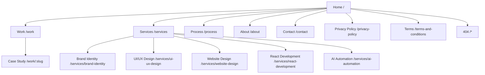
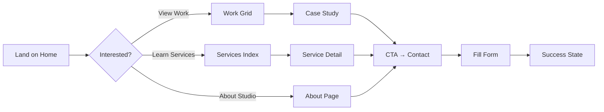
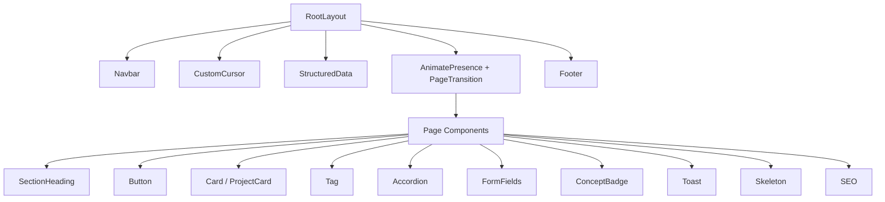
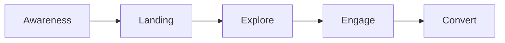
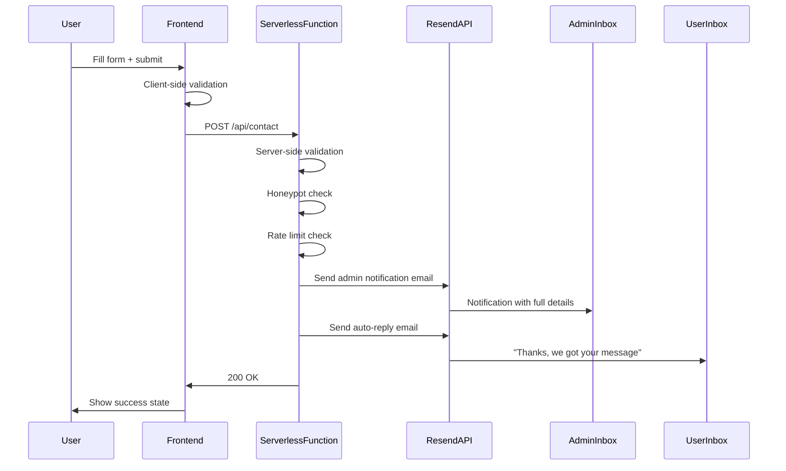

# Taksha — Official Website
## Product Requirements Document (PRD)

**Document Type:** Master Product Requirements Document
**Product:** Taksha Digital Craft Studio — Official Website (MVP)
**Version:** 2.0
**Status:** Final for Engineering Handoff
**Prepared For:** Design, Frontend Engineering, SEO, and Content Teams
**Prepared By:** Product, UX Strategy, Brand, and Technical Architecture (Combined PRD)

---

## Table of Contents

1. [Brand Foundation](#1-brand-foundation)
2. [Website Goals & Strategy](#2-website-goals--strategy)
3. [Information Architecture](#3-information-architecture)
4. [Tech Stack & Architecture](#4-tech-stack--architecture)
5. [Design System](#5-design-system)
6. [Motion System](#6-motion-system)
7. [Global Components](#7-global-components)
8. [Home Page](#8-home-page)
9. [Work Page](#9-work-page)
10. [Case Study Template](#10-case-study-template)
11. [Concept Projects](#11-concept-projects)
12. [Services Pages](#12-services-pages)
13. [Process Page](#13-process-page)
14. [About Page](#14-about-page)
15. [Contact Page](#15-contact-page)
16. [404 Page](#16-404-page)
17. [Legal Pages](#17-legal-pages)
18. [Email Integration](#18-email-integration)
19. [SEO Strategy](#19-seo-strategy)
20. [Accessibility](#20-accessibility)
21. [Performance](#21-performance)
22. [Security](#22-security)
23. [Analytics](#23-analytics)
24. [Deliverables & Checklists](#24-deliverables--checklists)
25. [Future Roadmap](#25-future-roadmap)
26. [Appendix](#26-appendix)

---

## 1. Brand Foundation

### 1.1 Brand Name

**Taksha**

### 1.2 Brand Etymology

Taksha comes from the Sanskrit word **"Takṣ" (तक्ष्)**, meaning:

- To carve
- To shape
- To craft
- To build
- To create with precision

The name embodies the studio's philosophy: every pixel, every line of code, every interaction is deliberately carved — not assembled from templates, not rushed to production, but shaped with the same intention a master craftsman brings to their work.

### 1.3 Brand Definition

Taksha is a **premium Digital Craft Studio** that transforms ideas into meaningful digital experiences through branding, design, engineering, and AI.

### 1.4 Tagline

**Crafting Digital Excellence.**

### 1.5 Mission

To help ambitious businesses communicate their value through thoughtful digital experiences that are beautifully designed, technically excellent, and built to last.

### 1.6 Vision

To become one of the world's most respected Digital Craft Studios — known for timeless design and precision engineering.

### 1.7 Purpose

Technology becomes meaningful only when crafted with intention.

### 1.8 Core Values

| Value | Definition |
|---|---|
| **Craftsmanship** | We treat every project as a craft — no shortcuts, no templates, no compromises. |
| **Precision** | Every detail is deliberate. Every pixel, every interaction, every line of code. |
| **Simplicity** | We remove complexity to reveal clarity. Less, but better. |
| **Honesty** | We show real work. We set real expectations. We communicate transparently. |
| **Curiosity** | We explore new techniques, new tools, new thinking — and bring them to our craft. |
| **Excellence** | We don't ship "good enough." We ship work we're proud of. |

### 1.9 Brand Personality

| Trait | Expression |
|---|---|
| Premium | High-quality materials, considered typography, generous white space |
| Minimal | Clean interfaces, no visual noise, purposeful elements only |
| Elegant | Refined color palette, fluid motion, sophisticated layout |
| Confident | Bold statements, clear value propositions, decisive CTAs |
| Warm | Approachable tone, human language, welcoming interactions |
| Modern | Current design patterns, contemporary tools, forward-thinking |
| Reliable | Consistent experience, predictable navigation, stable performance |
| Purposeful | Every element justifies its existence — nothing decorative for decoration's sake |
| Creative | Unexpected details, subtle delight, distinctive visual identity |
| Technical | Code-aware copy, engineering credibility, performance-conscious |
| Timeless | Avoids trends that age poorly — classic proportions, enduring aesthetics |

### 1.10 Brand Positioning

> **Taksha is NOT a web development agency.**
> **Taksha is a Digital Craft Studio.**

We combine branding, design, engineering, and AI to create digital experiences businesses are proud to own.

**Positioning Statement:** For ambitious businesses that need a digital presence worthy of their ambition, Taksha is the Digital Craft Studio that crafts every detail with intention — unlike agencies that optimize for speed and volume, Taksha optimizes for quality and longevity.

### 1.11 Brand Colors

| Token | Value | Usage |
|---|---|---|
| `--color-bg` | `#FAF9F6` | Page background |
| `--color-surface` | `#FFFFFF` | Cards, panels, elevated surfaces |
| `--color-surface-translucent` | `rgba(250,249,246,0.95)` | Navbar on scroll, overlays |
| `--color-ink` | `#000000` | Primary text, headings, borders |
| `--color-text-primary` | `#000000` | Body text, primary content |
| `--color-text-secondary` | `#333333` | Supporting text, captions |
| `--color-text-tertiary` | `#666666` | Timestamps, labels, disabled |
| `--color-border` | `#000000` | Default borders, dividers |
| `--color-border-strong` | `#000000` | Emphasized borders |
| `--color-accent` | `#FFC107` | Primary accent — bright yellow |
| `--color-accent-hover` | `#FFB300` | Hover state for accent |
| `--color-accent-soft` | `#FFECB3` | Accent backgrounds, subtle highlights |
| `--color-card-mint` | `#A7E4D0` | Card background pastel |
| `--color-card-lilac` | `#C4B5FD` | Card background pastel |
| `--color-card-yellow` | `#FDE68A` | Card background pastel |
| `--color-card-blue` | `#93C5FD` | Card background pastel |

### 1.12 Brand Logo

The Taksha logo mark is a geometric, stylized **"T"** composed of:

1. **Three dark navy segments** separated by two diagonal white cuts — creating a sense of precision, sharpness, and craftsmanship
2. **One amber/yellow accent triangle** in the upper-right notch — representing the creative spark, the golden ratio of craft

The diagonal cuts reference the Sanskrit meaning "to carve" — the mark itself looks carved from a solid block.

**Logo files:**
- `/public/taksha-logo-mark.svg` — Icon mark only (the T)
- `/public/favicon.svg` — Favicon version

**Usage rules:**
- The mark must always appear alongside the wordmark "Taksha" in the Navbar and Footer
- Minimum size: 24×24px for the mark
- The amber accent triangle must always use `--color-accent`
- The navy segments use `currentColor` to adapt to theme

### 1.13 Services Offered

| Service | Sub-Services |
|---|---|
| **Brand Identity** | Logo Design, Visual Identity, Brand Systems, Brand Guidelines |
| **UI/UX Design** | UI Design, UX Design, Dashboard Design, Design Systems |
| **Website Design** | Website Design, Landing Pages, Responsive Design |
| **React Development** | Website Development, Frontend Engineering, Performance Optimization |
| **AI Automation** | AI Chatbots, Workflow Automation, Business Automation, AI Integration |

### 1.14 Target Audience

| Segment | Description |
|---|---|
| Startups & Founders | Early-stage companies needing a premium launch presence |
| Creative Businesses | Studios, agencies, freelancers who value design quality |
| Healthcare | Clinics, practices, health-tech that need trust-building design |
| Restaurants & Hotels | Hospitality businesses seeking sophisticated digital presence |
| Education | Schools, e-learning platforms, educational institutions |
| Real Estate | Property developers, agencies, luxury real estate |
| SaaS | Software companies needing polished product marketing sites |
| Creators | Content creators, personal brands, portfolio sites |
| Premium Local Businesses | Established local businesses ready for a digital upgrade |

### 1.15 Non-Negotiable Brand Truth

> **Taksha is a completely new studio.**

There are:
- ❌ NO real clients yet
- ❌ NO real testimonials
- ❌ NO awards
- ❌ NO case studies from real clients

**Rules:**
- DO NOT fabricate any clients
- DO NOT invent testimonials
- DO NOT create fake reviews
- DO NOT fabricate metrics or business outcomes

**Instead, position the portfolio as:**
- ✅ Studio Originals
- ✅ Concept Projects
- ✅ Self-Initiated Explorations
- ✅ Design Experiments

The website celebrates transparency. This is a strength, not a weakness.

---

## 2. Website Goals & Strategy

### 2.1 Primary Goals

| Priority | Goal | Success Metric |
|---|---|---|
| P0 | Establish trust and credibility | Time on site > 2 min, bounce rate < 55% |
| P0 | Showcase craftsmanship through concept work | Projects viewed per session > 2 |
| P0 | Generate qualified project inquiries | > 5 qualified leads/month by month 6 |
| P1 | Demonstrate technical excellence | Lighthouse score > 95, WCAG 2.2 AA compliant |
| P1 | Rank for target keywords over time | Indexed pages > 20, impressions growth MoM |
| P2 | Educate visitors on the studio's process | Process page visits, scroll depth > 75% |

### 2.2 Design Principles for the Website

1. **Quality over quantity** — Fewer elements, each exceptional
2. **Show, don't tell** — Let the work speak; avoid marketing superlatives
3. **Earned credibility** — Transparent about being new; confident in the craft
4. **Performance is a feature** — Fast load times are non-negotiable
5. **Accessible by default** — WCAG 2.2 AA is the floor, not the ceiling

### 2.3 Content Strategy

| Content Type | Approach |
|---|---|
| Headlines | Bold, concise, benefit-driven. No jargon. |
| Body copy | Warm, professional, human. Second person ("you") when addressing clients. |
| CTAs | Action-oriented, specific. "Start a Project" not "Submit". |
| Project descriptions | Honest about being concept work. Rich in design rationale. |
| Micro-copy | Helpful, specific, conversational. Error messages should guide, not blame. |

---

## 3. Information Architecture

### 3.1 Site Map



### 3.2 Navigation Map

**Primary Navigation (Navbar):**

| Label | Path | Notes |
|---|---|---|
| Work | `/work` | Portfolio grid |
| Services | `/services` | Services index |
| Process | `/process` | Methodology timeline |
| About | `/about` | Studio story |
| Start a Project | `/contact` | Primary CTA button |

**Footer Navigation:**

| Column | Links |
|---|---|
| **Sitemap** | Home, Work, Process, About, Contact |
| **Services** | Brand Identity, UI/UX Design, Website Design, React Development, AI Automation |
| **Legal** | Privacy Policy, Terms & Conditions |

### 3.3 User Flows



### 3.4 Page Hierarchy

| Level | Page | Template |
|---|---|---|
| L0 | Home | Unique — editorial sections |
| L1 | Work | Grid layout |
| L1 | Services | Index + detail pages |
| L1 | Process | Timeline layout |
| L1 | About | Editorial layout |
| L1 | Contact | Form layout |
| L2 | Case Study | Reusable template |
| L2 | Service Detail | Reusable template |
| L3 | Privacy Policy | Legal layout |
| L3 | Terms & Conditions | Legal layout |
| L3 | 404 | Centered message |

---

## 4. Tech Stack & Architecture

### 4.1 Core Stack

| Technology | Version | Purpose |
|---|---|---|
| React | 19 | UI framework |
| Vite | Latest | Build tool, dev server, HMR |
| React Router | v7 | Client-side routing |
| Framer Motion | Latest | Declarative animations, page transitions, layout animations |
| GSAP | Latest | Scroll-triggered animations, complex timelines |
| Lenis | Latest | Smooth scroll (synced with GSAP ScrollTrigger) |
| Lucide React | Latest | Icon library (no brand icons — use custom SVGs for social) |
| Plain CSS | — | Styling (NO Tailwind, NO Bootstrap, NO UI libraries) |

### 4.2 Explicitly Excluded

- ❌ Tailwind CSS
- ❌ Bootstrap
- ❌ Material UI / Chakra / Ant Design / any UI component library
- ❌ Styled Components / Emotion / CSS-in-JS
- ❌ TypeScript (MVP is JavaScript only)

### 4.3 Folder Structure

```
taksha-website/
├── public/
│   ├── favicon.svg
│   ├── taksha-logo-mark.svg
│   ├── robots.txt
│   ├── sitemap.xml
│   └── og-image.jpg
├── src/
│   ├── components/
│   │   ├── Accordion/
│   │   │   ├── Accordion.jsx
│   │   │   └── Accordion.css
│   │   ├── Button/
│   │   │   ├── Button.jsx
│   │   │   └── Button.css
│   │   ├── Card/
│   │   │   ├── Card.jsx
│   │   │   └── Card.css
│   │   ├── ConceptBadge/
│   │   │   ├── ConceptBadge.jsx
│   │   │   └── ConceptBadge.css
│   │   ├── CustomCursor/
│   │   │   ├── CustomCursor.jsx
│   │   │   └── CustomCursor.css
│   │   ├── Footer/
│   │   │   ├── Footer.jsx
│   │   │   └── Footer.css
│   │   ├── FormFields/
│   │   │   ├── Input.jsx
│   │   │   ├── Textarea.jsx
│   │   │   ├── Select.jsx
│   │   │   └── FormFields.css
│   │   ├── Navbar/
│   │   │   ├── Navbar.jsx
│   │   │   └── Navbar.css
│   │   ├── PageTransition/
│   │   │   ├── PageTransition.jsx
│   │   │   └── PageTransition.css
│   │   ├── ProjectCard/
│   │   │   ├── ProjectCard.jsx
│   │   │   └── ProjectCard.css
│   │   ├── SEO/
│   │   │   └── SEO.jsx
│   │   ├── SectionHeading/
│   │   │   ├── SectionHeading.jsx
│   │   │   └── SectionHeading.css
│   │   ├── Skeleton/
│   │   │   ├── Skeleton.jsx
│   │   │   └── Skeleton.css
│   │   ├── StructuredData/
│   │   │   └── StructuredData.jsx
│   │   ├── Tag/
│   │   │   ├── Tag.jsx
│   │   │   └── Tag.css
│   │   └── Toast/
│   │       ├── Toast.jsx
│   │       └── Toast.css
│   ├── content/
│   │   ├── projects/
│   │   │   ├── taksha.js
│   │   │   ├── novacare.js
│   │   │   ├── flowos.js
│   │   │   ├── vertex-atelier.js
│   │   │   ├── aure-home.js
│   │   │   ├── skyline-realty.js
│   │   │   ├── finora.js
│   │   │   ├── aaranya.js
│   │   │   └── ember-and-oak.js
│   │   └── services.js
│   ├── context/
│   │   ├── ThemeProvider.jsx
│   │   └── MotionPreferenceContext.jsx
│   ├── layouts/
│   │   ├── RootLayout.jsx
│   │   └── LegalPageLayout.jsx
│   ├── pages/
│   │   ├── Home.jsx
│   │   ├── Home.css
│   │   ├── Work.jsx
│   │   ├── Work.css
│   │   ├── CaseStudy.jsx
│   │   ├── CaseStudy.css
│   │   ├── ServicesIndex.jsx
│   │   ├── ServicesIndex.css
│   │   ├── ServiceDetail.jsx
│   │   ├── ServiceDetail.css
│   │   ├── Process.jsx
│   │   ├── Process.css
│   │   ├── About.jsx
│   │   ├── About.css
│   │   ├── Contact.jsx
│   │   ├── Contact.css
│   │   ├── NotFound.jsx
│   │   ├── NotFound.css
│   │   ├── PrivacyPolicy.jsx
│   │   └── Terms.jsx
│   ├── styles/
│   │   ├── tokens.css
│   │   ├── reset.css
│   │   ├── typography.css
│   │   └── global.css
│   ├── utils/
│   │   └── helpers.js
│   ├── App.jsx
│   ├── main.jsx
│   └── router.jsx
├── index.html
├── vite.config.js
├── package.json
└── README.md
```

### 4.4 Routing Architecture

All page components are loaded via `React.lazy()` for route-based code splitting.

```jsx
// src/router.jsx
import { lazy, Suspense } from 'react';
import { createBrowserRouter } from 'react-router-dom';
import RootLayout from './layouts/RootLayout';

const Home = lazy(() => import('./pages/Home'));
const Work = lazy(() => import('./pages/Work'));
const CaseStudy = lazy(() => import('./pages/CaseStudy'));
const ServicesIndex = lazy(() => import('./pages/ServicesIndex'));
const ServiceDetail = lazy(() => import('./pages/ServiceDetail'));
const Process = lazy(() => import('./pages/Process'));
const About = lazy(() => import('./pages/About'));
const Contact = lazy(() => import('./pages/Contact'));
const PrivacyPolicy = lazy(() => import('./pages/PrivacyPolicy'));
const Terms = lazy(() => import('./pages/Terms'));
const NotFound = lazy(() => import('./pages/NotFound'));

function SuspenseWrapper({ children }) {
  return (
    <Suspense fallback={<div className="page-loading" />}>
      {children}
    </Suspense>
  );
}

export const router = createBrowserRouter([
  {
    element: <RootLayout />,
    children: [
      { path: "/", element: <SuspenseWrapper><Home /></SuspenseWrapper> },
      { path: "/work", element: <SuspenseWrapper><Work /></SuspenseWrapper> },
      { path: "/work/:slug", element: <SuspenseWrapper><CaseStudy /></SuspenseWrapper> },
      { path: "/services", element: <SuspenseWrapper><ServicesIndex /></SuspenseWrapper> },
      { path: "/services/:slug", element: <SuspenseWrapper><ServiceDetail /></SuspenseWrapper> },
      { path: "/process", element: <SuspenseWrapper><Process /></SuspenseWrapper> },
      { path: "/about", element: <SuspenseWrapper><About /></SuspenseWrapper> },
      { path: "/contact", element: <SuspenseWrapper><Contact /></SuspenseWrapper> },
      { path: "/privacy-policy", element: <SuspenseWrapper><PrivacyPolicy /></SuspenseWrapper> },
      { path: "/terms-and-conditions", element: <SuspenseWrapper><Terms /></SuspenseWrapper> },
      { path: "*", element: <SuspenseWrapper><NotFound /></SuspenseWrapper> },
    ],
  },
]);
```

### 4.5 Component Architecture



---

## 5. Design System

### 5.1 Color Tokens

See [Section 1.11](#111-brand-colors) for the complete color token table. All colors are defined as CSS custom properties in `src/styles/tokens.css` under `:root` (light) and `[data-theme="dark"]` (dark).

**Developer Note:** Never use raw hex values in component CSS. Always reference `var(--color-*)`. This ensures theme switching works automatically.

### 5.2 Typography Scale

| Token | Size | Px Equiv | Usage |
|---|---|---|---|
| `--text-xs` | `0.75rem` | 12px | Labels, captions, timestamps |
| `--text-sm` | `0.875rem` | 14px | Small body, nav links, form labels |
| `--text-base` | `1rem` | 16px | Default body text |
| `--text-md` | `1.125rem` | 18px | Lead paragraphs, callouts |
| `--text-lg` | `1.375rem` | 22px | Section subtitles |
| `--text-xl` | `1.75rem` | 28px | Card titles, h4 |
| `--text-2xl` | `2.25rem` | 36px | Section headings, h3 |
| `--text-3xl` | `3rem` | 48px | Page titles, h2 |
| `--text-4xl` | `4rem` | 64px | Hero headline (mobile) |
| `--text-5xl` | `5.5rem` | 88px | Hero headline (desktop only) |

**Font Stack:**

| Role | Stack | Weight Range |
|---|---|---|
| Display / Headings | `"Fraunces", Georgia, serif` | 400–700 |
| Body / UI | `"Inter", -apple-system, BlinkMacSystemFont, sans-serif` | 400–600 |
| Mono / Code | `"JetBrains Mono", "Fira Code", monospace` | 400–500 |

**Line Heights:**

| Token | Value | Usage |
|---|---|---|
| `--line-height-tight` | `1.1` | Large headings |
| `--line-height-snug` | `1.3` | Sub-headings, card titles |
| `--line-height-normal` | `1.6` | Body text |
| `--line-height-relaxed` | `1.8` | Long-form content, legal pages |

**Letter Spacing:**

| Token | Value | Usage |
|---|---|---|
| `--tracking-tight` | `-0.02em` | Headings |
| `--tracking-normal` | `0em` | Body text |
| `--tracking-wide` | `0.04em` | Eyebrow labels, all-caps text |

### 5.3 Spacing System

Based on an 8px grid:

| Token | Value | Px |
|---|---|---|
| `--space-1` | `0.25rem` | 4px |
| `--space-2` | `0.5rem` | 8px |
| `--space-3` | `0.75rem` | 12px |
| `--space-4` | `1rem` | 16px |
| `--space-6` | `1.5rem` | 24px |
| `--space-8` | `2rem` | 32px |
| `--space-12` | `3rem` | 48px |
| `--space-16` | `4rem` | 64px |
| `--space-24` | `6rem` | 96px |
| `--space-32` | `8rem` | 128px |
| `--space-48` | `12rem` | 192px |

### 5.4 Grid System

| Token | Value |
|---|---|
| `--container-max` | `1440px` |
| `--container-padding-desktop` | `5vw` |
| `--container-padding-mobile` | `24px` |
| `--grid-columns` | `12` |
| `--grid-gap` | `24px` |

**Container class:**

```css
.container {
  max-width: var(--container-max);
  margin-inline: auto;
  padding-inline: var(--container-padding-mobile);
}

@media (min-width: 1024px) {
  .container {
    padding-inline: var(--container-padding-desktop);
  }
}
```

### 5.5 Breakpoints

| Name | Min-width | Usage |
|---|---|---|
| `sm` | `640px` | Large phones, small tablets |
| `md` | `768px` | Tablets |
| `lg` | `1024px` | Desktop |
| `xl` | `1280px` | Large desktop |
| `2xl` | `1536px` | Ultra-wide |

**Developer Note:** Use mobile-first CSS. Base styles are mobile. Add `@media (min-width: ...)` for larger screens.

### 5.6 Elevation & Shadows

| Token | Value | Usage |
|---|---|---|
| `--shadow-sm` | `2px 2px 0 0 #000000` | Subtle lift — cards at rest |
| `--shadow-md` | `4px 4px 0 0 #000000` | Card hover, buttons |
| `--shadow-lg` | `8px 8px 0 0 #000000` | Modals, mobile menu |
| `--shadow-focus` | `0 0 0 4px #000000` | Focus rings |

### 5.7 Border Radius

| Token | Value | Usage |
|---|---|---|
| `--radius-sm` | `0px` | Tags, small badges (sharp for neo-brutalism) |
| `--radius-md` | `0px` | Inputs, small cards |
| `--radius-lg` | `0px` | Cards, modals, panels |
| `--radius-xl` | `0px` | Feature cards, hero elements |
| `--radius-full` | `999px` | Pill buttons, avatars |

### 5.8 Component Specifications

#### 5.8.1 Button

**Variants:**

| Variant | Background | Text | Border | Usage |
|---|---|---|---|---|
| `primary` | `--color-accent` | `#0F172A` (dark text on amber) | none | Primary CTAs |
| `secondary` | transparent | `--color-text-primary` | `1px solid --color-border` | Secondary actions |
| `ghost` | transparent | `--color-text-secondary` | none | Tertiary actions |

**Sizes:**

| Size | Padding | Font Size |
|---|---|---|
| `sm` | `8px 16px` | `--text-sm` |
| `md` | `12px 24px` | `--text-sm` |
| `lg` | `16px 32px` | `--text-base` |

**States:** Default → Hover (scale 1.02, shadow-md) → Active (scale 0.98) → Disabled (opacity 0.5, cursor not-allowed) → Focus (shadow-focus ring)

**Props:**

```jsx
<Button
  variant="primary|secondary|ghost"
  size="sm|md|lg"
  to="/path"           // renders as <Link>
  href="https://..."   // renders as <a>
  onClick={handler}    // renders as <button>
  disabled={boolean}
  icon={<LucideIcon />}
  className=""
>
  Label
</Button>
```

#### 5.8.2 Card

A reusable surface component with optional image, content area, and actions.

**Props:** `variant` (default | outlined | elevated), `padding` (sm | md | lg), `as` (article | div | section)

**CSS:**

```css
.card {
  background: var(--color-surface);
  border: 1px solid var(--color-border);
  border-radius: var(--radius-lg);
  overflow: hidden;
  transition: transform 300ms var(--ease-out-quart),
              box-shadow 300ms var(--ease-out-quart);
}

.card:hover {
  transform: translateY(-4px);
  box-shadow: var(--shadow-md);
}
```

#### 5.8.3 ProjectCard

Specialized card for project thumbnails on the Work page and Home featured section.

**Layout:** Image (aspect-ratio 4/3) → Title → Category tags → ConceptBadge

**Hover:** Image scales to 1.05 within its overflow-hidden container. Title underline animates in.

**Props:** `project` (object with slug, title, subtitle, thumbnail, categories), `index` (for stagger delay)

#### 5.8.4 SectionHeading

Reusable component for section introductions.

**Props:** `eyebrow` (string, uppercase monospace label), `title` (string, large heading), `subtitle` (string, secondary text), `align` (left | center), `as` (h1 | h2 | h3)

**Layout:**

```
[Eyebrow — small caps, accent color, tracking-wide]
[Title — display font, tight line-height]
[Subtitle — body font, secondary color, max-width 600px]
```

#### 5.8.5 ConceptBadge

A small inline badge that labels a project as concept work.

**Copy:** `Studio Original` or `Concept Project`

**Style:** Monospace font, `--text-xs`, `--color-accent` text, `--color-accent-soft` background, pill border-radius, padding `4px 12px`.

#### 5.8.6 Tag / FilterPill

**Tag:** Static label. Used in project cards for categories.

**FilterPill:** Interactive. Used in Work page filter bar. Has active/inactive states.

**Active state:** `--color-accent` background, dark text.
**Inactive state:** transparent background, `--color-border` border, secondary text.

#### 5.8.7 Accordion

Animated expand/collapse for FAQs.

**Props:** `items` (array of `{ title, content }` or `{ question, answer }`)

**Behavior:**
- Single-open mode (opening one closes the previous)
- Click outside: does not close (only clicking the trigger toggles)
- Chevron icon rotates 180° on open
- Content animates with Framer Motion `height: "auto"` transition

#### 5.8.8 Form Fields (Input, Textarea, Select)

**Shared styling:**

```css
/* All form inputs */
padding: var(--space-3) var(--space-4);
background: var(--color-bg);
border: 1px solid var(--color-border);
border-radius: var(--radius-md);
color: var(--color-text-primary);
font-family: inherit;
font-size: var(--text-base);
transition: border-color 200ms ease, box-shadow 200ms ease;
```

**Focus:** `border-color: var(--color-accent)`, `box-shadow: var(--shadow-focus)`

**Error:** `border-color: var(--color-error)`, `border-left: 4px solid var(--color-error)`

**Error message:** `--text-xs`, `--color-error`, appears below the field with a slide-down animation.

#### 5.8.9 Toast

Non-blocking notification.

**Variants:** `success` (green), `error` (red), `info` (accent)

**Behavior:** Appears at bottom-right, auto-dismisses after 5s, has a close button. Animates in from below.

#### 5.8.10 Skeleton

Loading placeholder matching the shape of actual content.

**Style:** `--color-border` background with a shimmer animation (gradient sweep from left to right, 1.5s loop).

---

## 6. Motion System

### 6.1 Motion Philosophy

| Principle | Description |
|---|---|
| **Reveal** | Elements emerge as the user scrolls — nothing is visible until earned |
| **Refine** | Animations are subtle and short — they polish, never distract |
| **Shape** | Motion gives form to transitions — guiding the eye between states |
| **Assemble** | Staggered animations build layouts piece by piece — establishing hierarchy |

### 6.2 Motion Tokens

| Token | Value | Usage |
|---|---|---|
| `--ease-out-quart` | `cubic-bezier(0.25, 1, 0.5, 1)` | Primary ease for enters |
| `--ease-in-out-quart` | `cubic-bezier(0.76, 0, 0.24, 1)` | Symmetrical transitions |
| `--ease-out-expo` | `cubic-bezier(0.16, 1, 0.3, 1)` | Dramatic reveals |
| `--duration-fast` | `150ms` | Hovers, toggles, micro-interactions |
| `--duration-base` | `300ms` | Standard transitions |
| `--duration-slow` | `500ms` | Section reveals, page transitions |
| `--duration-slower` | `800ms` | Hero animations, complex sequences |
| `--stagger-tight` | `40ms` | Tight list stagger |
| `--stagger-base` | `80ms` | Standard stagger |
| `--stagger-loose` | `120ms` | Dramatic stagger |

### 6.3 Animation Specifications

#### 6.3.1 Scroll Reveal (Framer Motion)

```jsx
const fadeUp = {
  hidden: { opacity: 0, y: 24 },
  visible: {
    opacity: 1,
    y: 0,
    transition: { duration: 0.5, ease: [0.25, 1, 0.5, 1] }
  }
};

// Usage
<motion.div
  variants={fadeUp}
  initial="hidden"
  whileInView="visible"
  viewport={{ once: true, margin: "-80px" }}
>
```

#### 6.3.2 Staggered Children

```jsx
const staggerContainer = {
  hidden: {},
  visible: {
    transition: { staggerChildren: 0.08 }
  }
};

const staggerChild = {
  hidden: { opacity: 0, y: 20 },
  visible: { opacity: 1, y: 0, transition: { duration: 0.4 } }
};
```

#### 6.3.3 Page Transition

Handled in `RootLayout.jsx` via `AnimatePresence`:

```jsx
const pageTransition = {
  initial: { opacity: 0, y: 16 },
  animate: { opacity: 1, y: 0, transition: { duration: 0.3, ease: [0.25, 1, 0.5, 1] } },
  exit: { opacity: 0, y: -16, transition: { duration: 0.2, ease: [0.76, 0, 0.24, 1] } },
};
```

#### 6.3.4 Hero Headline

GSAP SplitText-style animation (or manual span wrapping):
- Each word fades up individually with stagger
- Duration: 800ms per word, stagger: 80ms
- Ease: `power4.out`

#### 6.3.5 Card Hover

```css
.card {
  transition: transform 300ms var(--ease-out-quart),
              box-shadow 300ms var(--ease-out-quart);
}
.card:hover {
  transform: translateY(-4px);
  box-shadow: var(--shadow-md);
}
.card__image {
  transition: transform 500ms var(--ease-out-quart);
}
.card:hover .card__image {
  transform: scale(1.05);
}
```

#### 6.3.6 Button Hover

```css
.btn {
  transition: transform 150ms ease, box-shadow 150ms ease, background-color 150ms ease;
}
.btn:hover {
  transform: translateY(-1px) scale(1.02);
  box-shadow: var(--shadow-md);
}
.btn:active {
  transform: scale(0.98);
}
```

#### 6.3.7 Navbar Scroll State

CSS transition on `background-color`, `backdrop-filter`, and `box-shadow`:
- Transparent → blurred surface when `scrollY > 80px`
- Duration: `--duration-base` (300ms)

#### 6.3.8 Custom Cursor

- Only on `pointer: fine` devices (desktop with mouse)
- Spring-based position tracking (Framer Motion `useSpring`)
- Expands on hover over interactive elements (links, buttons)
- Uses `mix-blend-mode: difference` for visibility on any background

#### 6.3.9 Skeleton Shimmer

```css
@keyframes shimmer {
  0% { background-position: -200% 0; }
  100% { background-position: 200% 0; }
}
.skeleton {
  background: linear-gradient(90deg, var(--color-border) 25%, var(--color-surface) 50%, var(--color-border) 75%);
  background-size: 200% 100%;
  animation: shimmer 1.5s ease-in-out infinite;
}
```

#### 6.3.10 Reduced Motion

All animations must respect `prefers-reduced-motion: reduce`:

```jsx
// MotionPreferenceContext.jsx
const prefersReducedMotion = window.matchMedia('(prefers-reduced-motion: reduce)').matches;

// In RootLayout — skip Lenis, use instant page transitions
// In components — set duration: 0 or skip animation entirely
```

---

## 7. Global Components

### 7.1 Navbar

**Behavior:**
- **Position:** Fixed top, z-index 1000
- **Default state:** Transparent background (blends with hero)
- **Scrolled state:** Solid surface background with blur and subtle shadow (triggered at `scrollY > 80px`)
- **Mobile:** Hamburger icon at 1024px breakpoint → compact dropdown menu (not full-screen overlay)

**Layout:**

```
┌─────────────────────────────────────────────────────────┐
│ [Logo Mark + "Taksha"]    [Work] [Services] [Process] [About]    [☀/🌙] [Start a Project] │
└─────────────────────────────────────────────────────────┘
```

**Logo:** `` + "Taksha" wordmark (display font)

**Active Route Indicator:** Animated underline via Framer Motion `layoutId`

**Theme Toggle:** Sun/Moon icon swap with rotate animation (Framer Motion `AnimatePresence`)

**Mobile Menu:**
- Compact dropdown positioned top-right (width: 220px)
- Click outside (backdrop) closes the menu
- Escape key closes the menu
- Body scroll locked while open
- Links have hover highlight with accent-soft background

**Accessibility:**
- `aria-label="Primary"` on `<nav>`
- `aria-expanded` on hamburger
- `aria-controls="mobile-menu"` linking hamburger to menu
- Skip link before navbar: `<a href="#main-content" className="skip-link">Skip to content</a>`

### 7.2 Footer

**Layout:** 4-column grid (brand, sitemap, services, contact) → 2-column on tablet → single-column on mobile.

**Column 1 — Brand:**
- Logo mark + "Taksha"
- Tagline: "Crafting Digital Excellence."
- Mission blurb
- Social links: LinkedIn, Instagram, X/Twitter (custom SVG icons — NOT from lucide-react, which removed brand icons)

**Column 2 — Sitemap:** Home, Work, Process, About, Contact

**Column 3 — Services:** Brand Identity, UI/UX Design, Website Design, React Development, AI Automation

**Column 4 — Contact:**
- Email: `hello@taksha.studio`
- CTA button: "Start a Project" → `/contact`
- "We reply within 1–2 business days."

**Bottom Bar:**
- `© {year} Taksha. All rights reserved.`
- Privacy Policy | Terms & Conditions

**Animation:** Each column fades up with stagger on scroll into view.

### 7.3 SEO Component

Uses `react-helmet-async` to inject per-page `<head>` metadata.

**Props:**

```jsx
<SEO
  title="Page Title — Taksha"
  description="Page description (150-160 chars)"
  canonical="/path"
  ogImage="/og-image.jpg"
  ogType="website"
  noIndex={false}
/>
```

**Output:**
```html
<title>Page Title — Taksha</title>
<meta name="description" content="..." />
<link rel="canonical" href="https://taksha.studio/path" />
<meta property="og:title" content="..." />
<meta property="og:description" content="..." />
<meta property="og:image" content="..." />
<meta property="og:url" content="..." />
<meta property="og:type" content="website" />
<meta name="twitter:card" content="summary_large_image" />
<meta name="twitter:title" content="..." />
<meta name="twitter:description" content="..." />
<meta name="twitter:image" content="..." />
```

### 7.4 StructuredData Component

Injects JSON-LD `<script>` tags.

**Schemas:**

```jsx
// Organization (sitewide, in RootLayout)
export function organizationSchema() {
  return {
    "@context": "https://schema.org",
    "@type": "Organization",
    name: "Taksha",
    url: "https://taksha.studio",
    logo: "https://taksha.studio/taksha-logo-mark.svg",
    description: "Premium Digital Craft Studio...",
    contactPoint: {
      "@type": "ContactPoint",
      email: "hello@taksha.studio",
      contactType: "sales",
    },
    sameAs: [
      "https://www.linkedin.com/company/taksha",
      "https://www.instagram.com/taksha.studio",
      "https://twitter.com/taksha_studio"
    ]
  };
}

// FAQ (for service detail pages)
export function faqSchema(faqs) { ... }

// Breadcrumb (for nested pages)
export function breadcrumbSchema(items) { ... }
```

---

## 8. Home Page

**Route:** `/`
**SEO Title:** `Taksha — Digital Craft Studio | Crafting Digital Excellence`
**SEO Description:** `Taksha is a premium Digital Craft Studio that combines branding, design, engineering, and AI to create digital experiences businesses are proud to own.`

### 8.1 Hero Section

**Purpose:** Instant emotional impact. Communicate what Taksha is in under 3 seconds.

**Layout:**
```
[Full viewport height section]

                [Eyebrow — monospace, accent, tracking-wide]
                   DIGITAL CRAFT STUDIO

              [Headline — display, text-5xl desktop / text-4xl mobile]
              We carve ideas into
              digital experiences.

              [Subtitle — body, text-lg, secondary color, max-width 540px]
              Branding, design, engineering, and AI —
              shaped with intention, built to last.

              [CTA Group]
              [Start a Project — primary]   [View Our Work — secondary]
```

**Animations:**
1. Eyebrow fades in (opacity 0→1, y 20→0, delay 0ms)
2. Headline words animate in one by one (stagger 80ms, y 40→0, opacity 0→1)
3. Subtitle fades up (delay 400ms)
4. Buttons fade up together (delay 600ms)

**Responsive:**
- Desktop: centered, generous padding (space-48 top)
- Mobile: left-aligned, reduced padding (space-24 top), text-4xl headline

**Accessibility:**
- Headline is `<h1>`
- CTA buttons have descriptive text (no "Click here")
- Animations respect `prefers-reduced-motion`

### 8.2 Craft Philosophy Section

**Purpose:** Differentiate from agencies. Establish the "craft" positioning.

**Eyebrow:** `Our Philosophy`
**Heading:** `A new studio. An honest one.`
**Body:**

> We're not a factory. We don't churn out websites on an assembly line.
>
> Every project begins with understanding — your brand, your audience, your ambition. Then we carve. Pixel by pixel. Line by line. Until what emerges isn't just a website, but a digital experience that communicates who you are.
>
> No fabricated clients. No invented testimonials. Just real craft, transparent process, and work we're genuinely proud to show.

**Layout:** Text-heavy, editorial style. Max-width 680px, centered. Optional decorative accent line divider above/below.

**Animation:** Paragraph lines fade up as user scrolls into view.

### 8.3 Featured Projects Section

**Purpose:** Showcase the best 3–4 concept projects as proof of craft.

**Eyebrow:** `Selected Work`
**Heading:** `Studio Originals`
**Subtitle:** `Self-initiated explorations in branding, design, and engineering.`

**Layout:** Asymmetric grid — large card (span 2 cols) + two smaller cards. All link to their case study pages.

**Each card contains:**
- Project thumbnail (aspect 4/3)
- Project title
- Category tags
- `ConceptBadge` ("Studio Original")

**Hover:** Image scale 1.05, subtle shadow lift, title underline.

**CTA at bottom:** `View All Projects →` links to `/work`

**Animation:** Cards stagger in from bottom (80ms stagger).

### 8.4 Services Overview Section

**Purpose:** Give visitors a clear map of what Taksha offers.

**Eyebrow:** `What We Do`
**Heading:** `Five crafts. One studio.`

**Layout:** 5-column grid (desktop) → 2-col (tablet) → 1-col (mobile). Each service is a card:

| Service | Icon | Short Description |
|---|---|---|
| Brand Identity | `Palette` | Logo, visual identity, and brand systems that make businesses unmistakable. |
| UI/UX Design | `Layout` | Interfaces designed around real people — intuitive, beautiful, and purposeful. |
| Website Design | `Monitor` | Pixel-perfect websites that communicate your value at first glance. |
| React Development | `Code` | Fast, accessible, production-grade frontends — built to last. |
| AI Automation | `Bot` | Chatbots, workflows, and intelligent integrations that save time and scale effort. |

**Each card links to:** `/services/{slug}`

**Animation:** Cards stagger in on scroll.

### 8.5 Process Preview Section

**Purpose:** Build confidence by showing a structured methodology.

**Eyebrow:** `How We Work`
**Heading:** `Precision has a process.`

**Layout:** Horizontal scrolling strip of 4 key stages (abbreviated from the full 10 on the Process page):

1. **Discover** — We listen, research, and understand before anything else.
2. **Design** — Strategy becomes structure. Structure becomes interface.
3. **Develop** — Clean code, fast load times, accessible to everyone.
4. **Deliver** — Launch-ready, thoroughly tested, and built to grow with you.

**CTA:** `See Our Full Process →` links to `/process`

**Animation:** Cards slide in from right as user scrolls.

### 8.6 Why Taksha Section

**Purpose:** Handle objections. Address the "why a new studio?" question head-on.

**Eyebrow:** `Why Taksha`
**Heading:** `New doesn't mean inexperienced.`

**Layout:** 2-column — left column has the heading/body, right column has a grid of value propositions:

| Value | Description |
|---|---|
| **Craft Over Volume** | We take fewer projects and give each one everything. |
| **Transparent Pricing** | No surprises. You'll know the cost before we start. |
| **Modern Stack** | React 19, Vite, GSAP — built with tools that last. |
| **No Templates** | Every project is designed from scratch. Every line is custom. |
| **SEO Built In** | Structured data, Core Web Vitals, semantic HTML — from day one. |
| **AI-Ready** | We don't just build websites. We make them smarter. |

**Animation:** Left column fades up. Right column cards stagger in.

### 8.7 Brand Manifesto Section

**Purpose:** Emotional resonance. This is the "soul" of the page.

**Layout:** Full-width dark navy background, centered text, generous padding.

**Copy:**

> **We believe technology becomes meaningful only when crafted with intention.**
>
> In a world drowning in templates and quick fixes, we choose to carve.
> To shape every pixel with purpose. To write every line of code with care.
> To build digital experiences that don't just work — they endure.
>
> This is Taksha. This is what it means to craft digital excellence.

**Typography:** Display font, text-2xl, tight line-height, `--color-accent` for key words.

**Animation:** Text fades in on scroll. Key phrases ("crafted with intention", "craft digital excellence") highlight with accent color.

### 8.8 CTA Section

**Purpose:** Convert interested visitors into leads.

**Eyebrow:** `Ready?`
**Heading:** `Let's build something worth owning.`
**Subtitle:** `Tell us about your project. We'll tell you how we'd approach it.`

**CTA:** `Start a Project →` (primary button, links to `/contact`)

**Layout:** Centered, generous vertical padding (space-32), subtle background gradient.

**Animation:** Entire section fades up on scroll.

---

## 9. Work Page

**Route:** `/work`
**SEO Title:** `Our Work — Taksha | Studio Originals & Concept Projects`
**SEO Description:** `Explore Taksha's portfolio of self-initiated concept projects across branding, UI/UX design, website design, and React development.`

### 9.1 Hero

**Eyebrow:** `Portfolio`
**Heading:** `Work we're proud to show.`
**Subtitle:** `Every project here is a self-initiated Studio Original — concept work crafted to the same standard we bring to client engagements.`

### 9.2 Filter Bar

**Position:** Sticky below hero (sticks at top on scroll)

**Categories:**

| Filter | Slug |
|---|---|
| All | (default, no filter) |
| Branding | `branding` |
| UI/UX Design | `ui-ux` |
| Website Design | `website` |
| React Development | `react` |
| AI Automation | `ai` |

**Behavior:**
- URL query param: `/work?category=branding`
- Single-select (not multi)
- Active filter shows amber background
- Switching filters animates cards out (fade) then new set in (stagger)
- Framer Motion `AnimatePresence` + `layout` for smooth transitions

### 9.3 Project Grid

**Layout:**

| Viewport | Columns |
|---|---|
| Mobile (< 640px) | 1 column |
| Tablet (640–1023px) | 2 columns |
| Desktop (≥ 1024px) | 2 columns, alternating large/small (masonry-like) |

**Each ProjectCard:**
- Thumbnail image (aspect-ratio 4/3, overflow hidden)
- Project title (text-xl, display font)
- Subtitle/tagline (text-sm, secondary color)
- Category tags (Tag components)
- ConceptBadge ("Studio Original")
- Links to `/work/{slug}`

**Hover effects:**
- Image scales to 1.05 within overflow-hidden container
- Card lifts (`translateY(-4px)`)
- Shadow transitions from sm to md
- Title text gets an underline animation

### 9.4 Empty State

If a filter yields 0 results (unlikely with curated content, but defensive):

**Copy:** `No projects match this filter yet. We're always creating new work — check back soon.`

### 9.5 Future-Ready: Pagination

Current MVP shows all 9 projects. The grid component should accept a `projects` array prop so that pagination or "Load More" can be added later without restructuring.

### 9.6 Future-Ready: Search

Not in MVP. But the filter mechanism should use URL query params (`/work?q=search`) so a search input can be added later.

---

## 10. Case Study Template

**Route:** `/work/:slug`
**Purpose:** Deep-dive into a single project. This is where craftsmanship is proven.

### 10.1 Template Structure

Every case study page uses the same reusable template. Content is sourced from `src/content/projects/{slug}.js`.

### 10.2 Sections

#### 10.2.1 Hero

- **Project title** (h1, display, text-4xl)
- **Subtitle** — one-line project description
- **ConceptBadge** — "Studio Original" or "Concept Project"
- **Hero image** — full-width, aspect-ratio 16/9, with border-radius

#### 10.2.2 Overview

| Field | Content |
|---|---|
| **Client** | Self-initiated / Studio Project |
| **Timeline** | e.g. "4 weeks" |
| **Services** | e.g. "Brand Identity, UI/UX Design, Website Design" |
| **Industry** | e.g. "Healthcare" |
| **Year** | e.g. "2025" |

**Layout:** Horizontal stats row (4 columns desktop, 2 columns mobile), each with a label above and value below.

#### 10.2.3 Challenge

**Heading:** `The Challenge`

A 2–3 paragraph description of the problem space this concept project explores. Written in a way that demonstrates strategic thinking without fabricating a real client relationship.

**Important:** Copy must clearly frame this as an exploration:

> *"We identified [industry] as a space where digital experiences consistently fail to match the quality of the service being offered. This concept project explores how thoughtful design and engineering can close that gap."*

#### 10.2.4 Research & Discovery

**Heading:** `Research & Discovery`

- Competitive landscape observations (real research into the industry)
- User persona descriptions (archetypal, not fabricated from "interviews")
- Key insights that shaped design decisions

**Layout:** Text blocks with optional supporting imagery (mood boards, competitive screenshots — clearly labeled as reference material).

#### 10.2.5 User Journey

**Heading:** `User Journey`

A simplified user flow showing key touchpoints:



Text explanation of each stage.

#### 10.2.6 Wireframes

**Heading:** `Wireframes`

Low-fidelity wireframe images showing structural decisions before visual design.

**Layout:** 2-column grid of wireframe images with captions.

#### 10.2.7 Visual Language

**Heading:** `Visual Language`

Explains the design direction: why these colors, this typography, this mood.

#### 10.2.8 Typography

**Heading:** `Typography`

Display font + body font pairings, with specimen showing scale and weights used.

**Layout:** Side-by-side specimen blocks — one for the display font, one for the body font.

#### 10.2.9 Color Palette

**Heading:** `Color Palette`

Color swatches with hex values, organized by role (primary, secondary, accent, semantic).

**Layout:** Horizontal row of large swatches with labels beneath.

#### 10.2.10 Component Library

**Heading:** `Component Library`

Screenshots of key UI components designed for this project: buttons, cards, navigation, form fields.

**Layout:** Grid of component screenshots with labels.

#### 10.2.11 Responsive Screens

**Heading:** `Responsive Design`

Side-by-side desktop/tablet/mobile mockups showing responsive behavior.

**Layout:** 3-up comparison (desktop center, tablet and mobile flanking).

#### 10.2.12 Motion & Interaction

**Heading:** `Motion Design`

Description of the animation philosophy applied to this project. If video/gif assets exist, embed them.

#### 10.2.13 Accessibility Considerations

**Heading:** `Accessibility`

How WCAG 2.2 AA compliance was considered in this design: contrast ratios, keyboard navigation, screen reader support.

#### 10.2.14 Development Notes

**Heading:** `Development`

- Tech stack used/recommended for this concept
- Key implementation considerations
- Performance optimizations applied

#### 10.2.15 Performance

**Heading:** `Performance`

Lighthouse score targets, image optimization strategy, Core Web Vitals considerations.

#### 10.2.16 Lessons Learned

**Heading:** `Lessons & Reflections`

Honest reflections on what worked, what was challenging, and what would be done differently. This reinforces the "honest studio" brand.

#### 10.2.17 Next Project CTA

**Layout:** Full-width row with next/previous project navigation.

```
← Previous: [Project Name]                    Next: [Project Name] →
```

### 10.3 Important Content Rules

Every case study page MUST prominently display:

1. **ConceptBadge** — visible in the hero, never hidden
2. **"Studio Exploration" or "Concept Project"** — stated in the overview
3. **No fabricated business outcomes** — never write "Revenue increased 200%", "Conversion rate improved", or any fake metric
4. **Honest framing** — "This concept explores..." not "We helped [fake client] achieve..."

---

## 11. Concept Projects

### 11.1 Project: Taksha

| Field | Value |
|---|---|
| **Slug** | `taksha` |
| **Title** | Taksha — Digital Craft Studio |
| **Subtitle** | Our own brand identity and website |
| **Categories** | Branding, UI/UX Design, Website Design, React Development |
| **Industry** | Design Studio |
| **Timeline** | 6 weeks |

**Problem:** Most digital agency websites feel interchangeable — dark backgrounds, generic hero animations, stock photography, identical layouts. How do you build a studio website that actually practices what it preaches about craftsmanship?

**Audience:** Founders, startup teams, creative directors, and business owners evaluating studios for a digital project.

**Goal:** Create a website that serves as both portfolio and proof — every design decision, every interaction, every performance metric should demonstrate the quality of work the studio produces.

**Design Thinking:**
- Typography-first design: the type does the talking, not flashy graphics
- Motion with purpose: animations that reveal content, never that delay it
- Performance as a design feature: sub-second loads feel premium
- Honest positioning: embrace being new rather than pretending otherwise

**Color System:**
- Primary: Navy (#0F172A) — sophistication, depth, trust
- Accent: Amber (#F59E0B) — warmth, craft, the golden detail
- Neutrals: Slate scale — professional without being cold
- Dark mode: Deep navy (#0B1120) with warmer amber (#FBBF24)

**Typography:**
- Display: Fraunces — elegant, humanist serif with character
- Body: Inter — clean, highly legible, technically optimized
- Mono: JetBrains Mono — for code references and technical labels

**UI Highlights:**
- Custom cursor with mix-blend-mode difference
- Smooth scroll via Lenis
- Page transitions via Framer Motion AnimatePresence
- Scroll-triggered reveals with GSAP ScrollTrigger
- Theme toggle with animated sun/moon icons
- Compact mobile dropdown (not full-screen overlay)

**Features:** Dark/light theme, responsive grid, lazy-loaded routes, structured data SEO, honeypot spam protection on contact form, animated success states.

**Screens:** Home (8 sections), Work (filterable grid), Case Study (15+ section template), Services (index + 5 detail pages), Process (10-stage timeline), About (editorial), Contact (form with validation), 404, Privacy Policy, Terms.

**Technology:** React 19, Vite, React Router v7, Framer Motion, GSAP, Lenis, Plain CSS, Lucide React.

**Outcome:** A living portfolio that demonstrates every capability Taksha offers — designed, built, and maintained as the studio's flagship project.

---

### 11.2 Project: NovaCare

| Field | Value |
|---|---|
| **Slug** | `novacare` |
| **Title** | NovaCare |
| **Subtitle** | Reimagining the modern healthcare experience |
| **Categories** | Branding, UI/UX Design, Website Design |
| **Industry** | Healthcare |
| **Timeline** | 5 weeks |

**Problem:** Healthcare websites are notoriously clinical, cold, and difficult to navigate. Patients searching for care providers encounter walls of text, stock photography of smiling doctors, and booking flows that feel like filing taxes. This concept explores what healthcare digital experiences could feel like if designed with the same care the providers bring to their practice.

**Audience:** Patients aged 25–55 seeking primary care, specialist referrals, or wellness services. Secondary: practice administrators evaluating their digital presence.

**Goal:** Design a healthcare platform concept that feels warm, trustworthy, and efficient — proving that clinical doesn't have to mean cold.

**Design Thinking:**
- Warmth through rounded shapes and soft gradients
- Trust through clear hierarchy and medical credibility indicators
- Efficiency through streamlined booking flows (3 steps max)
- Accessibility as a first-class concern (healthcare audience includes users with disabilities)

**Color System:**
- Primary: Teal (#0D9488) — healing, calm, medical professionalism
- Secondary: Warm white (#FFFBEB) — softness, approachability
- Accent: Coral (#F97316) — warmth, call-to-action urgency
- Neutrals: Warm grays

**Typography:**
- Display: Plus Jakarta Sans — friendly, modern, trustworthy
- Body: DM Sans — clean, readable, professional

**UI Highlights:**
- Animated doctor availability indicators
- 3-step booking flow with progress indicator
- Symptom checker with conversational UI
- Patient testimonial carousel (labeled as "sample content")
- Responsive dashboard view for patient portal concept

**Features:** Appointment booking flow, doctor profiles, service listings, patient portal concept, accessibility-first form design, mobile-responsive dashboard.

**Screens:** Landing page, Doctor profile, Booking flow (3 steps), Patient dashboard, Service detail, Mobile views.

**Technology:** React, Framer Motion, responsive CSS grid, form validation, skeleton loading states.

**Outcome:** A concept that demonstrates how healthcare brands can differentiate through design quality while maintaining the trust and clarity patients need.

---

### 11.3 Project: FlowOS

| Field | Value |
|---|---|
| **Slug** | `flowos` |
| **Title** | FlowOS |
| **Subtitle** | A productivity workspace designed for focus |
| **Categories** | UI/UX Design, Website Design, React Development |
| **Industry** | SaaS / Productivity |
| **Timeline** | 4 weeks |

**Problem:** Productivity tools promise to simplify work but often add complexity. Dashboards become cluttered. Features compete for attention. The tool meant to reduce cognitive load ends up increasing it. This concept explores a productivity interface built around the principle of progressive disclosure — showing only what matters, when it matters.

**Audience:** Knowledge workers, remote teams, project managers who feel overwhelmed by existing tools.

**Goal:** Design a SaaS landing page and product interface concept that feels calm, focused, and empowering.

**Design Thinking:**
- Progressive disclosure: features reveal themselves contextually
- Calm design: muted tones, generous white space, minimal borders
- Focus mode: a mode that strips away everything except the current task
- Keyboard-first: power users should never need a mouse

**Color System:**
- Primary: Deep indigo (#312E81) — focus, depth, intelligence
- Surface: Near-white (#FAFAFA) — cleanliness, space
- Accent: Electric violet (#7C3AED) — creativity, energy
- Neutrals: Cool grays

**Typography:**
- Display: Outfit — geometric, modern, tech-forward
- Body: Inter — versatile, highly legible at small sizes
- Mono: JetBrains Mono — for code blocks and data

**UI Highlights:**
- Animated task completion with confetti micro-interaction
- Kanban board with drag-and-drop visual design
- Focus mode toggle that dims everything except the active card
- Dark/light theme with smooth transition
- Command palette (⌘K) concept

**Features:** SaaS landing page, product dashboard concept, Kanban view, List view, Calendar view, Focus mode, Command palette, Settings panel.

**Screens:** Marketing landing page, Dashboard, Kanban board, Task detail, Focus mode, Settings, Mobile responsive.

**Technology:** React, CSS Grid/Flexbox, Framer Motion, dark theme support.

**Outcome:** A concept demonstrating Taksha's ability to design complex SaaS interfaces that feel simple.

---

### 11.4 Project: Vertex Atelier

| Field | Value |
|---|---|
| **Slug** | `vertex-atelier` |
| **Title** | Vertex Atelier |
| **Subtitle** | A fashion brand built on geometric precision |
| **Categories** | Branding, Website Design |
| **Industry** | Fashion / Luxury |
| **Timeline** | 3 weeks |

**Problem:** Emerging fashion brands often default to either high-contrast editorial layouts (copying established houses) or generic Shopify templates (losing brand identity entirely). This concept explores how a new fashion brand can establish a distinctive visual identity from day one — geometric, structured, and confident.

**Audience:** Fashion-conscious consumers aged 22–40 who value design-forward brands and sustainable practices.

**Goal:** Create a complete brand identity and e-commerce landing page concept for a fictional geometric fashion label.

**Design Thinking:**
- Geometry as brand language: angular shapes, grid-based layouts, precise alignments
- Monochrome foundation with accent color restraint
- Editorial photography direction (mocked via carefully selected stock)
- Typography as architecture — type placements that feel structural

**Color System:**
- Primary: Pure black (#000000) — boldness, luxury
- Secondary: Ivory (#F5F5F0) — warmth, sophistication
- Accent: Gold (#C5A047) — premium, selective highlighting
- Neutrals: Warm grays

**Typography:**
- Display: Monument Extended — bold, geometric, statement-making
- Body: Neue Haas Grotesk / Helvetica Neue — timeless, clean

**UI Highlights:**
- Full-bleed hero with overlay typography
- Horizontal scrolling product showcase
- Product detail with image zoom interaction
- Editorial lookbook layout
- Shopping cart slide-out panel concept

**Features:** Brand identity system, e-commerce landing, product grid, product detail, lookbook page, cart interaction.

**Screens:** Home, Collection grid, Product detail, Lookbook, About the brand, Cart, Mobile views.

**Technology:** React, CSS Grid, Framer Motion, horizontal scroll.

**Outcome:** A concept that proves Taksha can craft luxury-tier brand experiences from logo to landing page.

---

### 11.5 Project: Aure Home

| Field | Value |
|---|---|
| **Slug** | `aure-home` |
| **Title** | Aure Home |
| **Subtitle** | Scandinavian-inspired interior design studio |
| **Categories** | Branding, UI/UX Design, Website Design |
| **Industry** | Interior Design / Home |
| **Timeline** | 4 weeks |

**Problem:** Interior design studios often rely on Instagram as their primary portfolio platform, losing control over presentation, SEO, and lead generation. This concept explores a dedicated web presence for a design studio that feels as curated as the spaces they create.

**Audience:** Homeowners aged 30–55 interested in high-end interior design services, primarily in urban areas.

**Goal:** Design a portfolio website for a fictional Scandinavian-inspired interior design studio that captures the calm, considered aesthetic of their work.

**Design Thinking:**
- The website should feel like walking through a well-designed space
- Generous white space mimics the "breathing room" of Scandinavian design
- Photography is king: large, immersive project images
- Minimal navigation — let the work flow naturally

**Color System:**
- Primary: Warm sand (#D4C5A9) — natural, organic, warm
- Background: Off-white (#FEFCF6) — clean, spacious
- Accent: Forest green (#2D5A3D) — natural, grounding
- Text: Charcoal (#333333)

**Typography:**
- Display: Cormorant Garamond — elegant, classic, refined
- Body: Lora — readable serif with warmth

**UI Highlights:**
- Full-screen project image galleries with smooth transitions
- Before/after slider for renovation projects
- Room-by-room navigation within a project
- Subtle parallax on hero images
- "Book a Consultation" floating CTA

**Features:** Project portfolio, individual project galleries, before/after comparisons, about page, consultation booking concept, Instagram feed integration concept.

**Screens:** Home, Project gallery, Project detail, About, Contact, Mobile views.

**Technology:** React, CSS Grid, Framer Motion, intersection observer.

**Outcome:** A concept that demonstrates Taksha's ability to create immersive, image-driven portfolio experiences.

---

### 11.6 Project: Skyline Realty

| Field | Value |
|---|---|
| **Slug** | `skyline-realty` |
| **Title** | Skyline Realty |
| **Subtitle** | Luxury real estate, elevated digitally |
| **Categories** | UI/UX Design, Website Design, React Development |
| **Industry** | Real Estate |
| **Timeline** | 5 weeks |

**Problem:** Luxury real estate websites frequently feel dated — busy layouts, auto-playing video backgrounds, tiny property thumbnails, and search interfaces that haven't evolved since 2010. This concept reimagines the luxury property browsing experience for a digital-first generation of buyers.

**Audience:** High-net-worth individuals and investors aged 30–60 searching for premium properties.

**Goal:** Design a luxury real estate platform concept that matches the quality of the properties it showcases.

**Design Thinking:**
- Property images deserve cinematic presentation
- Search should feel like browsing, not filtering a spreadsheet
- Map integration is essential but should enhance, not dominate
- Virtual tour integration concept (3D walkthrough placeholder)

**Color System:**
- Primary: Deep navy (#1A1A2E) — luxury, trust, authority
- Surface: Pearl (#F5F3EE) — elegance, lightness
- Accent: Gold (#C9A84C) — luxury, premium
- Neutrals: Warm silvers

**Typography:**
- Display: Playfair Display — luxury, editorial, serif elegance
- Body: Source Sans Pro — clean, professional, readable

**UI Highlights:**
- Cinematic property hero with ken-burns effect
- Interactive property map with hover previews
- Property comparison tool concept
- Mortgage calculator widget
- Virtual tour placeholder with 360° icon
- Agent profile cards

**Features:** Property listings, property detail with gallery, interactive map concept, search with filters, mortgage calculator, agent profiles, contact form.

**Screens:** Home, Property listings, Property detail, Map view, Agent profile, Contact, Mobile views.

**Technology:** React, CSS Grid, Framer Motion, map placeholder, responsive images.

**Outcome:** A concept that demonstrates Taksha's capability in data-rich, visually sophisticated applications.

---

### 11.7 Project: Finora

| Field | Value |
|---|---|
| **Slug** | `finora` |
| **Title** | Finora |
| **Subtitle** | Personal finance made personal |
| **Categories** | UI/UX Design, Website Design |
| **Industry** | FinTech |
| **Timeline** | 4 weeks |

**Problem:** Personal finance apps either oversimplify (hiding important data) or overwhelm (showing every metric at once). This concept explores a middle ground — a financial dashboard that respects the user's intelligence while maintaining visual clarity.

**Audience:** Young professionals aged 25–40 who want better visibility into their spending, saving, and investment habits.

**Goal:** Design a fintech landing page and dashboard concept that makes financial data feel approachable, not intimidating.

**Design Thinking:**
- Data visualization as communication, not decoration
- Color-coded categories that are both beautiful and functional
- Actionable insights over raw numbers
- Privacy-conscious design (blur/hide sensitive amounts)

**Color System:**
- Primary: Deep teal (#134E4A) — stability, trust, growth
- Background: Slate (#0F172A) — modern, professional, dark-mode native
- Accent: Emerald (#10B981) — growth, positive momentum
- Alert: Amber (#F59E0B) — attention without alarm
- Negative: Rose (#F43F5E) — losses, alerts

**Typography:**
- Display: Space Grotesk — modern, geometric, tech-forward
- Body: Inter — clarity at all sizes
- Mono: JetBrains Mono — for financial figures

**UI Highlights:**
- Animated donut chart for spending breakdown
- Sparkline mini-charts in summary cards
- Slide-up transaction detail panel
- Budget progress bars with threshold warnings
- Savings goal tracker with milestone celebrations

**Features:** Marketing landing page, dashboard overview, spending breakdown, investment portfolio view, savings goals, transaction history, settings.

**Screens:** Landing page, Dashboard, Spending, Investments, Savings goals, Transaction detail, Mobile views.

**Technology:** React, SVG charts (custom, not a library), CSS Grid, Framer Motion.

**Outcome:** A concept proving Taksha can design data-dense interfaces that feel intuitive.

---

### 11.8 Project: Aaranya

| Field | Value |
|---|---|
| **Slug** | `aaranya` |
| **Title** | Aaranya |
| **Subtitle** | Boutique eco-resort in the Western Ghats |
| **Categories** | Branding, Website Design |
| **Industry** | Hospitality / Travel |
| **Timeline** | 3 weeks |

**Problem:** Eco-resorts and boutique hotels often have websites that feel generic — the same template layouts, the same stock imagery of infinity pools, the same booking widgets. A truly distinctive property deserves a website that captures its sense of place. This concept reimagines the digital presence of a fictional eco-resort nestled in the Western Ghats of India.

**Audience:** Travelers aged 28–50 seeking premium, nature-immersive escapes. Urban professionals looking for restorative getaways.

**Goal:** Create a brand identity and website concept that makes visitors feel the tranquility of the property before they arrive.

**Design Thinking:**
- The website should feel like the first breath of forest air
- Slow, intentional scrolling — no rushing through content
- Sound design concept (ambient forest sounds — optional, user-initiated)
- Seasonal content: the same property transforms across monsoon, winter, summer

**Color System:**
- Primary: Forest green (#1B4332) — nature, depth, serenity
- Secondary: Warm cream (#FAF3E0) — earth, warmth, natural fibers
- Accent: Terracotta (#C2703E) — earth, warmth, handcrafted
- Neutrals: Natural tones

**Typography:**
- Display: Cormorant — elegant, classic, evoking traditional hospitality
- Body: Lato — friendly, readable, approachable

**UI Highlights:**
- Full-screen hero with ambient video concept (nature footage)
- Horizontal scrolling room gallery
- Interactive trail/activity map concept
- Seasonal photo switcher (toggle between monsoon/winter/summer views)
- Booking inquiry form with date picker concept

**Features:** Landing page, room types, dining concept, experiences/activities, gallery, sustainability story, booking inquiry.

**Screens:** Home, Rooms, Dining, Experiences, Gallery, About, Booking, Mobile views.

**Technology:** React, CSS Grid, Framer Motion, intersection observer, responsive images.

**Outcome:** A concept demonstrating Taksha's ability to create immersive, emotion-driven brand experiences.

---

### 11.9 Project: Ember & Oak

| Field | Value |
|---|---|
| **Slug** | `ember-and-oak` |
| **Title** | Ember & Oak |
| **Subtitle** | Farm-to-table restaurant with fire-roasted craft |
| **Categories** | Branding, Website Design |
| **Industry** | Restaurant / Food & Beverage |
| **Timeline** | 3 weeks |

**Problem:** Restaurant websites are some of the worst on the internet — auto-playing music, PDF menus, Flash-era animations, and impossible-to-find hours. Diners deserve better. This concept explores what a restaurant website looks like when designed with the same care the chef puts into their food.

**Audience:** Local foodies aged 25–50, couples looking for date-night restaurants, food enthusiasts who research before dining.

**Goal:** Design a restaurant brand identity and website that reflects the warmth of fire-roasted cooking and the honesty of farm-to-table sourcing.

**Design Thinking:**
- Warmth: the website should feel like sitting by a fireplace
- Photography-forward: food photography is the primary design element
- Information hierarchy: hours, location, menu, and reservation — accessible in 2 clicks
- No PDF menus — ever

**Color System:**
- Primary: Charcoal (#2C2C2C) — smoke, char, grounded
- Secondary: Warm amber (#D4A843) — fire, warmth, oak
- Accent: Deep red (#8B2500) — ember, warmth, appetite
- Background: Cream (#FDF6EC) — natural, warm, inviting

**Typography:**
- Display: Playfair Display — editorial, appetizing, premium
- Body: Source Serif Pro — readable, warm, complements Playfair

**UI Highlights:**
- Full-screen hero with food photography and subtle smoke overlay
- HTML menu with beautiful typographic hierarchy (NOT a PDF)
- Reservation widget concept with date/time/party size
- Chef's story section with editorial layout
- Instagram feed integration concept
- "Today's Specials" dynamic section concept

**Features:** Landing page, HTML menu, chef's story, farm partners, private events, reservation concept, location/hours, gallery.

**Screens:** Home, Menu, Story, Events, Gallery, Contact/Reservation, Mobile views.

**Technology:** React, CSS Grid, Framer Motion, responsive typography.

**Outcome:** A concept that proves restaurant websites can be beautiful, fast, and functional — all at once.

---

## 12. Services Pages

### 12.1 Services Index Page

**Route:** `/services`
**SEO Title:** `Services — Taksha | Digital Craft Studio`

**Layout:**
- Hero with eyebrow/heading/subtitle
- 5 service cards in a vertical list, each linking to its detail page
- Each card: icon + title + short description + "Learn More →" link
- Alternating layout: odd cards have image right, even cards have image left

### 12.2 Service Detail Template

**Route:** `/services/:slug`

Each service detail page contains:

| Section | Content |
|---|---|
| **Hero** | Service title, subtitle, icon |
| **Overview** | 2–3 paragraphs explaining the service |
| **Ideal Clients** | Who this service is for |
| **Deliverables** | Bulleted list of what the client receives |
| **Timeline** | Typical project duration range |
| **Process** | How this specific service flows (abbreviated) |
| **FAQ** | 5–7 common questions (Accordion component) |
| **CTA** | "Start a Project" linking to `/contact?service={slug}` |

### 12.3 Brand Identity Service

**Slug:** `brand-identity`
**Title:** Brand Identity
**Subtitle:** The foundation every business needs but few invest in properly.

**Overview:**
Your brand is more than a logo. It's the system of visual and verbal cues that tells people who you are before you say a word. We design brand identities that are distinctive, consistent, and built to scale — from a single logo to a complete brand system.

**Ideal Clients:**
- Startups launching a new product or company
- Established businesses undergoing a rebrand
- Founders who've outgrown their DIY logo
- Companies expanding into new markets

**Deliverables:**
- Logo design (primary, secondary, icon versions)
- Color palette with usage guidelines
- Typography system (primary and secondary fonts)
- Visual identity elements (patterns, textures, graphic devices)
- Brand guidelines document (PDF)
- Social media profile assets
- Business card and letterhead design

**Timeline:** 3–5 weeks

**FAQ:**
1. **What if I already have a logo but need a full identity?** — We can work with your existing logo and build a comprehensive identity system around it, or recommend refinements to the logo if needed.
2. **How many logo concepts will I see?** — We present 2–3 refined directions, not 20 rough sketches. Each concept is fully developed and presented in context.
3. **Do you design logos for print and digital?** — Yes. Every logo is designed for both screen and print, and delivered in all necessary formats (SVG, PNG, PDF, EPS).
4. **What is a brand system?** — A brand system extends beyond the logo to include color, typography, imagery, layout patterns, and voice — everything needed to ensure consistency across every touchpoint.
5. **Can you help with naming?** — Brand naming is not our core service, but we can recommend naming partners or collaborate on naming if included in scope.

---

### 12.4 UI/UX Design Service

**Slug:** `ui-ux-design`
**Title:** UI/UX Design
**Subtitle:** Interfaces designed around real people — intuitive, beautiful, and purposeful.

**Overview:**
Great design isn't about making things look good — it's about making things work well and feel right. We design user interfaces grounded in research, structured by information architecture, and refined through iteration. The result: digital experiences that users understand intuitively and enjoy using.

**Ideal Clients:**
- SaaS companies building or redesigning a product
- Startups validating a product concept through design
- Businesses migrating complex workflows to digital
- Companies with existing products that feel outdated or confusing

**Deliverables:**
- User research synthesis and persona development
- Information architecture and user flows
- Low-fidelity wireframes
- High-fidelity UI design (Figma)
- Interactive prototype
- Design system / component library
- Developer handoff documentation
- Usability testing support

**Timeline:** 4–8 weeks (depending on scope)

**FAQ:**
1. **What's the difference between UI and UX?** — UX (User Experience) focuses on how something works — flows, structure, logic. UI (User Interface) focuses on how it looks — colors, typography, spacing. We do both because they're inseparable.
2. **Do you conduct user research?** — For concept projects, we conduct desk research and competitive analysis. For client projects, we can conduct interviews, surveys, and usability testing.
3. **What tools do you use?** — Figma for design and prototyping. FigJam for workshops. We deliver organized, well-documented Figma files with developer-ready specifications.
4. **Can you design dashboards?** — Yes. Data-rich, complex dashboards are one of our strengths. See our FlowOS and Finora concept projects.
5. **Do you design mobile apps?** — Our current focus is web-based interfaces. We design responsive web applications that work beautifully on mobile, but native iOS/Android app design is not in our current scope.

---

### 12.5 Website Design Service

**Slug:** `website-design`
**Title:** Website Design
**Subtitle:** Pixel-perfect websites that communicate your value at first glance.

**Overview:**
Your website is often the first impression someone has of your business. We design websites that make that impression count — through purposeful layout, deliberate typography, and the kind of attention to detail that separates a good website from a great one.

**Ideal Clients:**
- Businesses needing a new marketing website
- Companies redesigning an outdated site
- Startups needing a launch landing page
- Agencies looking for a white-label design partner

**Deliverables:**
- Complete website design in Figma
- Responsive designs for desktop, tablet, and mobile
- Design system with reusable components
- Micro-interaction specifications
- Content layout and hierarchy recommendations
- Image art direction and specifications
- SEO structure recommendations
- Developer handoff documentation

**Timeline:** 3–6 weeks

**FAQ:**
1. **How many pages are included?** — This depends on your project scope. A typical website includes 5–10 unique page designs plus responsive variants.
2. **Do you write content?** — We provide content structure, hierarchy recommendations, and sample copy direction. For final copy, we recommend working with a professional copywriter (we can recommend partners).
3. **What about stock photography?** — We provide art direction and can source stock photography. For the best results, we recommend professional photography.
4. **Do you design e-commerce?** — We design e-commerce landing pages and product detail pages. For full storefront design, contact us to discuss scope.
5. **Can I see the design before development?** — Absolutely. You'll review and approve designs in Figma before any development begins.

---

### 12.6 React Development Service

**Slug:** `react-development`
**Title:** React Development
**Subtitle:** Fast, accessible, production-grade frontends — built to last.

**Overview:**
Design without development is just a picture. We build what we design — and sometimes what others have designed — using React, the most adopted frontend framework in the industry. Our code is clean, performant, accessible, and maintainable. No shortcuts.

**Ideal Clients:**
- Businesses with approved designs that need implementation
- Startups needing a design-to-code partner
- Companies with existing React codebases needing improvement
- Agencies outsourcing frontend development

**Deliverables:**
- Production-ready React application
- Component library implementation
- Responsive CSS (no Tailwind/Bootstrap)
- Animation implementation (Framer Motion / GSAP)
- SEO implementation (metadata, structured data, sitemap)
- Performance optimization (Lighthouse 95+)
- Accessibility compliance (WCAG 2.2 AA)
- Deployment setup (Vercel / Netlify)
- Documentation and maintenance guide

**Timeline:** 4–8 weeks

**FAQ:**
1. **What stack do you use?** — React 19, Vite, React Router, Framer Motion, GSAP, plain CSS. We avoid UI component libraries and CSS frameworks to ensure unique, lightweight results.
2. **Do you work with TypeScript?** — We can work with TypeScript for client projects. Our concept projects use JavaScript for speed.
3. **Can you work with existing codebases?** — Yes. We can audit, refactor, or extend existing React projects.
4. **What about CMS integration?** — We can integrate with headless CMS platforms (Sanity, Contentful, Strapi) for content management. This is discussed during the discovery phase.
5. **Do you handle hosting and deployment?** — We set up deployment pipelines on Vercel or Netlify and provide documentation for ongoing maintenance.
6. **What Lighthouse score can I expect?** — We target 95+ across Performance, Accessibility, Best Practices, and SEO. This is a measurable deliverable, not a vague promise.

---

### 12.7 AI Automation Service

**Slug:** `ai-automation`
**Title:** AI Automation
**Subtitle:** Smarter workflows, instant answers, less busywork.

**Overview:**
AI isn't magic — it's engineering applied intelligently. We build chatbots that actually help, automate workflows that actually save time, and integrate AI into business processes where it genuinely adds value. No buzzwords. No "revolutionary AI solutions." Just practical automation that works.

**Ideal Clients:**
- Businesses drowning in repetitive manual tasks
- Companies wanting to offer 24/7 customer support
- Startups wanting to scale without proportionally scaling headcount
- Businesses curious about AI but unsure where to start

**Deliverables:**
- AI readiness assessment
- Custom chatbot development (trained on your content)
- Workflow automation setup (Zapier, Make, custom)
- Business process automation
- AI integration with existing tools
- Documentation and training
- Ongoing optimization support

**Timeline:** 2–6 weeks (depending on complexity)

**FAQ:**
1. **What AI models do you work with?** — We integrate with OpenAI (GPT-4), Anthropic (Claude), and open-source models depending on the use case, privacy requirements, and budget.
2. **Can you train a chatbot on my specific content?** — Yes. We can create chatbots trained on your documentation, FAQs, and knowledge base using RAG (Retrieval-Augmented Generation) techniques.
3. **What about data privacy?** — We take data privacy seriously. We'll discuss data handling, storage, and processing requirements during discovery.
4. **Do I need technical knowledge?** — No. We handle the technical implementation and provide user-friendly interfaces for managing your AI tools.
5. **What's the ROI?** — We focus on measurable outcomes: hours saved, response time reduced, queries handled automatically. We'll define success metrics together before starting.

---

## 13. Process Page

**Route:** `/process`
**SEO Title:** `Our Process — Taksha | How We Work`
**SEO Description:** `Discover Taksha's 10-stage methodology for creating digital experiences — from discovery to ongoing support.`

### 13.1 Hero

**Eyebrow:** `How We Work`
**Heading:** `Precision has a process.`
**Subtitle:** `Great work isn't random. It's the result of a structured methodology, applied with care at every stage.`

### 13.2 Timeline

A vertical, animated timeline with 10 stages. Each stage has a number, title, description, and icon.

**Layout:** Alternating left-right on desktop, single-column on mobile. A vertical line connects all stages. Each stage node pulses with accent color as it enters the viewport.

| # | Stage | Description |
|---|---|---|
| 01 | **Discover** | We start by listening. Through structured conversations, questionnaires, and research, we build a deep understanding of your business, your audience, and your goals. This isn't a formality — it's the foundation everything else is built on. |
| 02 | **Define** | We translate what we've learned into clear project parameters: scope, timeline, deliverables, and success metrics. Both sides know exactly what we're building and why. |
| 03 | **Research** | We study your industry, your competitors, and your audience. What are others doing well? What are they missing? Where are the opportunities to differentiate? |
| 04 | **Strategy** | Research becomes direction. We define the information architecture, content strategy, and design direction that will guide every decision from here forward. |
| 05 | **Design** | Strategy becomes visual. We design in Figma — high-fidelity, responsive, and interactive. You'll see exactly how your project will look and feel before a single line of code is written. |
| 06 | **Prototype** | Key interactions and flows are prototyped for validation. This is where we catch usability issues early — when they're cheap to fix and before they become expensive code problems. |
| 07 | **Develop** | Approved designs become production-ready code. React, clean CSS, optimized performance, and accessibility baked in from the start — not bolted on at the end. |
| 08 | **Test** | Cross-browser testing, responsive testing, accessibility auditing, performance benchmarking. We test on real devices, not just browser simulators. |
| 09 | **Launch** | Deployment, DNS configuration, SSL, analytics setup, and a final round of QA. We don't launch and disappear — we monitor the first 48 hours closely. |
| 10 | **Support** | Post-launch support, performance monitoring, and iterative improvements. We're available for ongoing maintenance and feature additions. |

**Animation:**
- The timeline line draws downward as user scrolls (GSAP ScrollTrigger)
- Each stage node appears when it enters viewport with a fade-up + scale animation
- Stage numbers count up with a brief number animation

### 13.3 CTA

**Heading:** `Ready to start the process?`
**CTA:** `Start a Project →` links to `/contact`

---

## 14. About Page

**Route:** `/about`
**SEO Title:** `About — Taksha | Our Story`
**SEO Description:** `Taksha is a premium Digital Craft Studio that believes technology becomes meaningful only when crafted with intention. Learn our story.`

### 14.1 Hero

**Eyebrow:** `About`
**Heading:** `A studio built on craft.`
**Subtitle:** `Not speed. Not scale. Craft.`

### 14.2 Brand Story

**Heading:** `Why Taksha Exists`

> The digital world is full of noise. Templates, themes, page builders, AI generators — tools that make it faster than ever to create something mediocre.
>
> We built Taksha because we believe there's still a place for care. For the kind of work where every pixel is deliberate, every interaction is considered, and every line of code is clean.
>
> Taksha — from the Sanskrit "to carve" — is our commitment to craftsmanship in a world that's forgotten what the word means.

### 14.3 Founder Philosophy

**Heading:** `A Note from the Studio`

> We're new. We don't have a client list to drop or awards to display. What we have is work we're genuinely proud to show, a process that's been refined through practice, and an uncompromising standard for quality.
>
> We believe that showing concept work honestly is more credible than pretending to have clients we don't. Every project in our portfolio was designed and built with the same rigor we bring to paid engagements.
>
> If that resonates with you, we'd love to hear about your project.

### 14.4 Mission, Vision, Values

Repeat from [Section 1.5–1.8](#15-mission) with editorial layout — large type for the mission/vision statements, values in a grid.

### 14.5 What We Believe

A manifesto-style section with key beliefs:

1. **Technology is a craft.** Code is a creative medium. Design is an engineering discipline. The best digital experiences emerge when these worlds collaborate, not compete.

2. **Simplicity is the ultimate sophistication.** Every element must earn its place. We add nothing for decoration. We remove until only the essential remains.

3. **Honesty builds trust faster than perfection.** We'd rather show real concept work transparently than fabricate a client history.

4. **Details compound.** A better font pairing. A smoother animation. A faster load time. Individually small. Collectively, the difference between good and exceptional.

5. **Quality doesn't scale linearly.** We take fewer projects so each one gets the attention it deserves.

### 14.6 Future Vision

> Today, Taksha is a Digital Craft Studio. Tomorrow, we aim to be a reference point — proof that you can build a successful practice on quality, honesty, and craft. We're playing the long game.

### 14.7 CTA

**Heading:** `Want to work with a studio that cares?`
**CTA:** `Start a Project →`

---

## 15. Contact Page

**Route:** `/contact`
**SEO Title:** `Start a Project — Taksha`
**SEO Description:** `Tell us what you're building. Start a project with Taksha Digital Craft Studio.`

### 15.1 Hero

**Eyebrow:** `Start a Project`
**Heading:** `Tell us what you're building.`
**Subtitle:** `The more context you share, the better we can tell you how we'd approach it.`

### 15.2 Form Fields

| Field | Type | Required | Validation |
|---|---|---|---|
| Name | Text | Yes | 2–80 chars, letters/spaces/hyphens |
| Email | Email | Yes | RFC-valid email format |
| Company | Text | No | Max 100 chars |
| Budget | Select | Yes | Options: `Under $2,000` · `$2,000–$5,000` · `$5,000–$15,000` · `$15,000+` · `Not sure yet` |
| Project Details | Textarea | Yes | 20–2,000 chars |
| Timeline | Select | Yes | Options: `ASAP` · `Within 1 month` · `1–3 months` · `Flexible` |
| Service Required | Checkbox (multi) | Yes | Options: Brand Identity, UI/UX Design, Website Design, React Development, AI Automation, Not sure yet |

**Pre-fill support:** `Service Required` accepts a pre-selected value via `?service=` query param (linked from Service pages CTAs).

### 15.3 Buttons

- Primary submit: `Send Project Details`
- Disabled state while submitting: shows "Sending..." text
- No secondary button on this form

### 15.4 Validation Behavior

- Client-side validation on blur (per field) and on submit (full form)
- Inline error messages beneath each invalid field, red text (`--color-error`), paired with a red left-border on the field
- Submit button remains enabled but shows all errors on submit attempt

### 15.5 Success State

On successful submission: form is replaced with a success panel:
- Checkmark icon animation (accent color)
- Heading: `"Thanks — we've got it."`
- Body: `"We typically reply within 1–2 business days. In the meantime, feel free to explore our work."`
- Link: `View Our Work →` to `/work`

### 15.6 Error State

On submission failure (network/server error): form remains populated (no data loss), inline error toast:
`"Something went wrong sending your message. Please try again, or email us directly at hello@taksha.studio."` — includes a direct mailto fallback link.

### 15.7 Spam Protection

- **Honeypot field:** Hidden input (visually hidden, not `display:none`) that must remain empty; submissions with it filled are silently rejected
- **Rate limiting:** Server-side, max 3 submissions per IP per hour

---

## 16. 404 Page

**Route:** `*` (catch-all)
**SEO Title:** `Page Not Found — Taksha`

### 16.1 Content

- **Eyebrow:** `404`
- **Heading:** `This page doesn't exist.`
- **Body:** `You might have followed a broken link, or the page was moved. Either way, it's not here.`

### 16.2 Actions

- `Back to Home` (secondary button with ArrowLeft icon)
- `View Our Work` (primary button with Grid icon)

### 16.3 Layout

Centered vertically and horizontally in the viewport. Minimal, clean, on-brand. Animated entry (fade up).

---

## 17. Legal Pages

### 17.1 Privacy Policy

**Route:** `/privacy-policy`

Content covering: data collection, cookies, analytics, form submissions, third-party services, user rights, contact information.

### 17.2 Terms & Conditions

**Route:** `/terms-and-conditions`

Content covering: intellectual property, user content, concept work disclosure (portfolio items are Studio Originals unless marked otherwise), limitation of liability, governing law.

### 17.3 Legal Layout

Both pages share a `LegalPageLayout` component:
- Header with title and last-updated date
- Sidebar with navigation between legal pages (sticky on desktop)
- Main content area with proper typographic hierarchy (h2, h3, p, ul, ol, a)

---

## 18. Email Integration

### 18.1 Recommended Stack

| Component | Technology | Purpose |
|---|---|---|
| Email API | **Resend** | Sending transactional emails |
| Email Templates | **React Email** | Styled, responsive email templates |
| Submission Endpoint | **Vercel Function** or **Netlify Function** | Serverless API, keeps credentials server-side |
| Spam Protection | Honeypot + rate limiting | Basic bot prevention |

### 18.2 Submission Flow



### 18.3 Admin Notification Email

**Subject:** `New Project Inquiry from {name}`

**Body includes:** Name, email, company, budget, timeline, services, project details, submission timestamp.

### 18.4 Auto-Reply Email

**Subject:** `Thanks for reaching out — Taksha`

**Body:**

> Hi {name},
>
> Thanks for getting in touch. We've received your project details and we're excited to learn more.
>
> We typically respond within 1–2 business days. In the meantime, feel free to explore our work at taksha.studio/work.
>
> If your inquiry is urgent, reply directly to this email.
>
> — The Taksha Team

### 18.5 Validation (Server-Side)

All client-side validations repeated server-side:
- Name: 2–80 chars
- Email: RFC-valid
- Company: max 100 chars
- Budget: must be from allowed options
- Timeline: must be from allowed options
- Services: at least one selected, must be from allowed options
- Project Details: 20–2,000 chars
- Honeypot: must be empty

### 18.6 Rate Limiting

Max 3 submissions per IP per hour. Excess submissions return `429 Too Many Requests`.

---

## 19. SEO Strategy

### 19.1 Important Disclaimer

> **SEO improves discoverability over time. It cannot guarantee that the website will appear at the top of Google search results.** SEO is a long-term investment that compounds with consistent effort, quality content, and technical excellence. Rankings depend on many factors including competition, domain authority, content quality, and search algorithm updates.

### 19.2 Keyword Research

| Page | Primary Keyword | Secondary Keywords | Long-tail Keywords |
|---|---|---|---|
| Home | digital craft studio | premium web design studio, design engineering studio | custom website design for startups |
| Work | design portfolio | concept projects, studio originals | branding and website design portfolio |
| Services (Brand) | brand identity design | logo design, visual identity | brand identity design for startups |
| Services (UI/UX) | ui ux design services | dashboard design, user interface design | saas ui ux design agency |
| Services (Web) | website design services | landing page design, responsive design | custom website design react |
| Services (Dev) | react development | frontend engineering, react developer | react website development agency |
| Services (AI) | ai automation services | chatbot development, workflow automation | ai chatbot for small business |
| Process | design process | how we work, design methodology | web design development process |
| About | about digital studio | design studio story | premium design studio values |
| Contact | contact design studio | hire web designer, project inquiry | start a project with design studio |

### 19.3 Title Tag Templates

```
{Page Title} — Taksha | {Descriptor}
```

Examples:
- `Taksha — Digital Craft Studio | Crafting Digital Excellence`
- `Our Work — Taksha | Studio Originals & Concept Projects`
- `Brand Identity — Taksha | Logo & Visual Identity Design`

### 19.4 Meta Description Templates

150–160 characters. Includes primary keyword, value proposition, and call-to-action.

### 19.5 Open Graph & Twitter Cards

Every page includes:

```html
<meta property="og:title" content="{title}" />
<meta property="og:description" content="{description}" />
<meta property="og:image" content="https://taksha.studio/og-image.jpg" />
<meta property="og:url" content="https://taksha.studio{path}" />
<meta property="og:type" content="website" />
<meta property="og:site_name" content="Taksha" />

<meta name="twitter:card" content="summary_large_image" />
<meta name="twitter:title" content="{title}" />
<meta name="twitter:description" content="{description}" />
<meta name="twitter:image" content="https://taksha.studio/og-image.jpg" />
```

### 19.6 Canonical URLs

Every page must have a canonical URL:
```html
<link rel="canonical" href="https://taksha.studio{path}" />
```

### 19.7 robots.txt

```
User-agent: *
Allow: /

Sitemap: https://taksha.studio/sitemap.xml
```

### 19.8 sitemap.xml

Static sitemap including all public routes. Updated manually when new pages are added. Consider auto-generation in v1.1.

### 19.9 Schema.org Structured Data

| Schema | Page | Purpose |
|---|---|---|
| Organization | Sitewide (RootLayout) | Company information, social profiles |
| WebSite | Home | Site name, search action (future) |
| BreadcrumbList | All nested pages | Navigation hierarchy |
| FAQPage | Service detail pages | FAQ rich results |
| CreativeWork | Case study pages | Project metadata |

### 19.10 Image SEO

- All images must have descriptive `alt` text
- Format: WebP (with JPEG fallback) or optimized SVG
- Lazy loading for below-fold images: `loading="lazy"`
- Width/height attributes to prevent layout shift
- File names: descriptive, kebab-case (e.g., `novacare-dashboard-mobile.webp`)

### 19.11 Internal Linking Strategy

- Every case study links to related services
- Every service page links to related case studies
- Home page links to work, services, process, about, contact
- Footer provides comprehensive site navigation
- Breadcrumbs on nested pages

### 19.12 Core Web Vitals Targets

| Metric | Target | Strategy |
|---|---|---|
| LCP | < 2.5s | Preload hero images, optimize fonts, SSR-friendly structure |
| INP | < 200ms | Efficient event handlers, no layout thrashing |
| CLS | < 0.1 | Explicit image dimensions, font-display: swap, no injected content |

### 19.13 Analytics Setup

- **Google Search Console:** Verify ownership, submit sitemap, monitor indexing
- **Google Analytics 4:** Track page views, events, conversions
- **Microsoft Clarity:** Session recordings, heatmaps, rage clicks

### 19.14 Future Content Strategy

| Content Type | Platform | Frequency | Purpose |
|---|---|---|---|
| Blog articles | `/blog` (v1.1) | 2–4/month | SEO, thought leadership, keyword targeting |
| Case study updates | `/work` | As created | Portfolio growth, long-tail SEO |
| Studio journal | `/journal` (v2) | 1–2/month | Behind-the-scenes, process transparency |

---

## 20. Accessibility

### 20.1 Standard

**WCAG 2.2 Level AA** compliance across all pages.

### 20.2 Requirements

#### 20.2.1 Keyboard Navigation

- All interactive elements reachable via Tab key
- Logical tab order following visual layout
- Visible focus indicators on all focusable elements
- Skip link: `Skip to content` as first focusable element
- Escape key closes modals, mobile menu, dropdowns
- Arrow keys navigate within component groups (tabs, radio groups)

#### 20.2.2 Screen Readers

- Semantic HTML: `<nav>`, `<main>`, `<article>`, `<section>`, `<header>`, `<footer>`, `<aside>`
- All images have descriptive `alt` text (or `alt=""` for decorative)
- ARIA labels on icon-only buttons
- `aria-expanded` on toggles (hamburger menu, accordions)
- `aria-controls` linking triggers to their targets
- `aria-live` regions for dynamic content (toast notifications, form errors)
- `aria-hidden="true"` on decorative elements
- `role="alert"` on error messages

#### 20.2.3 Color & Contrast

- Minimum contrast ratio: 4.5:1 for normal text, 3:1 for large text
- Information never conveyed by color alone (errors include text + icon + border)
- Both light and dark themes tested for contrast compliance

#### 20.2.4 Reduced Motion

- `prefers-reduced-motion: reduce` disables:
  - Smooth scroll (Lenis)
  - Page transitions
  - Scroll-triggered animations
  - Custom cursor
- Content still accessible — only animations are removed
- Implemented via `MotionPreferenceContext`

#### 20.2.5 Focus Indicators

```css
:focus-visible {
  outline: 2px solid var(--color-accent);
  outline-offset: 2px;
  border-radius: var(--radius-sm);
}
```

Never remove focus outlines. Only replace `:focus` with `:focus-visible` for aesthetic purposes.

#### 20.2.6 Forms

- All inputs have associated `<label>` elements (not just placeholder text)
- Required fields marked with `*` and `aria-required="true"`
- Error messages associated with fields via `aria-describedby`
- `aria-invalid="true"` on fields with errors
- Submit button never disabled (shows errors on click instead)

---

## 21. Performance

### 21.1 Targets

| Metric | Target |
|---|---|
| Lighthouse Performance | 95+ |
| Lighthouse Accessibility | 95+ |
| Lighthouse Best Practices | 95+ |
| Lighthouse SEO | 95+ |
| First Contentful Paint | < 1.5s |
| Largest Contentful Paint | < 2.5s |
| Interaction to Next Paint | < 200ms |
| Cumulative Layout Shift | < 0.1 |
| Total Bundle Size (gzip) | < 200KB initial |

### 21.2 Strategies

#### 21.2.1 Code Splitting

- Route-based splitting via `React.lazy()` — every page is its own chunk
- Heavy libraries (GSAP, Lenis) loaded via dynamic `import()` in `RootLayout`

#### 21.2.2 Image Optimization

- Format: WebP (with JPEG fallback via `<picture>`)
- Lazy loading: `loading="lazy"` for below-fold images
- Explicit width/height attributes to prevent CLS
- Responsive images via `srcset` where appropriate
- Maximum image file size: 150KB for thumbnails, 300KB for heroes

#### 21.2.3 Font Loading

```css
@font-face {
  font-family: "Inter";
  src: url("/fonts/Inter-Variable.woff2") format("woff2");
  font-display: swap;
  font-weight: 100 900;
}
```

- `font-display: swap` to prevent FOIT
- Preload critical fonts via `<link rel="preload">`
- Use variable fonts to reduce total font weight

#### 21.2.4 Preloading

```html
<link rel="preload" href="/fonts/Inter-Variable.woff2" as="font" type="font/woff2" crossorigin />
<link rel="preload" href="/fonts/Fraunces-Variable.woff2" as="font" type="font/woff2" crossorigin />
```

#### 21.2.5 Caching

- Static assets: `Cache-Control: public, max-age=31536000, immutable` (Vite handles content-hashed filenames)
- HTML: `Cache-Control: no-cache` (always revalidate)

#### 21.2.6 Compression

- Brotli compression (preferred) or Gzip — handled by hosting (Vercel/Netlify)

#### 21.2.7 Critical CSS

- Inline critical CSS for above-the-fold content
- Vite handles CSS extraction and minification automatically

#### 21.2.8 Tree Shaking

- Vite's Rollup bundler handles tree shaking
- Import only specific icons from Lucide: `import { ArrowRight } from 'lucide-react'`
- Never import entire libraries

---

## 22. Security

### 22.1 Headers

Configured on the hosting platform (Vercel/Netlify):

```
Strict-Transport-Security: max-age=31536000; includeSubDomains
X-Content-Type-Options: nosniff
X-Frame-Options: DENY
X-XSS-Protection: 1; mode=block
Referrer-Policy: strict-origin-when-cross-origin
Permissions-Policy: camera=(), microphone=(), geolocation=()
Content-Security-Policy: default-src 'self'; script-src 'self' 'unsafe-inline' https://www.googletagmanager.com; style-src 'self' 'unsafe-inline' https://fonts.googleapis.com; img-src 'self' data: https:; font-src 'self' https://fonts.gstatic.com; connect-src 'self' https://www.google-analytics.com;
```

### 22.2 Form Security

- All form inputs sanitized server-side before processing
- Honeypot field for basic bot detection
- Rate limiting: 3 submissions per IP per hour
- No sensitive data stored client-side
- HTTPS enforced sitewide

### 22.3 API Keys

- **Never expose API keys client-side** — all email sending happens in serverless functions
- Environment variables used for all secrets
- `.env` files excluded from version control

---

## 23. Analytics

### 23.1 Google Analytics 4 (GA4)

**Property setup:**
- Enhanced measurement enabled (page views, scrolls, outbound clicks, site search, file downloads)
- Custom events (see below)

**Custom Events:**

| Event | Trigger | Parameters |
|---|---|---|
| `cta_click` | Any CTA button click | `cta_text`, `cta_location`, `cta_destination` |
| `form_submit` | Contact form submission | `form_name`, `service_selected`, `budget_range` |
| `form_error` | Form submission fails | `error_type` |
| `project_view` | Case study page loaded | `project_slug`, `project_category` |
| `filter_change` | Work page filter changed | `filter_category` |
| `theme_toggle` | Theme switch | `theme_selected` |
| `service_view` | Service detail page loaded | `service_slug` |

**Conversions:**
- `form_submit` (primary conversion)
- `cta_click` where destination is `/contact`

### 23.2 Microsoft Clarity

- Session recordings for UX analysis
- Heatmaps for click and scroll patterns
- Rage click detection
- Dead click detection
- Smart events for form interactions

### 23.3 Scroll Depth Tracking

GA4 enhanced measurement handles 90% scroll automatically. Additional custom tracking at 25%, 50%, 75% thresholds on key pages (Home, Case Study).

---

## 24. Deliverables & Checklists

### 24.1 SEO Checklist

- [ ] Every page has a unique `<title>` tag
- [ ] Every page has a unique `<meta description>`
- [ ] Every page has a canonical URL
- [ ] All pages have Open Graph meta tags
- [ ] All pages have Twitter Card meta tags
- [ ] robots.txt is present and correct
- [ ] sitemap.xml is present and submitted to GSC
- [ ] Organization schema on all pages
- [ ] FAQ schema on service detail pages
- [ ] Breadcrumb schema on nested pages
- [ ] All images have alt text
- [ ] All images are optimized (WebP, lazy loaded)
- [ ] Heading hierarchy is logical (single h1 per page)
- [ ] Internal links use descriptive anchor text
- [ ] No broken links
- [ ] Core Web Vitals pass

### 24.2 Accessibility Checklist

- [ ] Skip link present and functional
- [ ] All pages navigable via keyboard
- [ ] Focus indicators visible on all interactive elements
- [ ] Color contrast meets WCAG 2.2 AA (4.5:1 normal, 3:1 large)
- [ ] All images have appropriate alt text
- [ ] All form inputs have labels
- [ ] Error messages associated via aria-describedby
- [ ] ARIA landmarks used correctly
- [ ] aria-expanded on all toggles
- [ ] Reduced motion preference respected
- [ ] Screen reader tested (NVDA or VoiceOver)
- [ ] No auto-playing media

### 24.3 Performance Checklist

- [ ] Lighthouse Performance ≥ 95
- [ ] Lighthouse Accessibility ≥ 95
- [ ] Lighthouse Best Practices ≥ 95
- [ ] Lighthouse SEO ≥ 95
- [ ] LCP < 2.5s
- [ ] INP < 200ms
- [ ] CLS < 0.1
- [ ] All routes code-split
- [ ] Images optimized and lazy loaded
- [ ] Fonts preloaded with font-display: swap
- [ ] No render-blocking resources
- [ ] Gzip/Brotli compression enabled

### 24.4 Testing Checklist

- [ ] Chrome (latest)
- [ ] Firefox (latest)
- [ ] Safari (latest)
- [ ] Edge (latest)
- [ ] iOS Safari (latest)
- [ ] Android Chrome (latest)
- [ ] Tested at 320px, 640px, 768px, 1024px, 1280px, 1536px
- [ ] Dark mode tested
- [ ] Reduced motion tested
- [ ] Form validation tested (all error states)
- [ ] Form success state tested
- [ ] 404 page tested
- [ ] All links verified
- [ ] Contact form submission tested end-to-end

### 24.5 Deployment Checklist

- [ ] Production build successful (`npm run build`)
- [ ] No console errors or warnings
- [ ] Environment variables configured
- [ ] Custom domain configured
- [ ] SSL certificate active
- [ ] Security headers configured
- [ ] robots.txt accessible
- [ ] sitemap.xml accessible
- [ ] Google Search Console verified
- [ ] Google Analytics tracking confirmed
- [ ] Microsoft Clarity tracking confirmed
- [ ] OG image rendering correctly on social media

### 24.6 Launch Checklist

- [ ] All deployment checks passed
- [ ] Final content review complete
- [ ] Legal pages reviewed
- [ ] Contact form tested in production
- [ ] Email integration tested (admin notification + auto-reply)
- [ ] Performance benchmarked in production
- [ ] Social media preview tested (OG tags)
- [ ] Favicon displaying correctly
- [ ] 404 page working
- [ ] Analytics events firing
- [ ] Backup/rollback plan documented

### 24.7 User Stories

| ID | As a... | I want to... | So that... |
|---|---|---|---|
| US-01 | Visitor | See the studio's best work immediately on the home page | I can quickly assess quality |
| US-02 | Visitor | Filter projects by category | I can find relevant work for my industry |
| US-03 | Visitor | View a detailed case study | I can understand the studio's process and capabilities |
| US-04 | Visitor | See that concept projects are clearly labeled | I trust the studio's honesty |
| US-05 | Visitor | Learn about services and pricing ranges | I can determine if the studio fits my budget |
| US-06 | Visitor | Understand the studio's process | I know what to expect if I hire them |
| US-07 | Visitor | Read about the studio's story and values | I can decide if they're a cultural fit |
| US-08 | Prospect | Submit a project inquiry with relevant details | The studio can assess my project |
| US-09 | Prospect | Pre-select a service when coming from a service page | I don't have to repeat myself |
| US-10 | Prospect | Get confirmation that my inquiry was received | I know my message wasn't lost |
| US-11 | Visitor | Switch between light and dark themes | I can view the site in my preferred mode |
| US-12 | Visitor | Navigate the site entirely via keyboard | I can use the site with assistive technology |
| US-13 | Visitor | Experience smooth, purposeful animations | The site feels premium and polished |
| US-14 | Visitor | Access the site on mobile with full functionality | I can evaluate the studio on any device |

### 24.8 Edge Cases

| Scenario | Behavior |
|---|---|
| JavaScript disabled | Content visible (SSR-friendly structure). Animations and interactions degrade gracefully. |
| Slow network (3G) | Skeleton loaders for lazy-loaded content. Images lazy-loaded. Core content loads first. |
| Invalid route | 404 page with clear navigation back to Home or Work. |
| Form submission network error | Form data preserved. Error toast with mailto fallback link. |
| Rapid form resubmission | Client-side debounce on submit button. Server-side rate limiting. |
| Empty filter results | Friendly empty state message. |
| Very long project title | CSS truncation with ellipsis. Full title in tooltip. |
| Browser back/forward | React Router handles state. Scroll position restored. |
| Theme preference | Persisted in localStorage. Falls back to system preference. |

### 24.9 Code Standards

| Standard | Rule |
|---|---|
| Component naming | PascalCase (`ProjectCard.jsx`) |
| CSS naming | BEM-inspired (`.project-card__title`) or page-scoped |
| File naming | PascalCase for components, camelCase for utils, kebab-case for content |
| CSS variables | Always use design tokens — no raw hex values |
| Imports | Grouped: React → Third-party → Components → Styles |
| Comments | JSDoc header per component file. Inline comments for non-obvious logic. |
| Prop types | Document via JSDoc comments (no PropTypes library in MVP) |

### 24.10 Git Workflow

| Branch | Purpose |
|---|---|
| `main` | Production-ready code |
| `develop` | Integration branch |
| `feature/{name}` | Feature branches |
| `fix/{name}` | Bug fix branches |

**Commit format:** `type(scope): description`
- `feat(home): add hero section with GSAP animation`
- `fix(contact): resolve form validation on blur`
- `style(tokens): update accent color to amber`

### 24.11 Deployment Strategy

| Platform | Configuration |
|---|---|
| **Vercel** (recommended) | Auto-deploy from `main` branch. Preview deployments for PRs. |
| **Netlify** (alternative) | Same auto-deploy model. Netlify Functions for email API. |

---

## 25. Future Roadmap

### 25.1 Version 1.1 (3–6 months post-launch)

| Feature | Priority | Effort |
|---|---|---|
| Blog with MDX | High | Medium |
| CMS integration (Sanity/Contentful) | High | Medium |
| Newsletter signup (ConvertKit/Buttondown) | Medium | Low |
| Cloudflare Turnstile (if spam warrants it) | Medium | Low |
| Auto-generated sitemap | Low | Low |

### 25.2 Version 2.0 (6–12 months)

| Feature | Priority | Effort |
|---|---|---|
| Client Portal | Medium | High |
| Appointment Booking (Calendly/Cal.com) | Medium | Medium |
| Proposal Generator | Medium | High |
| AI Project Estimator | Low | High |
| Studio Journal | Medium | Medium |
| Resource Library (templates, guides) | Medium | Medium |

### 25.3 Version 3.0 (12+ months)

| Feature | Priority | Effort |
|---|---|---|
| Full Dashboard | Low | High |
| Invoice Generation | Low | High |
| Client Feedback Portal | Medium | Medium |
| A/B Testing Framework | Low | Medium |
| Internationalization (i18n) | Low | Medium |

---

## 26. Appendix

### 26.1 Success Metrics

| Metric | Target | Measurement |
|---|---|---|
| Monthly site visitors | 500+ by month 6 | GA4 |
| Average time on site | > 2 minutes | GA4 |
| Bounce rate | < 55% | GA4 |
| Projects viewed per session | > 2 | Custom event |
| Contact form submissions | > 5/month by month 6 | Custom event |
| Lighthouse score | 95+ | Lighthouse CI |
| WCAG compliance | AA | Manual audit |
| Page load time | < 3s on 3G | WebPageTest |

### 26.2 Risk Assessment

| Risk | Probability | Impact | Mitigation |
|---|---|---|---|
| Low initial traffic | High | Medium | SEO foundation, content strategy, social presence |
| Spam form submissions | Medium | Low | Honeypot, rate limiting, potential Turnstile v1.1 |
| Performance regression | Low | High | Lighthouse CI in deployment pipeline |
| Accessibility regression | Low | High | Automated a11y testing, manual audits |
| Hosting downtime | Very Low | High | Vercel/Netlify SLA, status monitoring |
| Content staleness | Medium | Medium | Scheduled content reviews, blog v1.1 |

### 26.3 Project Timeline

| Phase | Duration | Deliverables |
|---|---|---|
| **Phase 1: Foundation** | Week 1–2 | Design system, tokens, reset, typography, global CSS, core components |
| **Phase 2: Shell** | Week 2–3 | Router, layouts, Navbar, Footer, theme, scroll, cursor |
| **Phase 3: Core Pages** | Week 3–5 | Home, Work, Case Study template, 9 project data files |
| **Phase 4: Supporting Pages** | Week 5–7 | Services (5 pages), Process, About, Contact |
| **Phase 5: Polish** | Week 7–8 | 404, Legal pages, SEO, performance, accessibility audit |
| **Phase 6: Launch** | Week 8 | Deployment, analytics, testing, launch |

### 26.4 Maintenance Plan

| Task | Frequency |
|---|---|
| Dependency updates | Monthly |
| Performance audit | Monthly |
| Content review | Quarterly |
| Accessibility audit | Quarterly |
| Security review | Quarterly |
| Analytics review | Weekly (first month), monthly thereafter |
| Backup verification | Monthly |

---

**End of Document**

*This PRD is the single source of truth for the Taksha website MVP. All design, development, and content decisions should reference this document. For questions or clarifications, contact the product team.*
